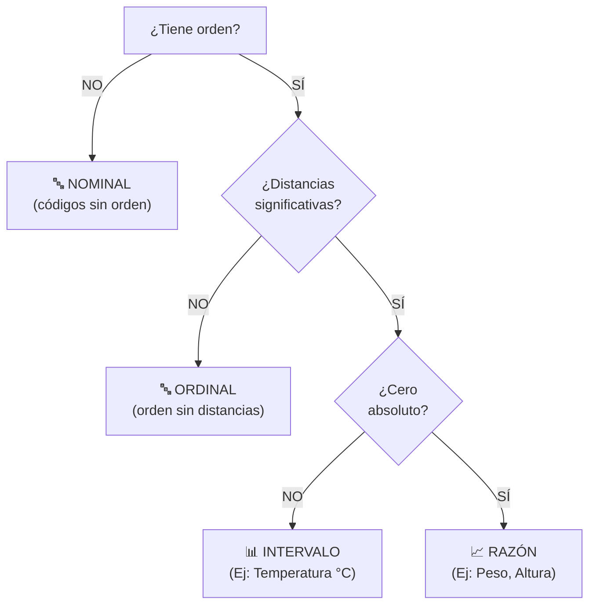

title: "Escalas de medición"
slug: "ud1-escalas-medicion"
date: "2026-01-14"
authors: ["Profesor UAX"]
tags: ["ud1", "escalas", "medición", "nominal", "ordinal", "intervalo", "razón"]
difficulty: "intro"
type: "definicion"
prerequisitos: ["ud1-tipos-datos"]

---

## Objetivo

✨ Comprender las **cuatro escalas de medición** (nominal, ordinal, intervalo, razón) y qué **operaciones matemáticas son válidas** en cada una, para seleccionar correctamente técnicas de análisis.

## Idea Clave 💡

No todas las operaciones matemáticas son válidas para todos los datos. **La escala de medición determina qué puedes hacer con tus datos.** Calcular la media de códigos nominales, o proporciones con temperaturas en Celsius, son errores comunes que resultan de ignorar esta distinción.

---

## Las Cuatro Escalas de Medición

### 1. Escala Nominal

**Definición:** Categorías **sin orden** que funcionan como **etiquetas identificadoras**. El número asignado es solo un código.

**Operaciones permitidas:**
- ✅ Contar frecuencias (¿cuántos de cada categoría?)
- ✅ Moda (categoría más frecuente)
- ✅ Tablas de contingencia
- ❌ Media, mediana, diferencias
- ❌ Proporciones entre códigos

**Ejemplos:**
- 🎨 Color: Rojo=1, Azul=2, Verde=3 (los números son solo códigos)
- 🌍 País: España=10, Francia=20, Alemania=30
- 💼 Sector: Tecnología=A, Salud=B, Manufactura=C

**Intuición:** Los números **no significan nada cuantitativamente**. No tiene sentido decir que "verde (3) es mayor que rojo (1)".

???+ example "Ejemplo Incorrecto"
    Codificas: Perro=1, Gato=2, Pájaro=3
    
    ❌ **INCORRECTO:** "Media = (1+2+3)/3 = 2" → No tiene significado
    
    ✅ **CORRECTO:** "Frecuencia: 40% perros, 35% gatos, 25% pájaros"

---

### 2. Escala Ordinal

**Definición:** Categorías **con orden significativo**, pero **distancias no cuantificadas** entre niveles.

**Operaciones permitidas:**
- ✅ Orden (ranking)
- ✅ Mediana y percentiles
- ✅ Pruebas no paramétricas
- ⚠️ Media (solo si asumes distancias iguales)
- ❌ Diferencias proporcionadas

**Ejemplos:**
- 📚 Educación: 1=Primaria < 2=Secundaria < 3=Universidad < 4=Doctorado
- ⭐ Satisfacción: 1=Muy Insatisfecho < 2=Insatisfecho < 3=Neutro < 4=Satisfecho < 5=Muy Satisfecho
- 🏆 Talla: XS < S < M < L < XL

**Intuición:** Sabemos que Doctorado > Universidad > Secundaria, pero **¿la diferencia entre Doctorado y Universidad es igual que entre Secundaria y Primaria?** No lo sabemos.

???+ example "Ejemplo: Escala de Satisfacción 1-5"
    Datos: 1, 2, 3, 4, 5
    
    **Análisis correcto:**
    - Mediana = 3 ✅
    - Moda = cada valor (poco informativo)
    
    **Análisis controversial:**
    - Media = 3 (✅ usado en práctica, pero ⚠️ asume distancias iguales)
    
    **Análisis incorrecto:**
    - Desviación típica (❌ requiere intervalos iguales)

!!! warning "Cuidado: Escala Likert"
    Las escalas tipo Likert (1-5) se tratan **frecuentemente como cuantitativas** en investigación, pero esto es una **simplificación** que requiere justificación teórica.

---

### 3. Escala de Intervalo

**Definición:** Números con **diferencias significativas**, pero **cero arbitrario** (no representa ausencia).

**Operaciones permitidas:**
- ✅ Diferencias y sumas (20 - 10 = 10)
- ✅ Media, mediana, desviación típica
- ❌ Proporciones (20°C NO es "el doble" de 10°C)
- ❌ Cero absoluto

**Ejemplos:**
- 🌡️ Temperatura en Celsius: 0°C ≠ ausencia de temperatura
- 📅 Años (calendario): Año 2000 - Año 1000 = 1000 años ✅, pero Año 2000 "es el doble" que Año 1000 ❌
- 🧠 Puntuación IQ: IQ=100 es "promedio", pero IQ=200 NO es "el doble de inteligencia"

**¿Por qué no proporciones?**
- 20°C es **10°C más caliente** que 10°C ✅
- Pero 20°C **NO es "el doble de caliente"** porque 0°C no significa "sin calor"
- Si usas Kelvin (cero absoluto): 20K/10K = 2 ✅

???+ example "Ejemplo: Temperatura"
    Conversión: 10°C = 283.15K, 20°C = 293.15K
    
    En Celsius: 20 - 10 = 10°C de diferencia ✅
    
    En Kelvin: 293.15 / 283.15 ≈ 1.035 (solo 3.5% más cálido)
    
    **Conclusión:** Las proporciones cambian con el punto cero elegido → ❌ no válidas en intervalo

---

### 4. Escala de Razón (Ratio)

**Definición:** Números con **diferencias, proporciones y cero absoluto**. Máxima información cuantitativa.

**Operaciones permitidas:**
- ✅ Todas: diferencias, proporciones, media, varianza, etc.
- ✅ Cero representa ausencia
- ✅ Proporciones significativas

**Ejemplos:**
- ⚖️ Peso en kg: 0 kg = sin peso; 20kg es el doble de 10kg ✅
- 📏 Altura en cm: 0 cm = sin altura; 200cm es el doble de 100cm ✅
- 💰 Salario en €: €0 = sin ingresos; €2000 es el doble de €1000 ✅
- ⏱️ Tiempo en segundos: 0s = momento inicial; 20s es el doble de 10s ✅

**Intuición:** Todas las operaciones aritméticas tienen significado físico.

???+ example "Ejemplo: Pesos"
    Datos: 50kg, 100kg, 150kg
    
    ✅ Media = 100kg (persona promedio pesa 100kg)
    ✅ 100kg es el doble de 50kg (significativo físicamente)
    ✅ Usar en cualquier análisis numérico estándar

---

## Tabla Comparativa: Las 4 Escalas

| **Escala** | **Orden** | **Distancias** | **Cero Absoluto** | **Proporciones** | **Ejemplo** |
|:---:|:---:|:---:|:---:|:---:|:---|
| 🔤 Nominal | ❌ | ❌ | ❌ | ❌ | Género: M/F |
| 🔤 Ordinal | ✅ | ❌ | ❌ | ❌ | Educación: 1º-2º-3º |
| 📊 Intervalo | ✅ | ✅ | ❌ | ❌ | Temperatura (°C) |
| 📈 Razón | ✅ | ✅ | ✅ | ✅ | Peso, Altura, Salario |

---

## Tabla: Operaciones Válidas en Cada Escala

| **Operación** | **Nominal** | **Ordinal** | **Intervalo** | **Razón** |
|:---|:---:|:---:|:---:|:---:|
| Conteo/Frecuencia | ✅ | ✅ | ✅ | ✅ |
| Moda | ✅ | ✅ | ✅ | ✅ |
| Mediana/Percentiles | ❌ | ✅ | ✅ | ✅ |
| Media | ❌ | ⚠️ | ✅ | ✅ |
| Desviación Típica | ❌ | ❌ | ✅ | ✅ |
| Diferencias | ❌ | ❌ | ✅ | ✅ |
| Proporciones | ❌ | ❌ | ❌ | ✅ |
| Regresión Lineal | ❌ | ❌ | ✅ | ✅ |

---

## ⚠️ Errores Comunes por Escala

### Error 1: Media de Variables Nominales
```
❌ INCORRECTO: 
Códigos: Rojo=1, Azul=2, Verde=3
Media = 2 → "El color promedio es azul" (¿sinsentido!)

✅ CORRECTO:
Frecuencia: 40% Rojo, 35% Azul, 25% Verde
Moda: Rojo (más frecuente)
```

### Error 2: Proporciones con Intervalo
```
❌ INCORRECTO:
Temperatura: 20°C es el doble de 10°C

✅ CORRECTO:
20°C es 10°C más caliente que 10°C
(La proporción solo es válida en Kelvin)
```

### Error 3: Media de Escala Likert sin Justificación
```
⚠️ COMÚN (pero técnicamente incorrecto):
Satisfacción: 1, 2, 3, 4, 5
Media = 3

✅ MÁS CORRECTO:
Usar mediana (Es ordinal)
O justificar por qué asumimos intervalos iguales
```

---

## 💡 Flujo de Decisión: ¿Qué Escala Tengo?



---

## 💼 Aplicaciones Prácticas

### En Análisis Estadístico
- **Nominal:** Tablas de contingencia, chi-cuadrado
- **Ordinal:** Pruebas de Mann-Whitney, Spearman
- **Intervalo/Razón:** t-test, regresión, ANOVA

### En Machine Learning
- **Nominal:** One-hot encoding (p. ej. color)
- **Ordinal:** Label encoding (1, 2, 3...) con cuidado, o embeddings
- **Intervalo/Razón:** Normalización/estandarización estándar

### En Visualización
- **Nominal:** Gráfico de barras (sin orden)
- **Ordinal:** Gráfico de barras (CON orden respetado)
- **Intervalo/Razón:** Histograma, box-plot, scatter

---

## 💭 Reflexión Final

!!! note "Resumen"
    La escala de medición de tus datos **no es una formalidad teórica**, sino una guía práctica para:
    
    1. ✅ Elegir **resúmenes apropiados** (media sí/no)
    2. ✅ Usar **tests estadísticos correctos** (paramétricos vs no paramétricos)
    3. ✅ Evitar **interpretaciones sin sentido** (proporciones en Celsius)
    4. ✅ Preparar datos **correctamente para ML** (encoding, normalización)

!!! tip "Consejo Profesional"
    Antes de cualquier análisis, pregúntate: **"¿Cuál es la escala de esta variable?"** Es la pregunta más importante.
