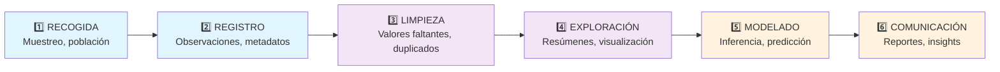

title: "UD1 — Introducción a la Estadística"
slug: "ud1-introduccion"
date: "2026-01-14"
authors: ["Profesor UAX"]
tags: ["ud1", "introducción", "estadística", "descriptiva", "inferencial"]
difficulty: "intro"
type: "definicion"
prerequisitos: []

---

## Objetivo

✨ Entender **qué es la estadística**, sus dos ramas principales (descriptiva e inferencial), y cómo se estructura este curso para aprender sistemáticamente.

## Idea Clave 💡

La **estadística transforma datos crudos en información útil**. Este proceso tiene dos enfoques: describir lo que vemos en los datos (descriptiva) o sacar conclusiones sobre poblaciones mayores a partir de muestras (inferencial). Dominar ambos es la base de todo análisis.

---

## ¿Qué es la Estadística?

**Definición:** La estadística es la **ciencia del dato** que se ocupa de:

1. 📊 **Recolección** — Diseñar muestreos, definir poblaciones y seleccionar fuentes
2. 🧹 **Organización** — Estructurar datos en registros limpios y validados
3. 📈 **Análisis** — Calcular resúmenes, detectar patrones y visualizar distribuciones
4. 💡 **Interpretación** — Sacar conclusiones válidas y comunicar resultados
5. 📋 **Presentación** — Reportar hallazgos de forma clara y reproducible

---

## Dos Ramas Principales

### Estadística Descriptiva 📊

**Objetivo:** Resumir y representar los datos que **ya tienes**.

**Técnicas:**

- Media, mediana, moda, varianza
- Histogramas, boxplots, gráficos de barras
- Tablas de frecuencias
- Correlaciones entre variables

**Pregunta típica:** _"¿Cuál es la edad media de los estudiantes en la clase?"_

**Nota:** Solo describes lo observado; no haces inferencias sobre poblaciones más grandes.

???+ example "Ejemplo: Análisis de Calificaciones"

    Datos: calificaciones de 30 estudiantes en un examen

    Análisis descriptivo:

    - Media = 6.8/10
    - Desviación típica = 1.5
    - Moda = 7
    - Visualización: histograma mostrando distribución

    **Conclusión:** El rendimiento promedio es bajo-medio, con alta variabilidad.

---

### Estadística Inferencial 🔮

**Objetivo:** Usar una **muestra** para sacar conclusiones sobre una **población** más grande.

**Técnicas:**

- Intervalos de confianza
- Pruebas de hipótesis
- Regresión y modelado
- Estimación de parámetros

**Pregunta típica:** _"¿Podemos asegurar que el tiempo promedio de respuesta de este servidor es menor de 200ms?"_

**Nota:** Permite generalizar más allá de los datos observados, con un nivel de confianza cuantificable.

???+ example "Ejemplo: Encuesta de Satisfacción"

    Población: 10,000 clientes de una empresa

    Muestra: 500 clientes encuestados aleatoriamente

    Resultado muestral: 85% satisfecho

    Inferencia: "Con 95% de confianza, entre 82% y 88% de todos los clientes están satisfechos"

    **Ventaja:** Conclusión sobre 10,000 a partir de 500 datos.

---

## La Estructura de UD1: Herramientas para Describir

| **Tema**                     | **Objetivo**              | **Conceptos Clave**                  |
| :--------------------------- | :------------------------ | :----------------------------------- |
| 🔢 **Tipos de Datos**        | Clasificar variables      | Nominal, ordinal, discreto, continuo |
| 📊 **Escalas de Medición**   | Validar operaciones       | Nominal, ordinal, intervalo, razón   |
| 📏 **Medidas Centrales**     | Resumen de posición       | Media, mediana, moda                 |
| 📈 **Medidas de Dispersión** | Resumen de variabilidad   | Varianza, desv. típica               |
| 🎨 **Gráficos**              | Visualizar distribuciones | Histograma, boxplot, barras          |
| 🧹 **Limpieza**              | Preparar datos            | Faltantes, duplicados, outliers      |
| 🎯 **Muestreo**              | Obtener muestras válidas  | Aleatorio, estratificado, sesgos     |

---

## El Flujo Completo del Análisis

**Colores:** UD1 cubrirá pasos 1-4 (azul/morado). Pasos 5-6 aparecen en UD3+ pero es crucial pensar en ellos desde el inicio.

---

## 💡 Consejos Prácticos

!!! tip "Estudia Modularmente"

    Cada página de UD1 es independiente pero conectada. Puedes estudiar en cualquier orden, pero recomendamos: tipos → medidas → gráficos → limpieza → muestreo.

!!! note "Documentación es Clave"

    En análisis real, documenta **siempre**: qué datos usaste, qué limpiezas hiciste, qué criterios aplicaste. Tu yo futuro (y los evaluadores) lo agradecerán.

!!! warning "Evita Conclusiones Precipitadas"

    Estadística descriptiva te muestra lo que **pasó en tu muestra**. No intentes generalizar sin técnicas de inferencia formales (UD3+).

---

## 📖 Mapa de Contenidos

Consulta estas páginas en orden para un aprendizaje sólido:

1. [Introducción](./introduccion.md) ← Estás aquí
2. [Tipos de datos](./tipos-datos.md)
3. [Escalas de medición](./escalas-medicion.md)
4. [Medidas de tendencia central](./medidas-tendencia-dispersion.md)
5. [Medias especializadas](./medias-geometricas.md)
6. [Observación y registro](./observacion-registro.md)
7. [Muestreo](./muestra-representativa.md)
8. [Limpieza de datos](./limpieza-de-datos.md)
9. [Visualización](./representacion-visual.md)
10. [Proceso completo](./proceso-analisis-datos.md)
11. [Ejercicios](./ejercicios.md) + [Examen](./examen-ud1-practica.md)
