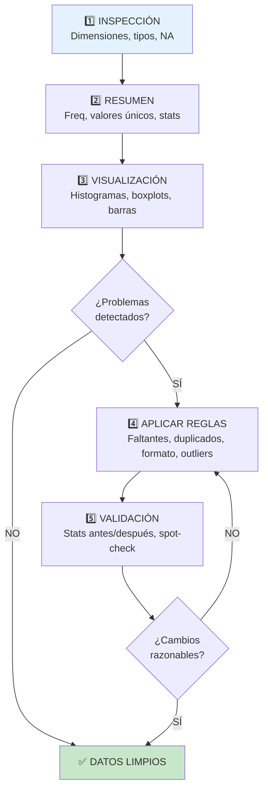

title: "Limpieza de datos"
slug: "ud1-limpieza-datos"
date: "2026-01-14"
authors: ["Profesor UAX"]
tags: ["ud1", "limpieza", "datos", "eda", "calidad", "outliers"]
difficulty: "intro"
type: "definicion"
prerequisitos: ["ud1-tipos-datos", "ud1-representacion-visual"]

---

## Objetivo

✨ Dominar técnicas para **detectar y corregir problemas comunes** en datos reales (faltantes, duplicados, errores, outliers) antes del análisis, garantizando conclusiones válidas.

## Idea Clave 💡

**"Garbage In, Garbage Out"** — Si los datos están sucios, ningún análisis riguroso puede salvarte. El 80% del trabajo en análisis real es **limpieza de datos**. Aprende a hacerlo bien y evitarás horas de frustración.

---

## ¿Por Qué Limpiar Datos?

**Problema:** Los datos reales vienen con imperfecciones:

- Valores faltantes (NA, NaN, espacios en blanco)
- Duplicados accidentales
- Errores de formato/tipeo
- Valores fuera de rango lógico
- Caracteres especiales mal codificados

**Consecuencia:** Análisis con datos sucios → Conclusiones engañosas

???+ example "Ejemplo: Media Distorsionada"

    Dataset: Edades [23, 25, 999, 30, 22]

    ❌ INCORRECTO (sin limpiar):
    $$\bar{x} = \frac{23+25+999+30+22}{5} = \frac{1099}{5} = 219.8 \text{ años}$$

    ✅ CORRECTO (tras limpiar, 999 → NA → imputar mediana = 25):
    $$\bar{x} = \frac{23+25+25+30+22}{5} = \frac{125}{5} = 25 \text{ años}$$

---

## Problemas Comunes y Soluciones

### 1. Valores Faltantes (NA)

**Patrones:** Pueden ser **aleatorios (MCAR)**, **dependientes de otros datos (MAR)**, o **no aleatorios (MNAR)**.

**Detección:**

- Contar NAs por variable
- Visualizar patrón (¿están concentrados?)
- Investigar causa (error de captura vs intencional)

**Estrategias de Tratamiento:**

| **Estrategia**            | **Cuándo Usar**      | **Ventajas**      | **Desventajas**            |
| :------------------------ | :------------------- | :---------------- | :------------------------- |
| **Eliminar fila**         | Muy pocos NA (<5%)   | Simple            | Pierdes información        |
| **Imputar media/mediana** | Cuantitativos, MCAR  | Rápido            | Reduce varianza            |
| **Imputar moda**          | Categóricos          | Intuitivo         | Artificial                 |
| **Regresión/k-NN**        | Relaciones complejas | Preserva varianza | Más complejo               |
| **Imputación múltiple**   | Análisis formal      | Riguroso          | Computacionalmente costoso |

???+ example "Ejemplo: Imputación de Peso"

    Dataset: Pesos [70kg, 75kg, NA, 80kg, 72kg]

    Opción 1 - Eliminar: [70, 75, 80, 72] → Pierdo 1/5 de datos

    Opción 2 - Media: [70, 75, **74.25**, 80, 72] → Imputar promedio

    Opción 3 - Mediana: [70, 75, **72**, 80, 72] → Imputar valor central

    **Recomendación:** Mediana (más robusta con outliers)

---

### 2. Duplicados

**Detección:**

- Buscar filas idénticas (todas las columnas iguales)
- Buscar duplicados en ID (imposible en ID único)
- Agrupar por variables clave y contar

**Tratamiento:**

!!! tip "Manejo de Duplicados"

    1. **Nunca eliminar sin revisar** — Podría ser error de captura o dato legítimo
    2. **Documentar criterio** — ¿Guardas primera ocurrencia o la más completa?
    3. **Crear flag** — Marcar registros duplicados en columna `is_duplicate`
    4. **Auditar** — Revisar muestra de duplicados antes de eliminar

???+ example "Ejemplo: Encuesta con Reenvío Accidental"

    Datos recibidos:
    ```
    id,nombre,email,respuesta
    001,Juan,juan@mail,Sí
    002,María,maria@mail,No
    001,Juan,juan@mail,Sí  ← DUPLICADO (reenvío accidental)
    003,Pedro,pedro@mail,Sí
    ```

    **Solución:** Mantener primer registro (001 único), marcar segundo como duplicado, documentar

---

### 3. Errores de Formato/Consistencia

**Problemas típicos:**

- Tipos mezclados: "10" vs 10 vs "diez"
- Unidades inconsistentes: "170cm" vs "1.7m"
- Fechas variadas: "01/02/2024" vs "2024-02-01" vs "1 febrero 2024"
- Encoding: caracteres especiales (€, ñ, °) corruptos

**Soluciones:**

!!! warning "Validación de Formato"

    1. **Normaliza tipos:** Todo numérico en número, texto en string
    2. **Estandariza unidades:** cm siempre, o m siempre (no mezclar)
    3. **Fechas ISO:** YYYY-MM-DD es estándar internacional
    4. **Encoding UTF-8:** Asegura caracteres especiales correctos

???+ example "Ejemplo: Temperatura"

    ❌ Inconsistente:
    ```
    temperatura
    20 °C
    68°F
    293K
    "veinte grados"
    ```

    ✅ Normalizado (todo Celsius):
    ```
    temperatura_celsius
    20.0
    20.0  (convertido de 68°F)
    19.85 (convertido de 293K)
    NA    (no numérico, marcar como NA)
    ```

---

### 4. Valores Atípicos (Outliers)

**Definición:** Valores **muy alejados** de la distribución normal — pueden ser errores o fenómenos reales.

**Detección con IQR (Rango Intercuartil):**

$$\text{IQR} = Q_3 - Q_1$$

Outliers: Valores fuera de $[Q_1 - 1.5 \times \text{IQR}, Q_3 + 1.5 \times \text{IQR}]$

**Detección con Z-score:**

$$z = \frac{x - \bar{x}}{s}$$

Outliers: |z| > 3 (aproximadamente)

**¿Qué hacer con outliers?**

| **Paso**          | **Acción**                                            |
| :---------------- | :---------------------------------------------------- |
| 1️⃣ **Investigar** | ¿Es error o fenómeno real?                            |
| 2️⃣ **Documentar** | Registra qué y por qué                                |
| 3️⃣ **Decidir**    | Eliminar, corregir o mantener + usar medidas robustas |
| 4️⃣ **Reportar**   | Siempre menciona outliers en análisis                 |

???+ example "Ejemplo: Salarios con CEO"

    Datos: [30k, 35k, 40k, 42k, 1000k]

    Media (con outlier): 229.4k ← Distorsionada ❌

    Mediana (robusto): 40k ← Representa bien ✅

    **Decisión:** Mantener 1000k porque es CEO real, pero usar mediana y documentar

---

## Flujo Completo de Limpieza



---

## Checklist de Limpieza

!!! tip "Pasos Recomendados"

    - [ ] Cargar dataset → Revisar dimensiones (filas, columnas)
    - [ ] Tipos: ¿Cada variable tiene tipo correcto?
    - [ ] Valores faltantes: ¿Cuántos NA por variable? ¿Patrón?
    - [ ] Duplicados: ¿Existen filas idénticas? ¿Duplicados en ID?
    - [ ] Formatos: ¿Fechas ISO? ¿Unidades consistentes?
    - [ ] Valores fuera de rango: ¿Edad = 999? ¿Nota = 150?
    - [ ] Outliers: ¿Boxplot muestra valores sospechosos?
    - [ ] Documentar: Registro de cambios, quién, cuándo, por qué
    - [ ] Validar: Comparar estadísticas antes/después
    - [ ] Backup: Guardar dataset original sin modificar

---

## Buenas Prácticas

!!! warning "Nunca Modificar Original"

    Siempre trabaja con **copias**. Mantén el dataset original intacto para auditoría y reproducibilidad.

!!! note "Documentación Completa"

    Crea un **registro de cambios**:

    ```
    Cambio: Sustituir edad=999 por NA
    Autor: Prof. García
    Fecha: 2024-01-14
    Justificación: 999 es código de error de captura
    Variables afectadas: edad (1 fila)
    ```

!!! tip "Script Reproducible"

    Escribe tu limpieza como script (Python/R) para:
    - Reproducibilidad
    - Auditoría
    - Aplicar a nuevos datos

---

## 📖 Enlaces Relacionados

- [Representación visual](./representacion-visual.md) — Visualizar problemas
- [Tipos de datos](./tipos-datos.md) — Validar tipos
- [Observación y registro](./observacion-registro.md) — Prevenir problemas en origen
