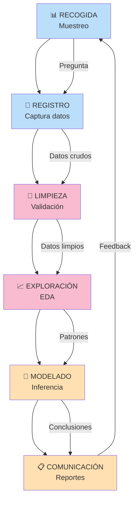
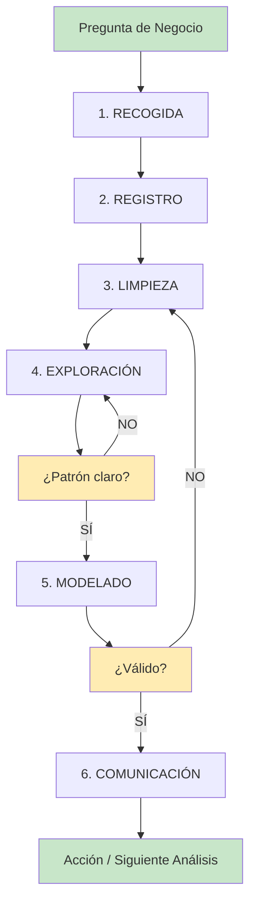

title: "Proceso estándar de análisis de datos"
slug: "ud1-proceso-analisis-datos"
date: "2026-01-14"
authors: ["Profesor UAX"]
tags: ["ud1", "workflow", "eda", "limpieza", "modelado", "análisis"]
difficulty: "intro"
type: "definicion"
prerequisitos: ["ud1-introduccion"]

---

## Objetivo

✨ Presentar un **flujo de trabajo (workflow) completo y ordenado** para el análisis de datos — guía de referencia para todo análisis riguroso.

## Idea Clave 💡

**No existe análisis sin estructura.** El flujo de trabajo es el "mapa" que guía tu análisis desde datos crudos hasta conclusiones. Seguirlo previene errores, mejora reproducibilidad y acelera desarrollo.

---

## El Workflow Completo: 6 Etapas

---

## Etapa 1️⃣: RECOGIDA — Definir y Muestrear

**Qué hacemos:** Diseñar el muestreo y recolectar datos representativos.

**Tareas:**

- ✅ Definir población objetivo con precisión
- ✅ Decidir método de muestreo (aleatorio, estratificado, etc.)
- ✅ Calcular tamaño de muestra necesario
- ✅ Establecer criterios de inclusión/exclusión
- ✅ Planificar logística de captura

**Outputs:**

- Plan de muestreo documentado
- Tamaño de muestra justificado
- Lista de población / protocolo de selección

**Recursos:** [Muestra representativa](./muestra-representativa.md)

---

## Etapa 2️⃣: REGISTRO — Capturar y Documentar

**Qué hacemos:** Recopilar datos en sistema ordenado con validaciones.

**Tareas:**

- ✅ Diseñar esquema de datos (nombres, tipos, unidades)
- ✅ Implementar validaciones en tiempo real
- ✅ Capturar metadatos (quién, cuándo, cómo)
- ✅ Crear backup inmediato

**Outputs:**

- Dataset con registros validados
- Metadatos de captura completos
- Backup del dataset original

**Recursos:** [Observación y registro](./observacion-registro.md)

---

## Etapa 3️⃣: LIMPIEZA — Validar y Reparar

**Qué hacemos:** Detectar y resolver problemas en datos crudos.

**Tareas:**

- ✅ Inspeccionar: tipos, dimensiones, valores faltantes
- ✅ Detectar: duplicados, valores fuera de rango, outliers
- ✅ Documentar: registro de cambios por cada transformación
- ✅ Aplicar: imputación, normalización, corrección
- ✅ Validar: comparar estadísticas antes/después

**Outputs:**

- Dataset limpio y validado
- Registro de cambios documentado
- Reporte de calidad de datos

**Recursos:** [Limpieza de datos](./limpieza-de-datos.md)

---

## Etapa 4️⃣: EXPLORACIÓN (EDA) — Entender Patrones

**Qué hacemos:** Análisis descriptivo profundo para encontrar patrones y anomalías.

**Tareas:**

- ✅ Estadísticas básicas: media, mediana, varianza, cuartiles
- ✅ Distribuciones: histogramas, densidades, boxplots
- ✅ Relaciones: correlaciones, tablas cruzadas
- ✅ Segmentación: análisis por subgrupos
- ✅ Hipótesis iniciales: qué patrones observas?

**Outputs:**

- Gráficos exploratorios
- Tabla de estadísticas descriptivas
- Hipótesis para modelado

**Recursos:** [Medidas de tendencia](./medidas-tendencia-dispersion.md), [Visualización](./representacion-visual.md)

---

## Etapa 5️⃣: MODELADO — Inferencia y Predicción

**Qué hacemos:** Aplicar técnicas estadísticas para generalizar y predecir.

**Tareas:**

- ✅ Seleccionar método (test estadístico, regresión, ML)
- ✅ Ajustar modelo y validar supuestos
- ✅ Evaluar con métricas apropiadas
- ✅ Hacer predicciones o estimaciones
- ✅ Cuantificar incertidumbre (intervalos de confianza)

**Outputs:**

- Modelo entrenado
- Métricas de desempeño
- Predicciones con intervalo de confianza

**Recursos:** Aparecen en UD3+ (inferencia, regresión, hipótesis)

---

## Etapa 6️⃣: COMUNICACIÓN — Reportar Resultados

**Qué hacemos:** Documentar hallazgos de forma clara y reproducible.

**Tareas:**

- ✅ Crear narrativa clara (pregunta → método → resultados)
- ✅ Visualizar conclusiones principales
- ✅ Documentar supuestos y limitaciones
- ✅ Proporcionar código reproducible
- ✅ Especificar siguientes pasos

**Outputs:**

- Reporte ejecutivo (1-2 páginas)
- Reporte técnico completo
- Código reproducible (scripts)
- Datasets generados

---

## ¿Por Qué Esta Estructura?

| **Etapa**       | **Si la saltas...**                                 |
| :-------------- | :-------------------------------------------------- |
| 1. Recogida     | Muestras sesgadas → conclusiones inválidas ❌       |
| 2. Registro     | Datos caóticos → limpieza imposible ❌              |
| 3. Limpieza     | Análisis con datos sucios → resultados engañosos ❌ |
| 4. Exploración  | Métodos inapropiados para tus datos ❌              |
| 5. Modelado     | Sin validación formal → intuiciones no probadas ❌  |
| 6. Comunicación | Resultados olvidados → sin impacto ❌               |

**Conclusión:** Todas son críticas. Saltar una = fracaso garantizado.

---

## Iteración y Feedback

**Nota:** El análisis no es lineal. Es común volver atrás (p.ej. exploración → más limpieza) cuando descubres problemas.

---

## Recomendaciones Prácticas

!!! tip "Documentación Continua"

    Documenta **mientras haces**, no después. Crea un **notebook** (Jupyter, R Markdown) que capture:
    - Pregunta de análisis
    - Código de cada etapa
    - Visualizaciones
    - Decisiones y justificaciones

!!! warning "Reproducibilidad"

    Tu análisis debe ser **100% reproducible**:
    - ✅ Código disponible y comentado
    - ✅ Datos de entrada especificados
    - ✅ Dependencias y versiones documentadas
    - ✅ Alguien más debe poder reejecutar en 10 minutos

!!! note "Pensamiento Crítico"

    En cada etapa, pregúntate:
    - ¿Por qué hago esto?
    - ¿Cuáles son mis supuestos?
    - ¿Qué podría estar equivocado?
    - ¿He validado mis conclusiones?

---

## Conexión con UD1

| **Etapa**       | **Contenido UD1**                                                                         |
| :-------------- | :---------------------------------------------------------------------------------------- |
| 1. Recogida     | [Muestreo](./muestra-representativa.md)                                                   |
| 2. Registro     | [Observación y registro](./observacion-registro.md)                                       |
| 3. Limpieza     | [Limpieza de datos](./limpieza-de-datos.md)                                               |
| 4. Exploración  | [Medidas](./medidas-tendencia-dispersion.md), [Visualización](./representacion-visual.md) |
| 5. Modelado     | Aparece en UD3+                                                                           |
| 6. Comunicación | Cada unidad                                                                               |

**UD1 prepara los pasos 1-4.** Etapas 5-6 se desarrollan en unidades posteriores, pero es fundamental dominar antes la preparación de datos.

---

## 💭 Reflexión Final

!!! important "Éxito en Análisis de Datos"

    El 80% de la tarea es **correcta preparación de datos** (etapas 1-4).

    El 20% es **modelado y comunicación** (etapas 5-6).

    Sin los primeros, los últimos son inútiles. Invierte el tiempo necesario en hacer bien las cosas desde el inicio.

---

## 📖 Referencias Internas

- [Introducción](./introduccion.md)
- [Tipos de datos](./tipos-datos.md)
- [Medidas](./medidas-tendencia-dispersion.md)
- [Muestreo](./muestra-representativa.md)
- [Limpieza](./limpieza-de-datos.md)
- [Visualización](./representacion-visual.md)
