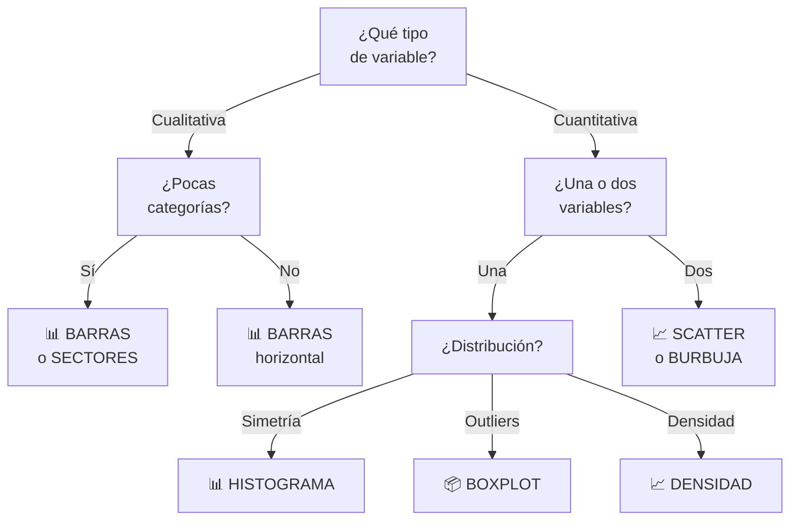

title: "Representación gráfica de datos"
slug: "ud1-representacion-visual"
date: "2026-01-14"
authors: ["Profesor UAX"]
tags: ["ud1", "gráficos", "visualización", "histograma", "boxplot", "eda"]
difficulty: "intro"
type: "definicion"
prerequisitos: ["ud1-medidas-tendencia-dispersion", "ud1-tipos-datos"]

---

## Objetivo

✨ Dominar los **gráficos fundamentales** para explorar datos — elegir el gráfico correcto es tan importante como calcular medidas numéricas.

## Idea Clave 💡

**"Una imagen vale más que mil palabras."** Los gráficos revelan patrones, outliers y distribuciones que los números solos nunca muestran. Aprender a visualizar correctamente es una habilidad crítica de científico de datos.

---

## Seleccionar el Gráfico Correcto



---

## Gráficos para Variables Cualitativas

### Gráfico de Barras (Bar Chart)

**Uso:** Contar frecuencias de categorías.

**Características:**

- ✅ Altura = frecuencia
- ✅ Fácil comparar categorías
- ✅ Mejor para ≤ 10 categorías

**Ejemplo:** Marcas de coche más frecuentes

???+ example "Datos: Colores Preferidos"

    ```
    Color    Frecuencia
    Rojo     25
    Azul     40
    Verde    18
    Negro    30
    ```

    **Gráfico:** Barras verticales, Azul es más alto (40)

---

### Gráfico de Sectores (Pie Chart)

**Uso:** Mostrar **proporciones** de un total (100%).

**Características:**

- ✅ Tamaño de sector = proporción
- ✅ Intuitividad
- ⚠️ Difícil comparar valores similares

**Mejor alternativa:** Gráfico de barras (más legible)

???+ example "Datos: Distribución de Sistemas Operativos"

    ```
    iOS:      45%
    Android:  50%
    Windows:  5%
    ```

    **Gráfico:** Sectores, Android y iOS dominan

---

## Gráficos para Variables Cuantitativas (Una Variable)

### Histograma

**Uso:** **Distribución** de una variable continua.

**Características:**

- ✅ Bins (intervalos) en eje X
- ✅ Frecuencia en eje Y
- ✅ Revela forma (normal, sesgada, bimodal)
- ⚠️ Elección de bins afecta visualización

**Información revelada:**

- Simetría vs asimetría
- Concentración de datos
- Número de modas

???+ example "Ejemplo: Altura de Estudiantes"

    160-165 cm: 8 estudiantes
    165-170 cm: 15 estudiantes
    170-175 cm: 20 estudiantes
    175-180 cm: 12 estudiantes
    180-185 cm: 5 estudiantes

    **Patrón:** Distribución aproximadamente normal, centrada en 170cm

---

### Diagrama de Caja (Boxplot)

**Uso:** Visualizar **dispersión, tendencia central, y outliers**.

**Anatomía:**

```
        ↑ Máximo (sin outliers)
        │
    ┌───┤ Q3 (75%)
    │   │
    │ ─ │ Mediana (Q2)
    │   │
    └───┤ Q1 (25%)
        │
        ↓ Mínimo

    * = Outlier (fuera de 1.5×IQR)
```

**Fórmulas:**

- IQR = Q3 - Q1
- Outliers: Fuera de [Q1 - 1.5×IQR, Q3 + 1.5×IQR]

**Ventajas:**

- ✅ Resumen completo de distribución
- ✅ Outliers claramente visibles
- ✅ Comparar múltiples grupos lado a lado

???+ example "Ejemplo: Salarios por Sector"

    Sector A: Mediana=40k, IQR=10k, sin outliers

    Sector B: Mediana=45k, IQR=15k, 1 outlier en 100k (CEO)

    **Boxplot:** Sector B más disperso y con CEO visible

---

### Gráfico de Densidad

**Uso:** Versión "suavizada" del histograma — distribución continua.

**Características:**

- ✅ Curva suave vs barras discretas
- ✅ Fácil comparar múltiples distribuciones
- ✅ Mejor para presentaciones

---

## Gráficos para Variables Cuantitativas (Dos Variables)

### Gráfico de Dispersión (Scatter Plot)

**Uso:** Mostrar **relación entre dos variables**.

**Características:**

- ✅ Punto = observación
- ✅ X = variable 1, Y = variable 2
- ✅ Patrón revela correlación

**Patrones:**

- Correlación positiva: puntos suben de izquierda a derecha
- Correlación negativa: puntos bajan de izquierda a derecha
- Sin correlación: nube dispersa sin patrón

???+ example "Ejemplo: Horas de Estudio vs Nota"

    Si alguien estudia más horas, típicamente obtiene mejor nota

    **Scatter:** Nube de puntos diagonal ascendente = correlación positiva

---

## Tabla Resumen: Cuándo Usar Cada Gráfico

| **Variable(s)**    | **Tipo**        | **Pregunta**               | **Gráfico**               |
| :----------------- | :-------------- | :------------------------- | :------------------------ |
| 1 Cualitativa      | Nominal/Ordinal | ¿Frecuencia de categorías? | Barras / Sectores         |
| 1 Cuantitativa     | Continua        | ¿Distribución?             | Histograma / Densidad     |
| 1 Cuantitativa     | Continua        | ¿Outliers y cuartiles?     | Boxplot                   |
| 2 Cuantitativas    | Continua        | ¿Relación entre variables? | Scatter                   |
| 1 Cualit + 1 Cuant | Mixto           | ¿Distribución por grupo?   | Boxplot agrupado / Violin |

---

## Buenas Prácticas en Visualización

!!! tip "Claridad"

    - ✅ Título descriptivo: No "Gráfico 1", sino "Distribución de Edades"
    - ✅ Etiquetas en ejes: Incluir unidades (cm, €, años)
    - ✅ Leyenda clara: Si hay múltiples series
    - ✅ Colores limitados: Máximo 5-6 colores distintos

!!! warning "Evita"

    - ❌ 3D innecesario: Es más confuso, no más informativo
    - ❌ Gráficos de torta con muchas categorías: Usa barras
    - ❌ Colores que discriminan: Asegura accesibilidad (daltonismo)
    - ❌ Escala manipulada: Eje Y no debe empezar arbitrariamente

!!! note "Contexto es Rey"

    Un gráfico sin contexto es inútil. Siempre incluye:
    - Pregunta que intenta responder
    - Población/muestra representada
    - Período de tiempo (si aplica)
    - Unidades y escala

---

## Ejemplos Prácticos: Análisis Completo

### Caso 1: Análisis de Edades en Clase

**Variables:** Edad (cuantitativa continua)

\*\*Gráficos:

1. **Histograma:** ¿Cómo se distribuyen edades?
   - Revela: mayoría entre 20-22 años, normal
2. **Boxplot:** ¿Hay outliers?

   - Revela: un estudiante de 35 años (outlier positivo)

3. **Estadísticas:** Media=21.5, Mediana=21, Desv=1.2

**Conclusión:** Clase homogénea de edad, 1 estudiante mayor

---

### Caso 2: Comparación de Satisfacción por Género

**Variables:** Género (cualitativa) × Satisfacción 1-5 (ordinal)

**Gráficos:**

1. **Barras agrupadas:** Frecuencias por género y satisfacción
   - Revela: hombres más insatisfechos, mujeres más satisfechas
2. **Boxplots lado a lado:** Distribución por género
   - Revela: mediana diferente entre géneros

**Conclusión:** Posible sesgo de género en satisfacción

---

## 💭 Checklist: Antes de Presentar un Gráfico

!!! tip "Validación"

    - [ ] ¿Elegí el tipo correcto para mis datos?
    - [ ] ¿El gráfico tiene título claro?
    - [ ] ¿Los ejes están etiquetados con unidades?
    - [ ] ¿Existe leyenda si es necesaria?
    - [ ] ¿He incluido fuente de datos o período?
    - [ ] ¿Un colega podría entenderlo sin yo presente?
    - [ ] ¿El patrón es claro y no engañoso?
    - [ ] ¿He mencionado limitaciones o contexto?

---

## 📖 Enlaces Relacionados

- [Medidas de tendencia](./medidas-tendencia-dispersion.md) — Números detrás de gráficos
- [Limpieza de datos](./limpieza-de-datos.md) — Preparar datos para visualizar
- [Tipos de datos](./tipos-datos.md) — Validar tipo para elegir gráfico
