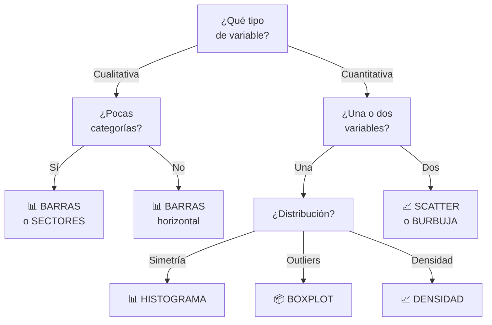

title: "Representación gráfica de datos"
slug: "ud1-representacion-visual"
date: "2026-01-14"
authors: ["Profesor UAX"]
tags: ["ud1", "gráficos", "visualización", "histograma", "boxplot", "eda"]
difficulty: "intro"
type: "definicion"
prerequisitos: ["ud1-medidas-tendencia-dispersion", "ud1-tipos-datos"]

---

## Objetivo

✨ Dominar los **gráficos fundamentales** para explorar datos — elegir el gráfico correcto es tan importante como calcular medidas numéricas.

## Idea Clave 💡

**"Una imagen vale más que mil palabras."** Los gráficos revelan patrones, outliers y distribuciones que los números solos nunca muestran. Aprender a visualizar correctamente es una habilidad crítica de científico de datos.

---

## Seleccionar el Gráfico Correcto


```mermaid
graph TD
    A["¿Qué tipo<br/>de variable?"] -->|Cualitativa| B["¿Pocas<br/>categorías?"]
    A -->|Cuantitativa| C["¿Una o dos<br/>variables?"]

    B -->|Sí| D["📊 BARRAS<br/>o SECTORES"]
    B -->|No| E["📊 BARRAS<br/>horizontal"]

    C -->|Una| F["¿Distribución?"]
    C -->|Dos| G["📈 SCATTER<br/>o BURBUJA"]

    F -->|Simetría| H["📊 HISTOGRAMA"]
    F -->|Outliers| I["📦 BOXPLOT"]
    F -->|Densidad| J["📈 DENSIDAD"]
```

---

## Gráficos para Variables Cualitativas

### Gráfico de Barras (Bar Chart)

**Uso:** Contar frecuencias de categorías.

**Características:**

- ✅ Altura = frecuencia
- ✅ Fácil comparar categorías
- ✅ Mejor para ≤ 10 categorías

**Ejemplo:** Marcas de coche más frecuentes

???+ example "Datos: Colores Preferidos"

    ```
    Color    Frecuencia
    Rojo     25
    Azul     40
    Verde    18
    Negro    30
    ```

    **Gráfico:** Barras verticales, Azul es más alto (40)

---

### Gráfico de Sectores (Pie Chart)

**Uso:** Mostrar **proporciones** de un total (100%).

**Características:**

- ✅ Tamaño de sector = proporción
- ✅ Intuitividad
- ⚠️ Difícil comparar valores similares

**Mejor alternativa:** Gráfico de barras (más legible)

???+ example "Datos: Distribución de Sistemas Operativos"

    ```
    iOS:      45%
    Android:  50%
    Windows:  5%
    ```

    **Gráfico:** Sectores, Android y iOS dominan

---

## Gráficos para Variables Cuantitativas (Una Variable)

### Histograma

**Uso:** **Distribución** de una variable continua.

**Características:**

- ✅ Bins (intervalos) en eje X
- ✅ Frecuencia en eje Y
- ✅ Revela forma (normal, sesgada, bimodal)
- ⚠️ Elección de bins afecta visualización

**Información revelada:**

- Simetría vs asimetría
- Concentración de datos
- Número de modas

???+ example "Ejemplo: Altura de Estudiantes"

    160-165 cm: 8 estudiantes
    165-170 cm: 15 estudiantes
    170-175 cm: 20 estudiantes
    175-180 cm: 12 estudiantes
    180-185 cm: 5 estudiantes

    **Patrón:** Distribución aproximadamente normal, centrada en 170cm

---

### ✨ Diagrama de Caja (Boxplot)

**Objetivo:** Vamos a ver, paso a paso, qué muestra un boxplot y cómo calcular sus elementos (Q1, Q2, Q3, IQR, outliers). Esta sección sigue el estilo del proyecto: definiciones formales, intuición y un ejemplo resuelto.

**Definición breve:** el boxplot resume la **mediana** y el **rango intercuartílico (IQR)** de una distribución, muestra la dispersión robusta y detecta observaciones atípicas (outliers).

**Componentes (qué representan):**

- **Línea central — mediana ($Q_2$):** posición del 50% central; robusta frente a extremos.
- **Caja — de $Q_1$ a $Q_3$:** contiene el 50% central. Su altura es el IQR: $$\mathrm{IQR}=Q_3-Q_1.$$
- **Bigotes (whiskers):** se suelen dibujar hasta el valor más extremo que no es outlier según Tukey: los valores dentro del intervalo

  $$[Q_1-1.5\cdot\mathrm{IQR},\;Q_3+1.5\cdot\mathrm{IQR}]$$

  son considerados no-outliers y marcan el extremo de los bigotes.
- **Outliers:** puntos fuera de ese intervalo; a menudo se distinguen entre leves ($>$1.5·IQR) y extremos ($>$3·IQR).

!!! tip "Anotación"

    El ancho físico de la caja en el boxplot clásico no tiene significado estadístico. Algunas variantes usan el ancho para representar el tamaño muestral o la densidad.

**Notches (opcional):** los "notches" marcan una aproximación del intervalo de confianza alrededor de la mediana; si dos notches no se solapan, se sugiere diferencia entre medianas.

**Interpretación rápida:**

- Mediana desplazada dentro de la caja → asimetría del 50% central.
- Caja más alta (IQR mayor) → mayor dispersión robusta.
- Bigote más largo a derecha → sesgo positivo; a izquierda → sesgo negativo.
- Outliers → investigar: errores, subpoblaciones o valores informativos.

**Diagrama ASCII (recuperando la versión visual intuitiva):**

```
        ↑ Máximo (sin outliers)
        │
    ┌───┤ Q3 (75%)
    │   │
    │ ─ │ Mediana (Q2)
    │   │
    └───┤ Q1 (25%)
        │
        ↓ Mínimo

    * = Outlier (fuera de 1.5×IQR)
```

En este esquema: la caja va de $Q_1$ a $Q_3$, la línea vertical interior es la mediana, los "bigotes" llegan hasta el máximo/mínimo no-outlier y los puntos separados son outliers.

**Ejemplo numérico (resuelto — necesario en examen):**

Datos (ordenados, $n=11$): $3,4,5,7,8,9,10,12,14,18,50$.

Calculemos los cuartiles y detectemos outliers:

1. Mediana $Q_2=9$ (valor central).
2. $Q_1=$ mediana de la mitad inferior $(3,4,5,7,8) \Rightarrow Q_1=5$.
3. $Q_3=$ mediana de la mitad superior $(10,12,14,18,50) \Rightarrow Q_3=14$.
4. $$\mathrm{IQR}=Q_3-Q_1=14-5=9.$$
5. Límites de Tukey: 

$$[Q_1-1.5\,\mathrm{IQR},\;Q_3+1.5\,\mathrm{IQR}]=[5-13.5,\;14+13.5]=[-8.5,\;27.5].$$

6. Observaciones fuera de esos límites: $50>27.5$ → $50$ es outlier.
7. Bigotes: mínimo no-outlier = 3, máximo no-outlier = 18; outlier = 50 (se representa como punto aislado).

<details>
<summary>Ver pasos detallados (clic)</summary>

Ordenamos, tomamos la mediana y luego las medianas de las mitades. En muestras impares el procedimiento es directo (excluir la mediana para las mitades o incluirla según convención; aquí hemos excluido la mediana de las mitades para definir Q1 y Q3).

</details>

!!! warning "Cuidado en exámenes"

    Explica siempre si has incluido o excluido la mediana al dividir en mitades para calcular Q1/Q3 (hay convenciones distintas). Muestra los pasos numéricos.


**Preguntas típicas de examen sobre boxplots:**

- Calcular Q1, Q2, Q3 e IQR para un conjunto de datos y determinar outliers usando 1.5·IQR.
- Explicar qué indica la posición de la mediana dentro de la caja (asimetría del 50% central).
- Interpretar la presencia de un outlier: causas posibles y acciones (verificar, transformar, mantener, separar).
- Comparar dos grupos con boxplots: decidir cuál es más disperso, cuál tiene mayor sesgo, y si hay diferencias en medianas.
- Explicar la diferencia entre la dispersión medida por la IQR y por la desviación típica (ventajas/desventajas).

**Consejos para el examen y práctica:**

- Siempre muestre los pasos numéricos (ordenar datos, calcular cuartiles, IQR, límites).
- Al comparar grupos, comente mediana, IQR, longitud de bigotes y número/posición de outliers.
- En caso de outliers, especifique si podrían deberse a errores, subpoblaciones o valores informativos.
- Use notches con prudencia: son aproximaciones y dependen de tamaño muestral.

**Ventajas (resumen):**

- ✅ Resumen robusto (mediana + IQR)
- ✅ Identificación visual de outliers
- ✅ Comparación clara entre grupos

**Ejemplo breve (aplicado):**

Sector A: Mediana = 40k, IQR = 10k, sin outliers

Sector B: Mediana = 45k, IQR = 15k, outlier en 100k (CEO)

**Boxplot:** Sector B es más disperso y muestra un valor extremo claro (investigar).

---

### Gráfico de Densidad

**Uso:** Versión "suavizada" del histograma — distribución continua.

**Características:**

- ✅ Curva suave vs barras discretas
- ✅ Fácil comparar múltiples distribuciones
- ✅ Mejor para presentaciones

---

## Gráficos para Variables Cuantitativas (Dos Variables)

### Gráfico de Dispersión (Scatter Plot)

**Uso:** Mostrar **relación entre dos variables**.

**Características:**

- ✅ Punto = observación
- ✅ X = variable 1, Y = variable 2
- ✅ Patrón revela correlación

**Patrones:**

- Correlación positiva: puntos suben de izquierda a derecha
- Correlación negativa: puntos bajan de izquierda a derecha
- Sin correlación: nube dispersa sin patrón

???+ example "Ejemplo: Horas de Estudio vs Nota"

    Si alguien estudia más horas, típicamente obtiene mejor nota

    **Scatter:** Nube de puntos diagonal ascendente = correlación positiva

---

## Tabla Resumen: Cuándo Usar Cada Gráfico

| **Variable(s)**    | **Tipo**        | **Pregunta**               | **Gráfico**               |
| :----------------- | :-------------- | :------------------------- | :------------------------ |
| 1 Cualitativa      | Nominal/Ordinal | ¿Frecuencia de categorías? | Barras / Sectores         |
| 1 Cuantitativa     | Continua        | ¿Distribución?             | Histograma / Densidad     |
| 1 Cuantitativa     | Continua        | ¿Outliers y cuartiles?     | Boxplot                   |
| 2 Cuantitativas    | Continua        | ¿Relación entre variables? | Scatter                   |
| 1 Cualit + 1 Cuant | Mixto           | ¿Distribución por grupo?   | Boxplot agrupado / Violin |

---

## Buenas Prácticas en Visualización

!!! tip "Claridad"

    - ✅ Título descriptivo: No "Gráfico 1", sino "Distribución de Edades"
    - ✅ Etiquetas en ejes: Incluir unidades (cm, €, años)
    - ✅ Leyenda clara: Si hay múltiples series
    - ✅ Colores limitados: Máximo 5-6 colores distintos

!!! warning "Evita"

    - ❌ 3D innecesario: Es más confuso, no más informativo
    - ❌ Gráficos de torta con muchas categorías: Usa barras
    - ❌ Colores que discriminan: Asegura accesibilidad (daltonismo)
    - ❌ Escala manipulada: Eje Y no debe empezar arbitrariamente

!!! note "Contexto es Rey"

    Un gráfico sin contexto es inútil. Siempre incluye:
    - Pregunta que intenta responder
    - Población/muestra representada
    - Período de tiempo (si aplica)
    - Unidades y escala

---

## Ejemplos Prácticos: Análisis Completo

### Caso 1: Análisis de Edades en Clase

**Variables:** Edad (cuantitativa continua)

\*\*Gráficos:

1. **Histograma:** ¿Cómo se distribuyen edades?
   - Revela: mayoría entre 20-22 años, normal
2. **Boxplot:** ¿Hay outliers?
   - Revela: un estudiante de 35 años (outlier positivo)

3. **Estadísticas:** Media=21.5, Mediana=21, Desv=1.2

**Conclusión:** Clase homogénea de edad, 1 estudiante mayor

---

### Caso 2: Comparación de Satisfacción por Género

**Variables:** Género (cualitativa) × Satisfacción 1-5 (ordinal)

**Gráficos:**

1. **Barras agrupadas:** Frecuencias por género y satisfacción
   - Revela: hombres más insatisfechos, mujeres más satisfechas
2. **Boxplots lado a lado:** Distribución por género
   - Revela: mediana diferente entre géneros

**Conclusión:** Posible sesgo de género en satisfacción

---

## 💭 Checklist: Antes de Presentar un Gráfico

!!! tip "Validación"

    - [ ] ¿Elegí el tipo correcto para mis datos?
    - [ ] ¿El gráfico tiene título claro?
    - [ ] ¿Los ejes están etiquetados con unidades?
    - [ ] ¿Existe leyenda si es necesaria?
    - [ ] ¿He incluido fuente de datos o período?
    - [ ] ¿Un colega podría entenderlo sin yo presente?
    - [ ] ¿El patrón es claro y no engañoso?
    - [ ] ¿He mencionado limitaciones o contexto?

---

## 📖 Enlaces Relacionados

- [Medidas de tendencia](./medidas-tendencia-dispersion.md) — Números detrás de gráficos
- [Limpieza de datos](./limpieza-de-datos.md) — Preparar datos para visualizar
- [Tipos de datos](./tipos-datos.md) — Validar tipo para elegir gráfico
