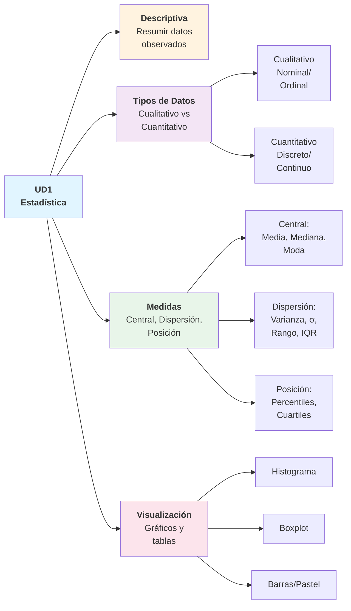
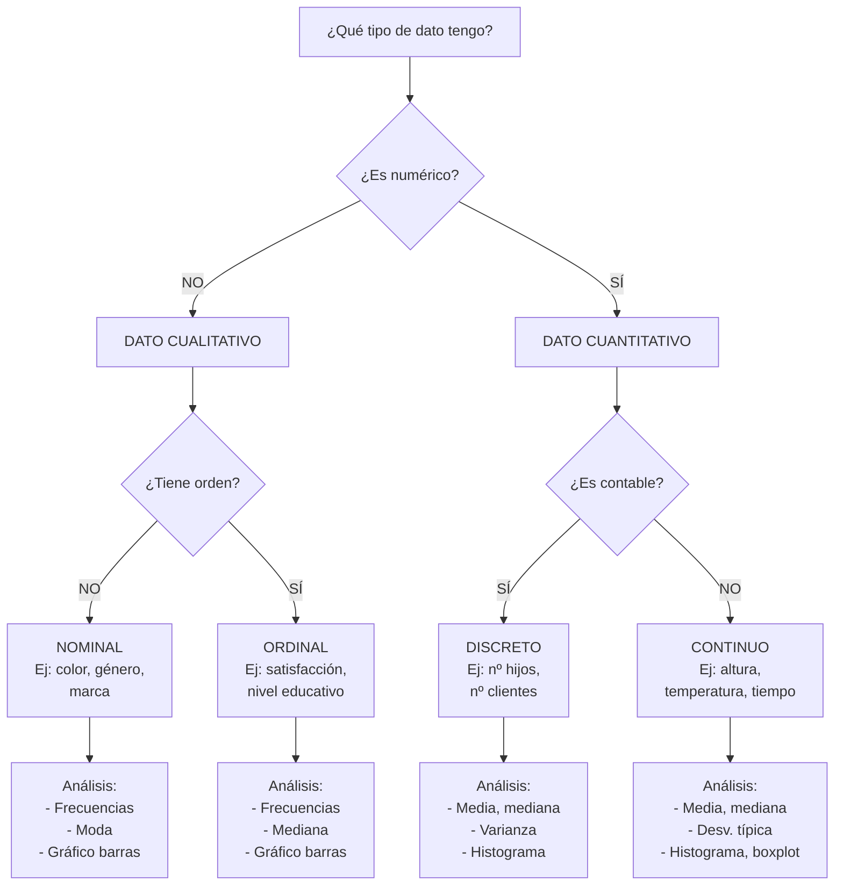
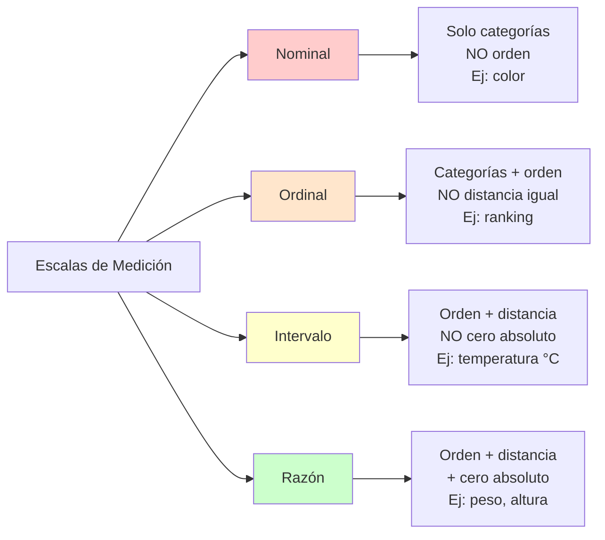
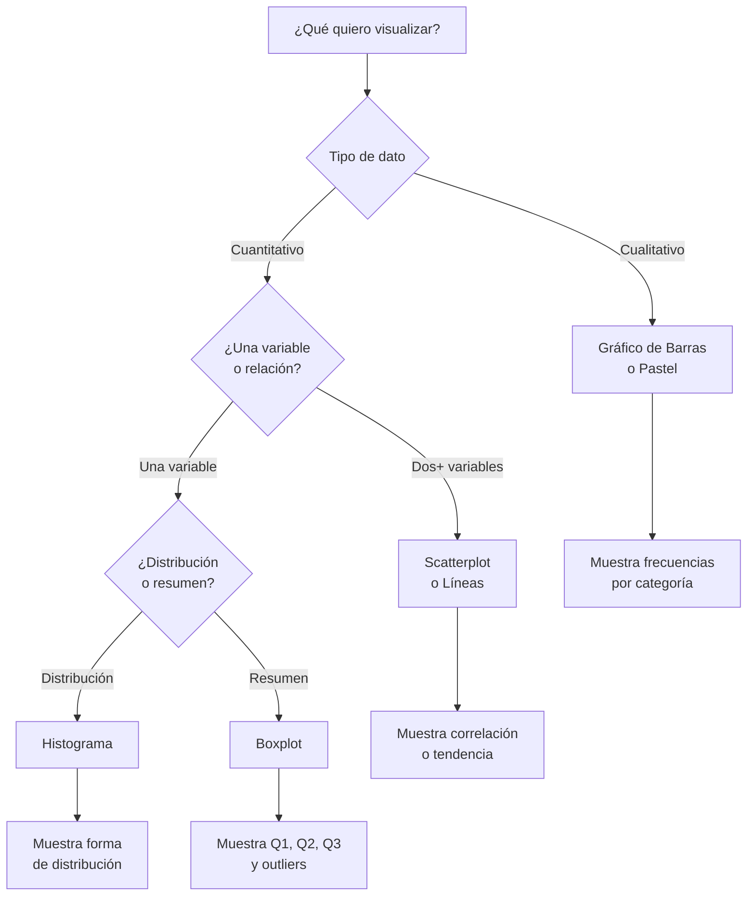
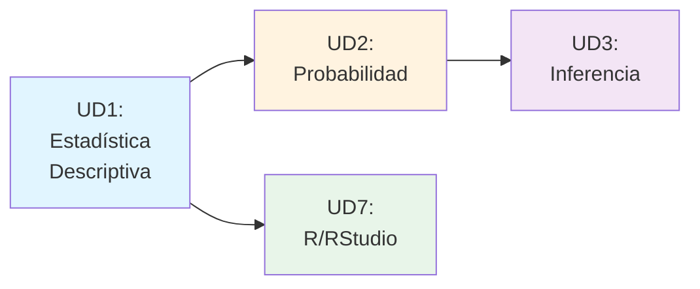

## ✨ Mapa Rápido de Conceptos UD1

---

## 🎯 Conceptos Clave en 1 Página

### Estadística Descriptiva vs Inferencial

| Aspecto             | Descriptiva                  | Inferencial                     |
| :------------------ | :--------------------------- | :------------------------------ |
| **Objetivo**        | Resumir datos observados     | Concluir sobre población        |
| **Datos**           | Muestra o población completa | Solo muestra                    |
| **Técnicas**        | Media, gráficos, tablas      | Intervalos, pruebas hipótesis   |
| **Pregunta típica** | "¿Cuál es la media?"         | "¿La media poblacional es > 5?" |

---

## 📊 Árbol de Decisión: Tipos de Datos

---

## 📏 Escalas de Medición

---

## 📐 Medidas de Tendencia Central

| Medida      | Fórmula                        | Cuándo usar                      | Ventajas            | Desventajas                     |
| :---------- | :----------------------------- | :------------------------------- | :------------------ | :------------------------------ |
| **Media**   | $\bar{x} = \frac{\sum x_i}{n}$ | Datos simétricos sin outliers    | Usa todos los datos | Sensible a outliers             |
| **Mediana** | Valor central ordenado         | Datos con outliers o asimétricos | Robusta a outliers  | Ignora valores extremos         |
| **Moda**    | Valor más frecuente            | Datos categóricos                | Fácil de entender   | Puede no existir o no ser única |

---

## 📊 Medidas de Dispersión

| Medida              | Fórmula                                    | Interpretación                          |
| :------------------ | :----------------------------------------- | :-------------------------------------- |
| **Varianza**        | $s^2 = \frac{\sum (x_i - \bar{x})^2}{n-1}$ | Dispersión promedio al cuadrado         |
| **Desv. Típica**    | $s = \sqrt{s^2}$                           | Dispersión en unidades originales       |
| **Rango**           | $R = \max(x) - \min(x)$                    | Amplitud total de los datos             |
| **IQR**             | $IQR = Q_3 - Q_1$                          | Rango del 50% central                   |
| **Coef. Variación** | $CV = \frac{s}{\bar{x}} \times 100\%$      | Dispersión relativa (comparar datasets) |

!!! warning "⚠️ Cuidado con la Varianza" - **Varianza poblacional:** divide por $n$ - **Varianza muestral:** divide por $n-1$ (corrección de Bessel) - Usa $n-1$ cuando calculas de una muestra para inferir sobre población

---

## 📦 Visualización: Guía Rápida

---

## 🔑 Fórmulas Esenciales

### Media Aritmética

$$
\bar{x} = \frac{1}{n}\sum_{i=1}^n x_i = \frac{x_1 + x_2 + \cdots + x_n}{n}
$$

### Varianza Muestral

$$
s^2 = \frac{1}{n-1}\sum_{i=1}^n (x_i - \bar{x})^2
$$

### Desviación Típica

$$
s = \sqrt{s^2}
$$

### Coeficiente de Variación

$$
CV = \frac{s}{\bar{x}} \times 100\%
$$

### Percentil k

Valor que deja el $k\%$ de datos por debajo. Ejemplo: $P_{75} = Q_3$ (tercer cuartil).

---

## ✅ Checklist del Análisis Descriptivo

???+ tip "Pasos para analizar un dataset"

    1. **Identificar tipo de datos**
       - ¿Cualitativos o cuantitativos?
       - ¿Discretos o continuos?

    2. **Limpiar datos**
       - Detectar y tratar valores faltantes
       - Identificar y manejar outliers

    3. **Calcular medidas de tendencia central**
       - Media, mediana, moda

    4. **Calcular medidas de dispersión**
       - Varianza, desviación típica, IQR

    5. **Visualizar**
       - Histograma o boxplot para cuantitativos
       - Barras para cualitativos

    6. **Interpretar**
       - ¿Los datos son simétricos o sesgados?
       - ¿Hay outliers significativos?
       - ¿Qué historia cuentan los datos?

---

## 🎓 Errores Comunes a Evitar

!!! danger "❌ Errores frecuentes"

    1. **Usar media con outliers extremos**
       - Solución: usar mediana

    2. **Comparar desviaciones típicas de datasets con medias muy diferentes**
       - Solución: usar coeficiente de variación (CV)

    3. **Confundir varianza poblacional (divide por n) con muestral (divide por n-1)**
       - Solución: memoriza que muestral usa n-1

    4. **Interpretar correlación como causalidad**
       - Solución: recordar que correlación ≠ causalidad

    5. **Elegir gráfico incorrecto para el tipo de dato**
       - Solución: usar árbol de decisión de visualización

---

## 📚 Relación con Otras Unidades

**UD1 es la base:** Necesitas dominar los conceptos descriptivos antes de avanzar a probabilidad e inferencia.

---

## 🚀 Para Profundizar

- [Tipos de datos](tipos-datos.md) — Clasificación detallada
- [Medidas de tendencia y dispersión](medidas-tendencia-dispersion.md) — Fórmulas y ejemplos
- [Escalas de medición](escalas-medicion.md) — Nominal, ordinal, intervalo, razón
- [Representación visual](representacion-visual.md) — Guía de gráficos
- [Ejercicios UD1](ejercicios.md) — Práctica con soluciones
