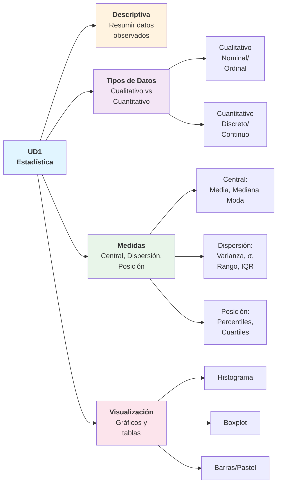
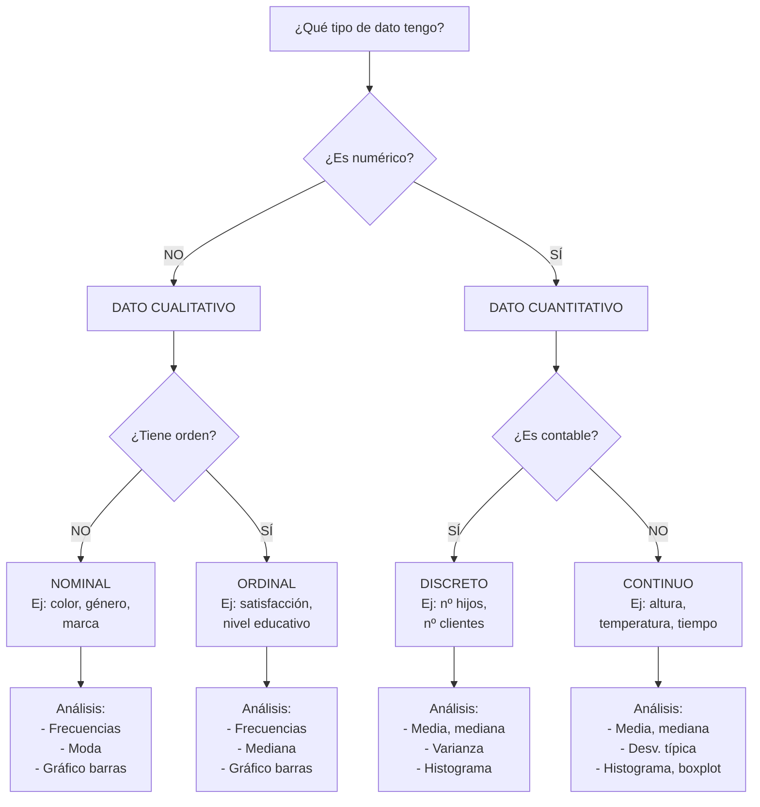
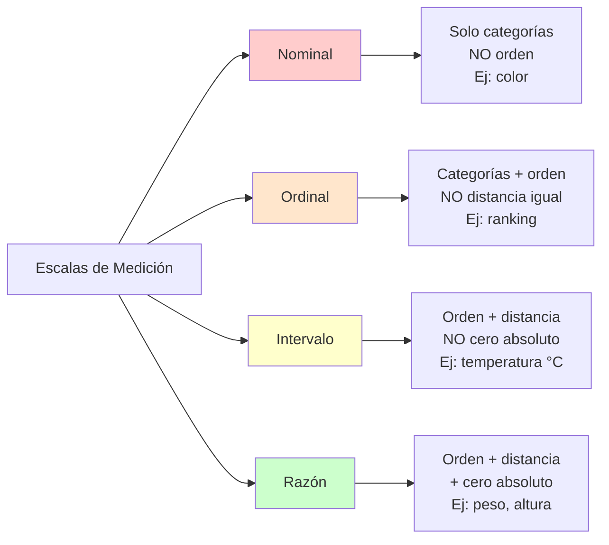
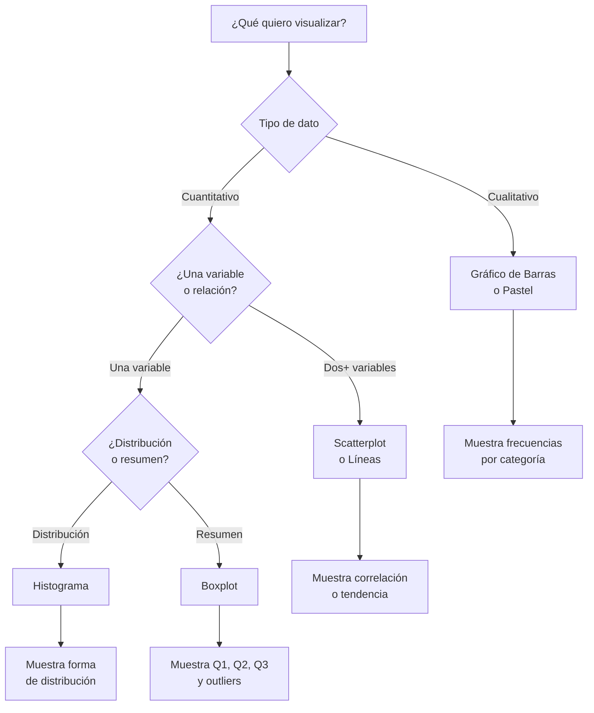
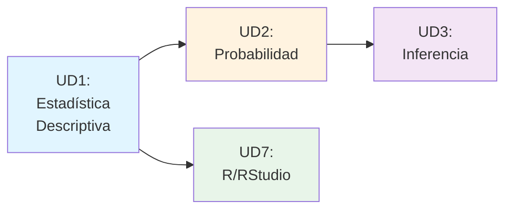

## ✨ Mapa Rápido de Conceptos UD1

```mermaid
graph LR
    A["<b>UD1<br/>Estadística</b>"]

    A --> B["<b>Descriptiva</b><br/>Resumir datos<br/>observados"]
    A --> C["<b>Tipos de Datos</b><br/>Cualitativo vs<br/>Cuantitativo"]
    A --> D["<b>Medidas</b><br/>Central, Dispersión,<br/>Posición"]
    A --> E["<b>Visualización</b><br/>Gráficos y<br/>tablas"]

    C --> C1["Cualitativo<br/>Nominal/<br/>Ordinal"]
    C --> C2["Cuantitativo<br/>Discreto/<br/>Continuo"]

    D --> D1["Central:<br/>Media, Mediana,<br/>Moda"]
    D --> D2["Dispersión:<br/>Varianza, σ,<br/>Rango, IQR"]
    D --> D3["Posición:<br/>Percentiles,<br/>Cuartiles"]

    E --> E1["Histograma"]
    E --> E2["Boxplot"]
    E --> E3["Barras/Pastel"]

    style A fill:#e1f5ff
    style B fill:#fff3e0
    style C fill:#f3e5f5
    style D fill:#e8f5e9
    style E fill:#fce4ec
```

---

## 🎯 Conceptos Clave en 1 Página

### Estadística Descriptiva vs Inferencial

| Aspecto             | Descriptiva                  | Inferencial                     |
| :------------------ | :--------------------------- | :------------------------------ |
| **Objetivo**        | Resumir datos observados     | Concluir sobre población        |
| **Datos**           | Muestra o población completa | Solo muestra                    |
| **Técnicas**        | Media, gráficos, tablas      | Intervalos, pruebas hipótesis   |
| **Pregunta típica** | "¿Cuál es la media?"         | "¿La media poblacional es > 5?" |

---

## 📊 Árbol de Decisión: Tipos de Datos

```mermaid
graph TD
    Start["¿Qué tipo de dato tengo?"] --> Q1{"¿Es numérico?"}

    Q1 -->|NO| Cualitativo["DATO CUALITATIVO"]
    Q1 -->|SÍ| Cuantitativo["DATO CUANTITATIVO"]

    Cualitativo --> Q2{"¿Tiene orden?"}
    Q2 -->|NO| Nominal["NOMINAL<br/>Ej: color, género,<br/>marca"]
    Q2 -->|SÍ| Ordinal["ORDINAL<br/>Ej: satisfacción,<br/>nivel educativo"]

    Cuantitativo --> Q3{"¿Es contable?"}
    Q3 -->|SÍ| Discreto["DISCRETO<br/>Ej: nº hijos,<br/>nº clientes"]
    Q3 -->|NO| Continuo["CONTINUO<br/>Ej: altura,<br/>temperatura, tiempo"]

    Nominal --> A1["Análisis:<br/>- Frecuencias<br/>- Moda<br/>- Gráfico barras"]
    Ordinal --> A2["Análisis:<br/>- Frecuencias<br/>- Mediana<br/>- Gráfico barras"]
    Discreto --> A3["Análisis:<br/>- Media, mediana<br/>- Varianza<br/>- Histograma"]
    Continuo --> A4["Análisis:<br/>- Media, mediana<br/>- Desv. típica<br/>- Histograma, boxplot"]
```

---

## 📏 Escalas de Medición

```mermaid
graph LR
    A["Escalas de Medición"] --> B["Nominal"]
    A --> C["Ordinal"]
    A --> D["Intervalo"]
    A --> E["Razón"]

    B --> B1["Solo categorías<br/>NO orden<br/>Ej: color"]
    C --> C1["Categorías + orden<br/>NO distancia igual<br/>Ej: ranking"]
    D --> D1["Orden + distancia<br/>NO cero absoluto<br/>Ej: temperatura °C"]
    E --> E1["Orden + distancia<br/>+ cero absoluto<br/>Ej: peso, altura"]

    style B fill:#ffcccc
    style C fill:#ffe6cc
    style D fill:#ffffcc
    style E fill:#ccffcc
```

---

## 📐 Medidas de Tendencia Central

| Medida      | Fórmula                        | Cuándo usar                      | Ventajas            | Desventajas                     |
| :---------- | :----------------------------- | :------------------------------- | :------------------ | :------------------------------ |
| **Media**   | $\bar{x} = \frac{\sum x_i}{n}$ | Datos simétricos sin outliers    | Usa todos los datos | Sensible a outliers             |
| **Mediana** | Valor central ordenado         | Datos con outliers o asimétricos | Robusta a outliers  | Ignora valores extremos         |
| **Moda**    | Valor más frecuente            | Datos categóricos                | Fácil de entender   | Puede no existir o no ser única |

---

## 📊 Medidas de Dispersión

| Medida              | Fórmula                                    | Interpretación                          |
| :------------------ | :----------------------------------------- | :-------------------------------------- |
| **Varianza**        | $s^2 = \frac{\sum (x_i - \bar{x})^2}{n-1}$ | Dispersión promedio al cuadrado         |
| **Desv. Típica**    | $s = \sqrt{s^2}$                           | Dispersión en unidades originales       |
| **Rango**           | $R = \max(x) - \min(x)$                    | Amplitud total de los datos             |
| **IQR**             | $IQR = Q_3 - Q_1$                          | Rango del 50% central                   |
| **Coef. Variación** | $CV = \frac{s}{\bar{x}} \times 100\%$      | Dispersión relativa (comparar datasets) |

!!! warning "⚠️ Cuidado con la Varianza"

- **Varianza poblacional:** divide por $n$
- **Varianza muestral:** divide por $n-1$ (corrección de Bessel)
- Usa $n-1$ cuando calculas de una muestra para inferir sobre población

---

## 📦 Visualización: Guía Rápida

```mermaid
graph TD
    Start["¿Qué quiero visualizar?"] --> Q1{"Tipo de dato"}

    Q1 -->|Cualitativo| G1["Gráfico de Barras<br/>o Pastel"]
    Q1 -->|Cuantitativo| Q2{"¿Una variable<br/>o relación?"}

    Q2 -->|Una variable| Q3{"¿Distribución<br/>o resumen?"}
    Q2 -->|Dos+ variables| G4["Scatterplot<br/>o Líneas"]

    Q3 -->|Distribución| G2["Histograma"]
    Q3 -->|Resumen| G3["Boxplot"]

    G1 --> R1["Muestra frecuencias<br/>por categoría"]
    G2 --> R2["Muestra forma<br/>de distribución"]
    G3 --> R3["Muestra Q1, Q2, Q3<br/>y outliers"]
    G4 --> R4["Muestra correlación<br/>o tendencia"]
```

---

[tabla de representacion grafica]

| Nombre gráfica                  | Tipo de datos                      | Puntos claves                                                                                                                                                                                                                                                                                                                                                                                                                   |
| :------------------------------ | :--------------------------------- | :------------------------------------------------------------------------------------------------------------------------------------------------------------------------------------------------------------------------------------------------------------------------------------------------------------------------------------------------------------------------------------------------------------------------------ |
| Gráfico de barras               | Cualitativa (nominal / ordinal)    | <ul><li>Muestra frecuencias o porcentajes por categoría.</li><li>Útil para ≤10 categorías; ordenar por frecuencia mejora lectura.</li><li>Etiqueta ejes y muestra valores; eje Y debe empezar en 0.</li><li>No usar 3D; preferir barras horizontales para etiquetas largas.</li><li>Preguntas de examen: interpretar la categoría más frecuente; comparar proporciones.</li></ul>                                               |
| Gráfico de sectores (pastel)    | Cualitativa (proporciones)         | <ul><li>Muestra proporciones relativas que suman 100%.</li><li>Adecuado para pocas categorías (≤5–6); difícil comparar valores similares.</li><li>Evitar si el objetivo es comparar tamaños parecidos; preferir barras.</li><li>Preguntas de examen: calcular proporción, justificar uso/limitaciones.</li></ul>                                                                                                                |
| Histograma                      | Cuantitativa (continua / discreta) | <ul><li>Muestra la distribución: forma, simetría, cola y modas (unimodal, bimodal).</li><li>La elección de bins (anchura) afecta la apariencia; justificar la elección en exámenes.</li><li>Permite inferir si la media≈mediana (simetría) o hay sesgo (media arrastrada hacia la cola).</li><li>Revela colas, agrupamientos y posibles outliers (aunque no los cuantifica).</li></ul>                                          |
| Boxplot (diagrama de caja)      | Cuantitativa                       | <ul><li>Muestra mediana (Q2), Q1, Q3 y IQR = Q3−Q1.</li><li>Bigotes según Tukey: límites en [Q1−1.5·IQR, Q3+1.5·IQR]; puntos fuera = outliers.</li><li>Robusto frente a outliers; útil para comparar grupos (boxplots lado a lado).</li><li>Interpretar posición de la mediana dentro de la caja para detectar asimetría central.</li><li>Preguntas de examen: calcular Q1,Q2,Q3,IQR y detectar outliers con 1.5·IQR.</li></ul> |
| Gráfico de densidad (Kernel)    | Cuantitativa                       | <ul><li>Estimación suave de la distribución; útil para comparar múltiples grupos.</li><li>El parámetro de banda (bandwidth) controla suavizado; justificar su elección.</li><li>Puede mostrar multimodalidad más claramente que un histograma con bins pobres.</li><li>No es ideal para muestras muy pequeñas; área total normalmente = 1 (densidad).</li></ul>                                                                 |
| Gráfico de dispersión (scatter) | Dos variables cuantitativas        | <ul><li>Muestra relación entre dos variables: dirección y fuerza aparente (correlación).</li><li>Revelar patrones: linealidad, clusters, heterocedasticidad y outliers bivariados.</li><li>Agregar línea de regresión/ajuste ayuda a interpretar tendencia; codificar color/tamaño para 3ª variable.</li><li>Preguntas de examen: describir relación (positiva/negativa/ninguna), identificar outliers y linealidad.</li></ul>  |

---

## 🔑 Fórmulas Esenciales

### Media Aritmética

$$
\bar{x} = \frac{1}{n}\sum_{i=1}^n x_i = \frac{x_1 + x_2 + \cdots + x_n}{n}
$$

### Varianza Muestral

$$
s^2 = \frac{1}{n-1}\sum_{i=1}^n (x_i - \bar{x})^2
$$

### Desviación Típica

$$
s = \sqrt{s^2}
$$

### Coeficiente de Variación

$$
CV = \frac{s}{\bar{x}} \times 100\%
$$

### Percentil k

Valor que deja el $k\%$ de datos por debajo. Ejemplo: $P_{75} = Q_3$ (tercer cuartil).

---

## ✅ Checklist del Análisis Descriptivo

???+ tip "Pasos para analizar un dataset"

    1. **Identificar tipo de datos**
       - ¿Cualitativos o cuantitativos?
       - ¿Discretos o continuos?

    2. **Limpiar datos**
       - Detectar y tratar valores faltantes
       - Identificar y manejar outliers

    3. **Calcular medidas de tendencia central**
       - Media, mediana, moda

    4. **Calcular medidas de dispersión**
       - Varianza, desviación típica, IQR

    5. **Visualizar**
       - Histograma o boxplot para cuantitativos
       - Barras para cualitativos

    6. **Interpretar**
       - ¿Los datos son simétricos o sesgados?
       - ¿Hay outliers significativos?
       - ¿Qué historia cuentan los datos?

---

## 🎓 Errores Comunes a Evitar

!!! danger "❌ Errores frecuentes"

    1. **Usar media con outliers extremos**
       - Solución: usar mediana

    2. **Comparar desviaciones típicas de datasets con medias muy diferentes**
       - Solución: usar coeficiente de variación (CV)

    3. **Confundir varianza poblacional (divide por n) con muestral (divide por n-1)**
       - Solución: memoriza que muestral usa n-1

    4. **Interpretar correlación como causalidad**
       - Solución: recordar que correlación ≠ causalidad

    5. **Elegir gráfico incorrecto para el tipo de dato**
       - Solución: usar árbol de decisión de visualización

---

## 📚 Relación con Otras Unidades

```mermaid
graph LR
    UD1["UD1:<br/>Estadística<br/>Descriptiva"] --> UD2["UD2:<br/>Probabilidad"]
    UD2 --> UD3["UD3:<br/>Inferencia"]
    UD1 --> UD7["UD7:<br/>R/RStudio"]

    style UD1 fill:#e1f5ff
    style UD2 fill:#fff3e0
    style UD3 fill:#f3e5f5
    style UD7 fill:#e8f5e9
```

**UD1 es la base:** Necesitas dominar los conceptos descriptivos antes de avanzar a probabilidad e inferencia.

---

## 🚀 Para Profundizar

- [Tipos de datos](tipos-datos.md) — Clasificación detallada
- [Medidas de tendencia y dispersión](medidas-tendencia-dispersion.md) — Fórmulas y ejemplos
- [Escalas de medición](escalas-medicion.md) — Nominal, ordinal, intervalo, razón
- [Representación visual](representacion-visual.md) — Guía de gráficos
- [Ejercicios UD1](ejercicios.md) — Práctica con soluciones
