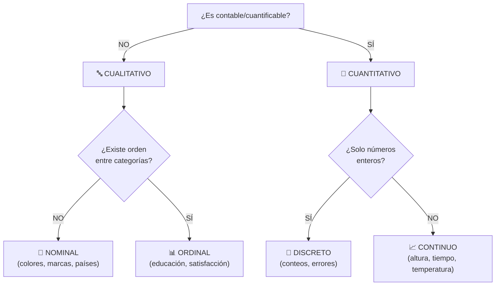

title: "Tipos de datos: cualitativos y cuantitativos"
slug: "ud1-tipos-datos"
date: "2026-01-14"
authors: ["Profesor UAX"]
tags: ["ud1", "tipos-datos", "cualitativo", "cuantitativo", "variables"]
difficulty: "intro"
type: "definicion"
prerequisitos: ["ud1-introduccion"]

---

## Objetivo

✨ Clasificar correctamente los datos como **cualitativos o cuantitativos** y sus subtipos, entendiendo qué técnicas de análisis se aplican a cada uno.

## Idea Clave 💡

El **tipo de dato determina qué análisis puedes hacer**. No puedes calcular una media de colores (cualitativo), ni hacer un gráfico de barras tiene sentido para tiempo exacto (cuantitativo continuo). Esta clasificación es el **primer paso** en cualquier análisis estadístico.

---

## Datos Cualitativos (Categóricos)

### Nominales

**Definición:** Categorías **sin orden inherente**. Son simplemente etiquetas que clasifican en grupos distintos.

**Característica clave:** No existe relación de magnitud entre categorías.

**Ejemplos:**
- 🎨 Color de ojos: azul, verde, marrón
- 🚗 Marca de coche: Toyota, BMW, Audi
- 🌍 País de residencia: España, Francia, Alemania
- 💼 Sector industrial: tecnología, salud, manufactura

**Análisis apropiado:**
- Tabla de frecuencias
- Gráfico de barras o pastel
- Moda (valor más frecuente)
- NO: media, mediana, desviación típica

---

### Ordinales

**Definición:** Categorías **con orden significativo**, pero **sin magnitud numérica precisa** entre niveles.

**Característica clave:** Hay un ranking, pero las "distancias" entre niveles no son iguales.

**Ejemplos:**
- 📚 Nivel educativo: Primaria < Secundaria < Universidad < Doctorado
- ⭐ Satisfacción del cliente: Muy Insatisfecho < Insatisfecho < Neutro < Satisfecho < Muy Satisfecho
- 🏆 Clasificación de películas: Mala < Regular < Buena < Excelente
- 🏥 Severidad de enfermedad: Leve < Moderada < Severa

**Análisis apropiado:**
- Tabla de frecuencias **ordenada**
- Gráfico de barras con orden respetado
- **Mediana** y percentiles (sí)
- Media (controversial, solo si asumimos intervalos iguales)
- NO: desviación típica estándar

!!! warning "Cuidado"
    Muchos análisis tratan escalas de satisfacción 1–5 **como si fueran cuantitativas** asumiendo que la diferencia entre 1 y 2 es la misma que entre 4 y 5. Esto es una **simplificación** útil pero técnicamente incorrecta.

---

## Datos Cuantitativos (Numéricos)

### Discretos

**Definición:** Valores **enteros contables**. Representan conteos de elementos indivisibles.

**Característica clave:** Solo ciertos valores específicos son posibles (0, 1, 2, ...). No hay valores intermedios.

**Ejemplos:**
- 👨‍👩‍👧‍👦 Número de hijos: 0, 1, 2, 3...
- 📞 Llamadas telefónicas recibidas: 0, 1, 2, 3...
- 🛒 Número de compras por cliente: 0, 1, 2, 3...
- ❌ Errores en un texto: 0, 1, 2, 3...

**Análisis apropiado:**
- Media, mediana, desviación típica ✅
- Gráfico de barras (no histograma)
- Distribuciones especiales: Poisson, Binomial
- Frecuencias absolutas y relativas

**Fórmulas aplicables:** Cualquier análisis numérico normal

---

### Continuos

**Definición:** Valores que pueden ser **cualquier número dentro de un intervalo**. Teóricamente infinitas posibilidades.

**Característica clave:** Precisión limitada por el instrumento de medición (decimales).

**Ejemplos:**
- 📏 Altura en cm: 170.5, 175.2, 182.1... (infinitas posibilidades)
- ⏱️ Tiempo en segundos: 12.34, 45.678, 89.012... 
- 🌡️ Temperatura en ºC: 20.5, 22.3, 25.8...
- 💰 Salario mensual en €: 1234.56, 2567.89...

**Análisis apropiado:**
- Media, mediana, desviación típica, varianza ✅
- Histograma o gráfico de densidad
- Distribuciones continuas: Normal, t, F, Chi-cuadrado
- Intervalos de confianza
- Regresión lineal

---

## Tabla Comparativa: Clasificación Completa

| **Tipo** | **Subtipo** | **Orden** | **Magnitud** | **Ejemplo** | **Análisis** |
|:---:|:---:|:---:|:---:|:---|:---|
| 🔤 Cualitativo | Nominal | ❌ | ❌ | Color ojos | Frecuencias, moda, gráfico barras |
| 🔤 Cualitativo | Ordinal | ✅ | ❌ | Satisfacción 1-5 | Mediana, percentiles, tablas |
| 🔢 Cuantitativo | Discreto | - | ✅ | Nº hijos | Media, desv. típica, Poisson |
| 🔢 Cuantitativo | Continuo | - | ✅ | Altura en cm | Media, histograma, regresión |

---

## Flujo de Decisión: ¿Qué tipo es mi variable?

---

## Ejemplos Prácticos: Clasificación Paso a Paso

### Ejemplo 1: Número de horas estudiadas
- ¿Cuantitativo? ✅ Sí, es un número
- ¿Discreto o continuo? Se registra en horas/minutos → **Continuo**
- ✅ Análisis: media, histograma, regresión

### Ejemplo 2: Satisfacción con un producto (escala 1-5)
- ¿Cuantitativo? 📊 Parece numérico pero son categorías ordenadas → **Ordinal**
- ¿Análisis? Mediana es mejor que media (aunque muchos usan media por simplicidad)

### Ejemplo 3: Número de defectos en un lote
- ¿Cuantitativo? ✅ Sí, es contable
- ¿Discreto o continuo? Solo números enteros → **Discreto**
- ✅ Análisis: media, Poisson, control de calidad

### Ejemplo 4: Temperatura ambiente
- ¿Cuantitativo? ✅ Sí
- ¿Discreto o continuo? Puede tomar decimales → **Continuo**
- ✅ Análisis: media, desv. típica, histograma

---

## 💡 Tips Prácticos

!!! tip "Pregunta Clave"
    **¿Tiene sentido calcular la media de mi variable?**
    - Sí → Cuantitativa (continua o discreta)
    - No → Cualitativa (nominal u ordinal)

!!! note "Relación con Escalas de Medición"
    Esta clasificación se complementa con las **escalas de medición** (nominal, ordinal, intervalo, razón). Ver [Escalas de medición](./escalas-medicion.md) para más detalles.

!!! warning "Error Común"
    Los códigos numéricos (1=Bajo, 2=Medio, 3=Alto) **no son cuantitativos** solo porque sean números. Sigue siendo **ordinal** porque los números son solo etiquetas con orden.

!!! tip "Análisis Apropiado"
    Elige siempre el análisis según el tipo de datos, no según lo que "se pueda" hacer. La media de códigos ordinales puede ser matemáticamente correcta pero **estadísticamente sin sentido**.

        - Opinión sobre una película: cualitativa ordinal.
