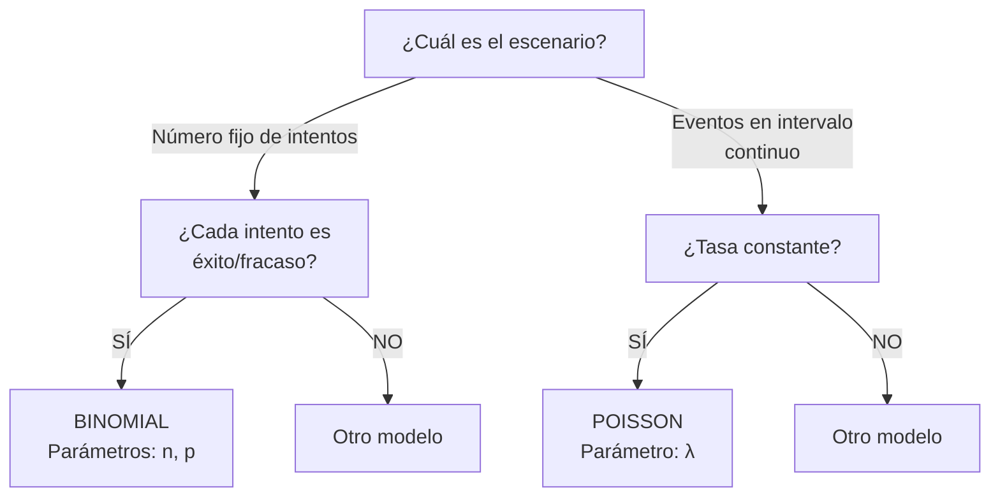

title: "Distribuciones discretas: Binomial y Poisson"
slug: "ud2-distribuciones-discretas"
date: "2026-01-14"
authors: ["Profesor UAX"]
tags: ["ud2", "binomial", "poisson", "distribuciones", "discretas"]
difficulty: "intermedio"
type: "definicion"
prerequisitos: ["ud2-eventos-probabilidad", "ud2-variables-aleatorias"]

---

## Objetivo

✨ Dominar las **dos distribuciones discretas más importantes** en estadística: binomial (intentos fijos) y Poisson (eventos raros en tiempo/espacio).

## Idea Clave 💡

**Distinguir entre "n intentos fijos" y "eventos raros en intervalo" es la clave.** Muchos errores vienen de confundir cuándo usar cada distribución. Una vez identificado el escenario, todo lo demás sigue de fórmulas estándar.

---

## Distribución Binomial

### Definición y Caracterización

**Modelo:** Repetir **n intentos independientes**, cada uno con **probabilidad p de éxito**, contar número total de éxitos.

**Ejemplos:**

- 🪙 Lanzar una moneda 10 veces, contar caras
- ✅ En una muestra de 50, contar defectuosos (p=2%)
- 🎯 En 20 disparos, contar blancos acertados (p=0.7)
- 📊 En 100 clientes, contar satisfechos (p=0.8)

**Condiciones (criterios MUST):**

1. ✅ Número **fijo** de intentos (n)
2. ✅ Cada intento: **éxito (p) o fracaso (1-p)**
3. ✅ Intentos **independientes**
4. ✅ Probabilidad **constante** en todos

### Fórmula

Si $X \sim \text{Binomial}(n, p)$:

$$P(X = k) = \binom{n}{k} p^k (1-p)^{n-k}, \quad k = 0, 1, \ldots, n$$

Donde $\binom{n}{k} = \frac{n!}{k!(n-k)!}$ = número de formas de elegir k de n

**Media y Varianza:**
$$E[X] = np, \quad \text{Var}(X) = np(1-p)$$

???+ example "Ejemplo 1: Moneda Justa"

    Lanzar moneda 5 veces, X = número de caras

    n = 5, p = 0.5

    P(X = 3) = $\binom{5}{3}$ × 0.5³ × 0.5² = 10 × 0.03125 = 0.3125

    E[X] = 5 × 0.5 = 2.5 (esperamos ~2-3 caras)

    Var(X) = 5 × 0.5 × 0.5 = 1.25

???+ example "Ejemplo 2: Control de Calidad"

    Fábrica: 2% de piezas defectuosas

    Revisar lote de 10 piezas, X = número defectuosas

    n = 10, p = 0.02

    P(X = 0) = $\binom{10}{0}$ × 0.02⁰ × 0.98¹⁰ ≈ 0.8171

    P(X = 1) = $\binom{10}{1}$ × 0.02¹ × 0.98⁹ ≈ 0.1667

    E[X] = 10 × 0.02 = 0.2 (esperamos ~0 defectos)

---

### Cuándo Usarla

✅ **USA BINOMIAL SI:**

- Hay **número fijo** de intentos
- Cada intento es **sí/no** (binario)
- Intentos son **independientes**
- p es **constante**

???+ warning "NO USES BINOMIAL SI:"

    - ❌ El número de intentos NO es fijo ("hasta obtener 3 éxitos")
    - ❌ p cambia entre intentos
    - ❌ Los intentos no son independientes
    - ❌ Habla de "tasa" o "eventos por unidad" (usa Poisson)

---

### Aproximación a Normal

**Regla Práctica:** Si $n > 30$ y $0.1 < p < 0.9$:

$$\text{Binomial}(n, p) \approx N(\mu = np, \sigma^2 = np(1-p))$$

**Ventaja:** Calcular probabilidades sin números enormes (factoriales).

???+ example "Ejemplo: Encuesta Grande"

    n = 100, p = 0.6

    X ~ Binomial(100, 0.6)

    Aproximar a: X ~ N(60, 24)

    P(X < 65) ≈ P(Z < (65-60)/√24) ≈ P(Z < 1.02)

---

## Distribución Poisson

### Definición y Caracterización

**Modelo:** Contar **eventos raros** que ocurren en un intervalo (tiempo, espacio, longitud) con **tasa constante λ**.

**Ejemplos:**

- 📞 Número de llamadas en 1 hora (λ = 3 llamadas/hora)
- 🐛 Defectos en 10 metros de cable (λ = 0.5 defectos/metro)
- 🚗 Accidentes en una carretera por mes (λ = 2 accidentes/mes)
- 💻 Errores de servidor en 1 día (λ = 5 errores/día)

**Condiciones:**

1. ✅ Eventos ocurren con **tasa λ constante**
2. ✅ Eventos **independientes**
3. ✅ **No hay "simultaneidad"** (2+ eventos mismo instante improbable)
4. ✅ Intervalo es **continuo** (tiempo/espacio)

### Fórmula

Si $X \sim \text{Poisson}(\lambda)$:

$$P(X = k) = e^{-\lambda} \frac{\lambda^k}{k!}, \quad k = 0, 1, 2, \ldots$$

**Nota:** e ≈ 2.71828

**Media y Varianza (¡iguales!):**
$$E[X] = \lambda, \quad \text{Var}(X) = \lambda$$

**¡Característica unique!** En Poisson, media = varianza.

???+ example "Ejemplo 1: Llamadas Telefónicas"

    Tasa: λ = 3 llamadas/hora

    ¿Probabilidad de 5 llamadas en una hora?

    P(X = 5) = e⁻³ × 3⁵ / 5! = 0.0498 × 243 / 120 ≈ 0.1008

    E[X] = 3, Var(X) = 3

???+ example "Ejemplo 2: Defectos en Cable"

    Tasa: λ = 2 defectos por 100 metros

    ¿Probabilidad de 0 defectos en 100 metros?

    P(X = 0) = e⁻² × 2⁰ / 0! = 0.1353 ≈ 13.53%

---

### Cuándo Usarla

✅ **USA POISSON SI:**

- Hay **tasa λ** (eventos por unidad: tiempo/espacio)
- Eventos son **independientes**
- Queremos contar eventos en **intervalo continuo**
- Para **eventos raros** (p pequeño, n grande)

???+ tip "Regla Rápida"

    **Si el enunciado dice "por hora", "por metro", "por día"** → Piensa Poisson

    **Si dice "en n intentos con prob p"** → Piensa Binomial

!!! note "Poisson como Límite de Binomial"

    Si n → ∞ y p → 0, pero np = λ es constante:

    Binomial(n, p) → Poisson(λ)

    **Práctica:** Usa Poisson si n > 100 y p < 0.01

---

## Tabla Comparativa: Binomial vs Poisson

| **Aspecto**      | **Binomial**              | **Poisson**                   |
| :--------------- | :------------------------ | :---------------------------- |
| **Parámetros**   | n (intentos), p (prob)    | λ (tasa)                      |
| **¿Qué modela?** | n intentos, contar éxitos | Eventos raros, contar eventos |
| **Rango**        | 0 a n                     | 0 a ∞                         |
| **Media**        | np                        | λ                             |
| **Varianza**     | np(1-p)                   | λ                             |
| **Cuándo**       | n fijo                    | Intervalo continuo            |
| **Ejemplo**      | 10 lanzamientos           | Llamadas por hora             |

---

## Diagrama de Decisión: ¿Binomial o Poisson?

---

## ⚠️ Trampas Comunes

### Trampa 1: Confundir "n intentos" con "tasa"

❌ **INCORRECTO:** "Un servidor recibe 5 solicitudes. ¿Prob de 3 solicitudes?" → No está claro si son fijas o por unidad tiempo

✅ **CORRECTO:** "Un servidor recibe 5 solicitudes/minuto (λ=5). ¿Prob de 3 en un minuto?" → Poisson

### Trampa 2: Asumir Poisson cuando hay n pequeño

❌ **INCORRECTO:** "5 lanzamientos de moneda, 1% de caras" → No es Poisson (n pequeño)

✅ **CORRECTO:** "1000 lanzamientos de moneda, 0.1% de caras" → Poisson aproximadamente

### Trampa 3: Olvidar que Var(X) = λ en Poisson

Si observas **media ≈ varianza**, es fuerte indicador de Poisson.

Si observas **varianza >> media**, podría ser sobre-dispersión (binomial negativa u otro).

---

## 💡 Checklist: Identificar Distribución

!!! tip "Antes de Calcular"

    1. **¿Hay "n intentos"?**
       - Sí → Binomial
       - No → Poisson

    2. **Si Binomial:**
       - [ ] n es fijo
       - [ ] p es constante
       - [ ] Intentos independientes
       - [ ] Cada intento es sí/no

    3. **Si Poisson:**
       - [ ] Hay tasa λ (eventos/unidad)
       - [ ] Intervalo continuo (tiempo/espacio)
       - [ ] Eventos independientes
       - [ ] Sin simultaneidad probable

---

## 📝 Ejercicios Prácticos

!!! tip "Práctica"

    1. 20 monedas, P(X=10 caras)? → Binomial
    2. Centro de llamadas recibe 4 llamadas/minuto, P(X>5)? → Poisson
    3. 1000 emails, 2% spam, P(exactamente 20 spam)? → Binomial o Poisson (ambos aproximan)

---

## 📖 Enlaces Relacionados

- [Eventos y probabilidad](./eventos-y-probabilidad.md) — Fundamentos
- [Variables aleatorias](./variables-aleatorias.md) — Conceptos base
- [Distribuciones continuas](./distribuciones-continuas.md) — Normal y otras
