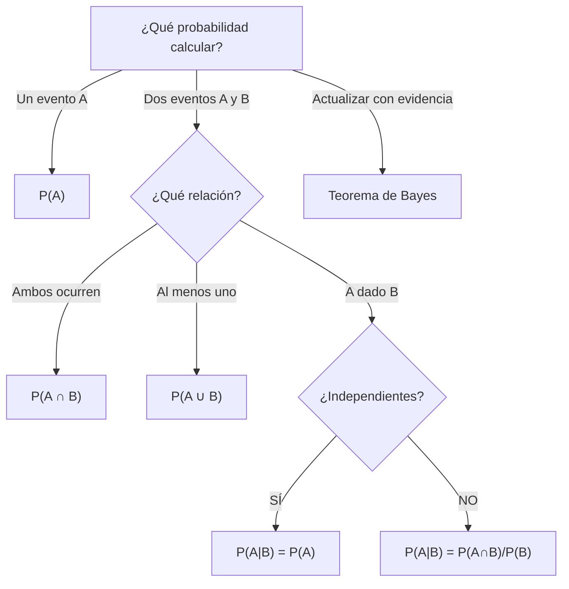

title: "UD2 — Eventos y probabilidad básica"
slug: "ud2-eventos-probabilidad"
date: "2026-01-14"
authors: ["Profesor UAX"]
tags: ["ud2", "probabilidad", "eventos", "espacio-muestral", "condicional"]
difficulty: "intro"
type: "definicion"
prerequisitos: ["ud1-introduccion"]

---

## Objetivo

✨ Comprender los **fundamentos de la probabilidad** — espacios muestrales, eventos, axiomas y probabilidad condicional — bases para toda inferencia estadística.

## Idea Clave 💡

**La probabilidad cuantifica incertidumbre.** Desde juegos de dados hasta diagnósticos médicos, la probabilidad nos permite modelar eventos inciertos con rigor matemático. Sin entender probabilidad, no puedes hacer inferencia válida.

---

## Conceptos Fundamentales

### Espacio Muestral (Ω)

**Definición:** El conjunto de **todos los resultados posibles** de un experimento aleatorio.

**Ejemplos:**

- 🎲 Lanzar un dado: Ω = {1, 2, 3, 4, 5, 6}
- 🪙 Lanzar una moneda 2 veces: Ω = {CC, CX, XC, XX}
- 📞 Número de llamadas en 1 hora: Ω = {0, 1, 2, 3, ...}
- 📏 Altura de estudiantes: Ω = (140, 210) cm (intervalo continuo)

**Características:**

- ✅ Debe ser exhaustivo (cubre todos los casos)
- ✅ Mutuamente excluyente (ninguna superposición)
- ✅ Nivel de detalle depende del problema

???+ example "Ejemplo: Lanzar Dos Dados"

    Ω = {(1,1), (1,2), ..., (1,6), (2,1), ..., (6,6)}

    |Ω| = 36 resultados posibles

---

### Evento (A)

**Definición:** Un **subconjunto de Ω** — una colección de resultados de interés.

**Tipos:**

- 🔴 **Evento simple:** Un único resultado (p.ej., sacar un 6)
- 🟠 **Evento compuesto:** Varios resultados (p.ej., sacar número par)
- ⚫ **Evento seguro:** Ω completo (probabilidad = 1)
- 💨 **Evento imposible:** ∅ vacío (probabilidad = 0)

???+ example "Ejemplo: Lanzar Un Dado"

    Ω = {1, 2, 3, 4, 5, 6}

    A = "sacar un número par" = {2, 4, 6}

    B = "sacar mayor que 4" = {5, 6}

    A ∩ B = {6} (intersección)

    A ∪ B = {2, 4, 5, 6} (unión)

---

## Axiomas de Kolmogorov (Fundamentos)

La probabilidad debe cumplir **3 axiomas fundamentales**:

| **Axioma**            | **Fórmula**                                      | **Interpretación**             |
| :-------------------- | :----------------------------------------------- | :----------------------------- |
| 1️⃣ **No negatividad** | $P(A) \geq 0$                                    | Probabilidad nunca es negativa |
| 2️⃣ **Certeza**        | $P(\Omega) = 1$                                  | Seguro de que ocurre algo      |
| 3️⃣ **Aditividad**     | $P(A_1 \cup A_2) = P(A_1) + P(A_2)$ si disjuntos | Suma de eventos disjuntos      |

**De estos axiomas se derivan:**

- $P(\emptyset) = 0$ (imposible)
- $P(\bar{A}) = 1 - P(A)$ (complemento)
- $P(A \cup B) = P(A) + P(B) - P(A \cap B)$ (inclusión-exclusión)

???+ example "Ejemplo: Baraja de Cartas"

    Ω = 52 cartas

    A = "as de cualquier palo" = 4 cartas

    P(A) = 4/52 = 1/13 ≈ 0.077

    P(no as) = 1 - 1/13 = 12/13 ≈ 0.923

---

## Probabilidad Condicional

### Definición

**Pregunta:** "Dado que pasó B, ¿cuál es la probabilidad de A?"

$$P(A|B) = \frac{P(A \cap B)}{P(B)}, \quad P(B) > 0$$

**Intuición:** Restriccionamos el espacio muestral a B, y calculamos qué fracción de B está también en A.

???+ example "Ejemplo: Dos Dados"

    Ω = {(1,1), (1,2), ..., (6,6)} = 36 resultados

    A = "suma = 7" = {(1,6), (2,5), (3,4), (4,3), (5,2), (6,1)} → 6 resultados

    B = "primer dado = 3" = {(3,1), (3,2), (3,3), (3,4), (3,5), (3,6)} → 6 resultados

    A ∩ B = {(3,4)} → 1 resultado

    P(A) = 6/36 = 1/6

    P(A|B) = P(A ∩ B)/P(B) = (1/36)/(6/36) = 1/6

---

### Independencia

**Definición:** A y B son **independientes** si:

$$P(A|B) = P(A)$$

O equivalentemente: $P(A \cap B) = P(A) \cdot P(B)$

**Intuición:** El hecho de que B ocurra no afecta la probabilidad de A.

???+ example "Ejemplo: Lanzamientos Independientes"

    Lanzar dos dados justos son eventos independientes:

    P(dado1 = 5 Y dado2 = 3) = P(dado1=5) × P(dado2=3) = (1/6) × (1/6) = 1/36 ✅

---

## Teorema de Bayes 🔮

**Fórmula:**

$$P(A|B) = \frac{P(B|A) \cdot P(A)}{P(B)}$$

**Componentes:**

- **P(A)** = Probabilidad a priori (antes de ver evidencia)
- **P(B|A)** = Verosimilitud (evidencia dada A)
- **P(B)** = Probabilidad de la evidencia
- **P(A|B)** = Probabilidad a posteriori (después de ver B)

**¿Por qué importa?** Permite **actualizar creencias** con nueva información.

???+ example "Ejemplo Crucial: Test Médico"

    Un test detecta enfermedad E:
    - Sensibilidad: P(+|E) = 95% (detecta 95% de enfermos)
    - Especificidad: P(-|¬E) = 90% (detecta 90% de sanos)
    - Prevalencia: P(E) = 1% (1 de 100 tiene la enfermedad)

    **Pregunta:** ¿Si doy positivo, realmente tengo la enfermedad?

    **Solución:**
    $$P(E|+) = \frac{P(+|E) \cdot P(E)}{P(+)}$$

    Primero calcular P(+):
    $$P(+) = P(+|E) \cdot P(E) + P(+|\neg E) \cdot P(\neg E)$$
    $$= 0.95 \times 0.01 + 0.10 \times 0.99 = 0.0095 + 0.099 = 0.1085$$

    Luego:
    $$P(E|+) = \frac{0.95 \times 0.01}{0.1085} = \frac{0.0095}{0.1085} \approx 0.0876 \approx 8.76\%$$

    **¡Sorpresa!** A pesar de 95% de sensibilidad, un positivo solo significa ~9% de probabilidad de tener la enfermedad (porque es muy rara).

---

## Tabla Comparativa: Probabilidades

| **Concepto**    | **Fórmula**                       | **Interpretación**        |
| :-------------- | :-------------------------------- | :------------------------ |
| **Simple**      | P(A)                              | Probabilidad de un evento |
| **Conjunta**    | P(A ∩ B)                          | Probabilidad de A y B     |
| **Unión**       | P(A ∪ B) = P(A) + P(B) - P(A ∩ B) | Probabilidad de A o B     |
| **Condicional** | P(A\|B) = P(A∩B)/P(B)             | A dado que B              |
| **Bayes**       | P(A\|B) = P(B\|A)P(A)/P(B)        | Actualizar con evidencia  |

---

## Diagrama de Decisión: ¿Qué Fórmula Usar?

---

## ⚠️ Trampa Común: Falacia del Fiscal

**Confundir P(B|A) con P(A|B)**

❌ **INCORRECTO:** "El test es 95% preciso, así que si doy positivo, tengo 95% de probabilidad de tener la enfermedad"

✅ **CORRECTO:** Usar Bayes. La probabilidad real depende de la prevalencia (como vimos, ~9%).

**Lección:** Siempre usa Bayes cuando quieras pasar de "evidencia dado hipótesis" a "hipótesis dada evidencia".

---

## 💡 Tips Prácticos

!!! tip "Verificar Probabilidades"

    - ¿Todas están entre 0 y 1?
    - ¿Los eventos cubren todo Ω? (suma = 1 si disjuntos)
    - ¿Son eventos independientes o dependientes?

!!! warning "Cuidado con la Independencia"

    No asumir independencia sin justificar. Ejemplo:

    - Estar enfermo Y tener síntomas: **NO independiente**
    - Lanzar dos dados: **SÍ independiente**

!!! note "Bayes en la Práctica"

    Siempre que veas "probabilidad de hipótesis dada evidencia", piensa en Bayes:
    - Diagnóstico médico
    - Filtros de spam
    - Detección de fraude
    - Machine Learning

---

## 📝 Ejercicios Clave

!!! tip "Practica Estos"

    1. Lanzar dos dados: P(suma = 7)
    2. Test médico: P(Enfermedad|Positivo)
    3. Baraja: P(as O rey)
    4. Eventos independientes: P(lluvia Y atasco)

---

## 📖 Enlaces Relacionados

- [Variables aleatorias](./variables-aleatorias.md) — Próximo nivel: formalizar probabilidad
- [Distribuciones discretas](./distribuciones-discretas.md) — Aplicar a casos reales
- [Distribuciones continuas](./distribuciones-continuas.md) — Extensión a variables continuas
