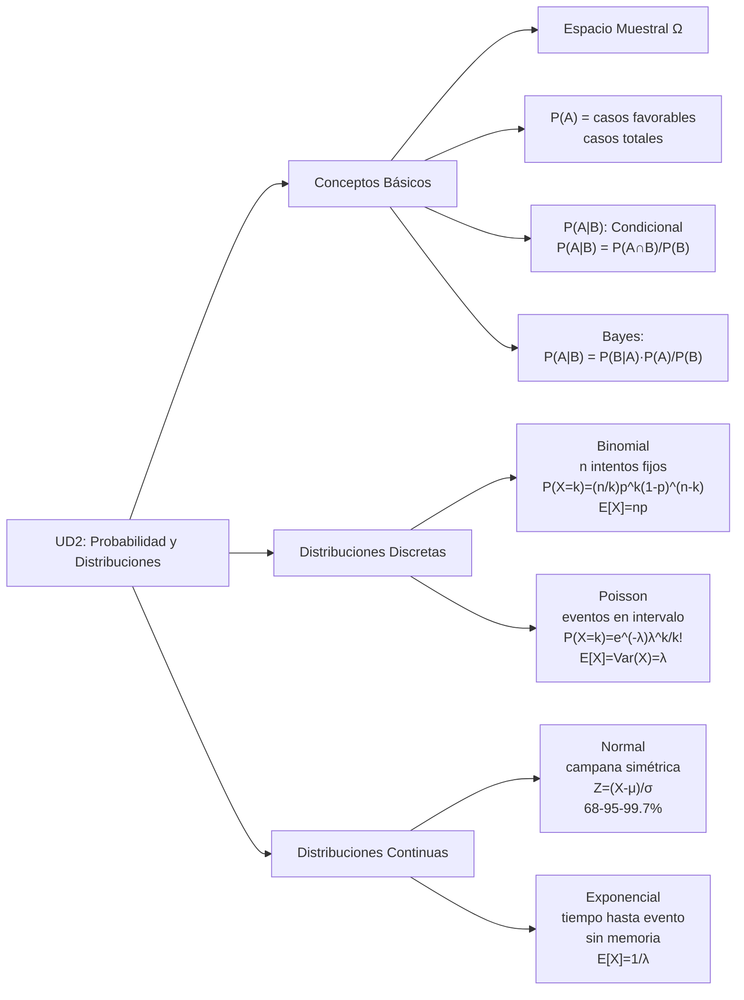

## ✨ Mapa Rápido de Conceptos UD2

---

## Conceptos Clave en 1 Página

### Espacios y Eventos

| Concepto         | Símbolo   | Significado                   |
| :--------------- | :-------- | :---------------------------- |
| Espacio Muestral | Ω         | Todos los posibles resultados |
| Evento           | A, B, ... | Subconjunto de Ω              |
| Evento Seguro    | Ω         | Ocurre siempre, P(Ω) = 1      |
| Evento Imposible | ∅         | Nunca ocurre, P(∅) = 0        |

### Probabilidad

- **Básica:** $P(A) = \frac{\text{casos favorables}}{\text{casos totales}}$
- **Condicional:** $P(A|B) = \frac{P(A \cap B)}{P(B)}$ = "prob de A sabiendo que B ocurre"
- **Bayes:** $P(A|B) = \frac{P(B|A) \cdot P(A)}{P(B)}$
- **Falacia Fiscal:** $P(B|A) \neq P(A|B)$ — ¡casi siempre diferentes!

### Variables Aleatorias

- **Esperanza:** $E[X] = \sum x \cdot P(X=x)$ (valor promedio)
- **Varianza:** $\text{Var}(X) = E[X^2] - (E[X])^2$ (dispersión)
- **Trampa:** $E[X^2] \neq (E[X])^2$

---

## Distribuciones Discretas (Conteos)

### Distribución Binomial

**Cuándo:** n intentos **fijos**, cada uno éxito (prob p) o fracaso

| Aspecto      | Fórmula / Valor                                     |
| :----------- | :-------------------------------------------------- |
| Probabilidad | $P(X=k) = \binom{n}{k} \cdot p^k \cdot (1-p)^{n-k}$ |
| Media        | $\mu = n \cdot p$                                   |
| Varianza     | $\sigma^2 = n \cdot p \cdot (1-p)$                  |
| Requisitos   | n fijo, p constante, intentos independientes        |
| Aproximación | Si $n>30$ y $p \approx 0.5$, usa Normal             |

**Ejemplo:** 10 monedas, ¿prob de 3 caras? → $\text{Bin}(10, 0.5)$, $P(X=3) = 0.117$

### Distribución Poisson

**Cuándo:** **Tasa** eventos λ, intervalo continuo (tiempo/espacio)

| Aspecto      | Fórmula / Valor                                           |
| :----------- | :-------------------------------------------------------- |
| Probabilidad | $P(X=k) = \frac{e^{-\lambda} \cdot \lambda^k}{k!}$        |
| Media        | $E[X] = \lambda$                                          |
| Varianza     | $\text{Var}(X) = \lambda$                                 |
| Cuándo       | Tasa constante, eventos independientes, sin simultaneidad |
| Regla        | Si P(+\|+) de Poisson: media $\approx$ varianza           |

**Ejemplo:** 5 llamadas/hora, ¿prob de 3 en una hora? → $P(\lambda=5, k=3) = 0.140$

---

## Distribuciones Continuas (Variables Continuas)

### Distribución Normal (Gaussiana)

**Cuándo:** Campana simétrica, muchos procesos naturales

| Aspecto          | Fórmula / Valor                                                               |
| :--------------- | :---------------------------------------------------------------------------- |
| Notación         | $X \sim N(\mu, \sigma^2)$                                                     |
| Estandarizar     | $Z = \frac{X - \mu}{\sigma} \rightarrow Z \sim N(0,1)$                        |
| Regla 68-95-99.7 | 68% dentro $\pm 1\sigma$, 95% $\pm 2\sigma$, 99.7% $\pm 3\sigma$              |
| Críticos         | $z_{0.05} = 1.645$ (90%), $z_{0.025} = 1.96$ (95%), $z_{0.005} = 2.576$ (99%) |
| Cálculo          | $P(a < X < b) = P(\frac{a-\mu}{\sigma} < Z < \frac{b-\mu}{\sigma})$ → tabla Z |

**Ejemplo:** Altura $\sim N(170, 8^2)$. $P(\text{altura} < 178) = P(Z < 1) = 0.8413$

### Distribución Exponencial

**Cuándo:** Tiempo hasta evento, relación Poisson (eventos/tasa) ↔ Exponencial (tiempos)

| Aspecto   | Fórmula / Valor                                 |
| :-------- | :---------------------------------------------- |
| Parámetro | $\lambda$ = tasa                                |
| Media     | $E[X] = \frac{1}{\lambda}$                      |
| Varianza  | $\text{Var}(X) = \frac{1}{\lambda^2}$           |
| CDF       | $P(X \leq t) = 1 - e^{-\lambda t}$              |
| Propiedad | Sin memoria: $P(X > s+t \mid X > s) = P(X > t)$ |

**Ejemplo:** Tiempo medio espera = 10 min → $\lambda = 0.1$, $P(\text{espera} < 5) = 1 - e^{-0.5} = 0.39$

---

## Tabla Comparativa: Toda UD2

| Característica |    Binomial     |     Poisson     |       Normal        |      Exponencial      |
| :------------- | :-------------: | :-------------: | :-----------------: | :-------------------: |
| **Tipo**       |    Discreta     |    Discreta     |      Continua       |       Continua        |
| **Parámetros** |     $n, p$      |    $\lambda$    |    $\mu, \sigma$    |       $\lambda$       |
| **Media**      |      $np$       |    $\lambda$    |        $\mu$        |  $\frac{1}{\lambda}$  |
| **Varianza**   |    $np(1-p)$    |    $\lambda$    |     $\sigma^2$      | $\frac{1}{\lambda^2}$ |
| **Rango**      |    $0$ a $n$    |   $0,1,2,...$   | $(-\infty,+\infty)$ |     $[0,+\infty)$     |
| **Fórmula**    |    Binomial     |     Poisson     |       Campana       |   $e^{-\lambda x}$    |
| **Cuándo**     |   n intentos    | Tasa/intervalo  |       Campana       |  Tiempo hasta evento  |
| **Ejemplo**    | 20 lanzamientos | 5 llamadas/hora |       Alturas       |  Tiempo entre fallas  |

---

## Trampas del Examen (¡Atención!)

### 🔴 Trampa 1: Bayes y Test Médico

"Si un test da positivo, tengo 95% prob de tener la enfermedad" ❌

**Verdad:** Usá Bayes. Si enfermedad rara (1%), $P(E|+)$ puede ser solo ~30%.

**Clave:** Baja prevalencia + sensibilidad/especificidad finitas = muchos falsos positivos

### 🔴 Trampa 2: Confundir Binomial ↔ Poisson

- **Binomial:** "En 50 intentos, ¿cuántos éxitos?" → n es FIJO
- **Poisson:** "Eventos por hora" → TASA, no n fijo

### 🔴 Trampa 3: $E[X^2]$ vs $(E[X])^2$

$E[X^2] = 6.5$, pero $(E[X])^2 = 6.25$ → ¡NO son iguales!

**Varianza siempre es:** $\text{Var}(X) = E[X^2] - (E[X])^2$

### 🔴 Trampa 4: Olvidar Estandarizar en Normal

$P(X < 175)$ cuando $X \sim N(170, 8^2)$?

**Correcto:** Primero $Z = \frac{175-170}{8} = 0.625$, luego tabla Z

### 🔴 Trampa 5: $z = 1.96$ siempre

$z = 1.96$ es para **95% confianza**. Para 90% usa $1.645$, para 99% usa $2.576$.

---

## Checklist Rápido Antes del Examen

✅ **Variables Aleatorias:**

- [ ] Entiendo qué es X (el qué contar)
- [ ] Distingo Discreta (conteo) vs Continua (medida)
- [ ] Puedo calcular $E[X]$ y $\text{Var}(X)$
- [ ] Sé que $E[X^2] \neq (E[X])^2$

✅ **Probabilidad:**

- [ ] Conozco fórmula Bayes
- [ ] Entiendo falacia fiscal: $P(A|B) \neq P(B|A)$
- [ ] Recuerdo axiomas: $P(\Omega)=1$, $P(\emptyset)=0$

✅ **Distribuciones:**

- [ ] Binomial = n fijo, éxito/fracaso
- [ ] Poisson = tasa, eventos raros
- [ ] Normal = campana, estandarizar con Z
- [ ] Exponencial = tiempo hasta evento, sin memoria

✅ **Tabla Normal:**

- [ ] $z = 1.645$ para 90%
- [ ] $z = 1.96$ para 95%
- [ ] $z = 2.576$ para 99%
- [ ] Sé buscar en tabla Z

---

## 📝 Problemas Tipo Examen

1. **Bayes + Prevalencia:** "Test 95% sens, 90% espec, 2% prev. P(E|+)?" → Usa Bayes, posible trampa
2. **Binomial:** "10 monedas, P(≤3 caras)?" → Suma P(0)+P(1)+P(2)+P(3)
3. **Poisson:** "3 eventos/hora, P(0 en 1 hora)?" → e^(-3) ≈ 0.05
4. **Normal:** "X~N(100,25), P(X<110)?" → Z=(110-100)/5=2, tabla Z(2)≈0.977
5. **Esperanza:** "X={1,2,3} con prob 0.5,0.3,0.2. E[X] y Var(X)?" → Fórmula suma

---

## 📖 Enlaces de Referencia

- [Eventos y probabilidad](./eventos-y-probabilidad.md) — Fundamentos Bayes
- [Variables aleatorias](./variables-aleatorias.md) — E[X], Var(X)
- [Distribuciones discretas](./distribuciones-discretas.md) — Binomial/Poisson en detalle
- [Distribuciones continuas](./distribuciones-continuas.md) — Normal/Exponencial en detalle
- [Ejercicios UD2](./ejercicios.md) — 9 problemas resueltos paso a paso
