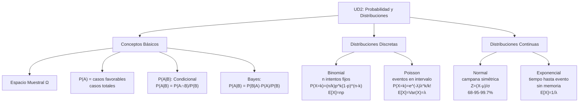

## ✨ Mapa Rápido de Conceptos UD2

---

## Conceptos Clave en 1 Página

### Espacios y Eventos

| Concepto         | Símbolo   | Significado                   |
| :--------------- | :-------- | :---------------------------- |
| Espacio Muestral | Ω         | Todos los posibles resultados |
| Evento           | A, B, ... | Subconjunto de Ω              |
| Evento Seguro    | Ω         | Ocurre siempre, P(Ω) = 1      |
| Evento Imposible | ∅         | Nunca ocurre, P(∅) = 0        |

### Probabilidad

- **Básica:** P(A) = (casos favorables) / (casos totales)
- **Condicional:** P(A\|B) = P(A∩B) / P(B) = "prob de A sabiendo que B ocurre"
- **Bayes:** P(A\|B) = P(B\|A) · P(A) / P(B)
- **Falacia Fiscal:** P(B\|A) ≠ P(A\|B) — ¡casi siempre diferentes!

### Variables Aleatorias

- **Esperanza:** E[X] = Σ x · P(X=x) (valor promedio)
- **Varianza:** Var(X) = E[X²] - (E[X])² (dispersión)
- **Trampa:** E[X²] ≠ (E[X])²

---

## Distribuciones Discretas (Conteos)

### Distribución Binomial

**Cuándo:** n intentos **fijos**, cada uno éxito (prob p) o fracaso

| Aspecto      | Fórmula / Valor                              |
| :----------- | :------------------------------------------- |
| Probabilidad | P(X=k) = (n/k) · p^k · (1-p)^(n-k)           |
| Media        | μ = n·p                                      |
| Varianza     | σ² = n·p·(1-p)                               |
| Requisitos   | n fijo, p constante, intentos independientes |
| Aproximación | Si n>30 y p ≈ 0.5, usa Normal                |

**Ejemplo:** 10 monedas, ¿prob de 3 caras? → Bin(10, 0.5), P(X=3) = 0.117

### Distribución Poisson

**Cuándo:** **Tasa** eventos λ, intervalo continuo (tiempo/espacio)

| Aspecto      | Fórmula / Valor                                           |
| :----------- | :-------------------------------------------------------- |
| Probabilidad | P(X=k) = e^(-λ) · λ^k / k!                                |
| Media        | E[X] = λ                                                  |
| Varianza     | Var(X) = λ                                                |
| Cuándo       | Tasa constante, eventos independientes, sin simultaneidad |
| Regla        | Si P(+\|+) de Poisson: media ≈ varianza                   |

**Ejemplo:** 5 llamadas/hora, ¿prob de 3 en una hora? → P(λ=5, k=3) = 0.140

---

## Distribuciones Continuas (Variables Continuas)

### Distribución Normal (Gaussiana)

**Cuándo:** Campana simétrica, muchos procesos naturales

| Aspecto          | Fórmula / Valor                                                |
| :--------------- | :------------------------------------------------------------- |
| Notación         | X ~ N(μ, σ²)                                                   |
| Estandarizar     | Z = (X - μ) / σ → Z ~ N(0,1)                                   |
| Regla 68-95-99.7 | 68% dentro ±1σ, 95% ±2σ, 99.7% ±3σ                             |
| Críticos         | z₀.₀₅ = 1.645 (90%), z₀.₀₂₅ = 1.96 (95%), z₀.₀₀₅ = 2.576 (99%) |
| Cálculo          | P(a < X < b) = P((a-μ)/σ < Z < (b-μ)/σ) → tabla Z              |

**Ejemplo:** Altura ~ N(170, 8²). P(altura < 178) = P(Z < 1) = 0.8413

### Distribución Exponencial

**Cuándo:** Tiempo hasta evento, relación Poisson (eventos/tasa) ↔ Exponencial (tiempos)

| Aspecto   | Fórmula / Valor                             |
| :-------- | :------------------------------------------ |
| Parámetro | λ = tasa                                    |
| Media     | E[X] = 1/λ                                  |
| Varianza  | Var(X) = 1/λ²                               |
| CDF       | P(X ≤ t) = 1 - e^(-λt)                      |
| Propiedad | Sin memoria: P(X > s+t \| X > s) = P(X > t) |

**Ejemplo:** Tiempo medio espera = 10 min → λ = 0.1, P(espera < 5) = 1 - e^(-0.5) = 0.39

---

## Tabla Comparativa: Toda UD2

| Característica |    Binomial     |     Poisson     |  Normal  |     Exponencial     |
| :------------- | :-------------: | :-------------: | :------: | :-----------------: |
| **Tipo**       |    Discreta     |    Discreta     | Continua |      Continua       |
| **Parámetros** |      n, p       |        λ        |   μ, σ   |          λ          |
| **Media**      |       np        |        λ        |    μ     |         1/λ         |
| **Varianza**   |     np(1-p)     |        λ        |    σ²    |        1/λ²         |
| **Rango**      |      0 a n      |    0,1,2,...    | (-∞,+∞)  |       [0,+∞)        |
| **Fórmula**    |    Binomial     |     Poisson     | Campana  |       e^(-λx)       |
| **Cuándo**     |   n intentos    | Tasa/intervalo  | Campana  | Tiempo hasta evento |
| **Ejemplo**    | 20 lanzamientos | 5 llamadas/hora | Alturas  | Tiempo entre fallas |

---

## Trampas del Examen (¡Atención!)

### 🔴 Trampa 1: Bayes y Test Médico

"Si un test da positivo, tengo 95% prob de tener la enfermedad" ❌

**Verdad:** Usá Bayes. Si enfermedad rara (1%), P(E|+) puede ser solo ~30%.

**Clave:** Baja prevalencia + sensibilidad/especificidad finitas = muchos falsos positivos

### 🔴 Trampa 2: Confundir Binomial ↔ Poisson

- **Binomial:** "En 50 intentos, ¿cuántos éxitos?" → n es FIJO
- **Poisson:** "Eventos por hora" → TASA, no n fijo

### 🔴 Trampa 3: E[X²] vs (E[X])²

E[X²] = 6.5, pero (E[X])² = 6.25 → ¡NO son iguales!

**Varianza siempre es:** Var(X) = E[X²] - (E[X])²

### 🔴 Trampa 4: Olvidar Estandarizar en Normal

P(X < 175) cuando X ~ N(170, 8²)?

**Correcto:** Primero Z = (175-170)/8 = 0.625, luego tabla Z

### 🔴 Trampa 5: z = 1.96 siempre

z = 1.96 es para **95% confianza**. Para 90% usa 1.645, para 99% usa 2.576.

---

## Checklist Rápido Antes del Examen

✅ **Variables Aleatorias:**

- [ ] Entiendo qué es X (el qué contar)
- [ ] Distingo Discreta (conteo) vs Continua (medida)
- [ ] Puedo calcular E[X] y Var(X)
- [ ] Sé que E[X²] ≠ (E[X])²

✅ **Probabilidad:**

- [ ] Conozco fórmula Bayes
- [ ] Entiendo falacia fiscal: P(A|B) ≠ P(B|A)
- [ ] Recuerdo axiomas: P(Ω)=1, P(∅)=0

✅ **Distribuciones:**

- [ ] Binomial = n fijo, éxito/fracaso
- [ ] Poisson = tasa, eventos raros
- [ ] Normal = campana, estandarizar con Z
- [ ] Exponencial = tiempo hasta evento, sin memoria

✅ **Tabla Normal:**

- [ ] z = 1.645 para 90%
- [ ] z = 1.96 para 95%
- [ ] z = 2.576 para 99%
- [ ] Sé buscar en tabla Z

---

## 📝 Problemas Tipo Examen

1. **Bayes + Prevalencia:** "Test 95% sens, 90% espec, 2% prev. P(E|+)?" → Usa Bayes, posible trampa
2. **Binomial:** "10 monedas, P(≤3 caras)?" → Suma P(0)+P(1)+P(2)+P(3)
3. **Poisson:** "3 eventos/hora, P(0 en 1 hora)?" → e^(-3) ≈ 0.05
4. **Normal:** "X~N(100,25), P(X<110)?" → Z=(110-100)/5=2, tabla Z(2)≈0.977
5. **Esperanza:** "X={1,2,3} con prob 0.5,0.3,0.2. E[X] y Var(X)?" → Fórmula suma

---

## 📖 Enlaces de Referencia

- [Eventos y probabilidad](./eventos-y-probabilidad.md) — Fundamentos Bayes
- [Variables aleatorias](./variables-aleatorias.md) — E[X], Var(X)
- [Distribuciones discretas](./distribuciones-discretas.md) — Binomial/Poisson en detalle
- [Distribuciones continuas](./distribuciones-continuas.md) — Normal/Exponencial en detalle
- [Ejercicios UD2](./ejercicios.md) — 9 problemas resueltos paso a paso
