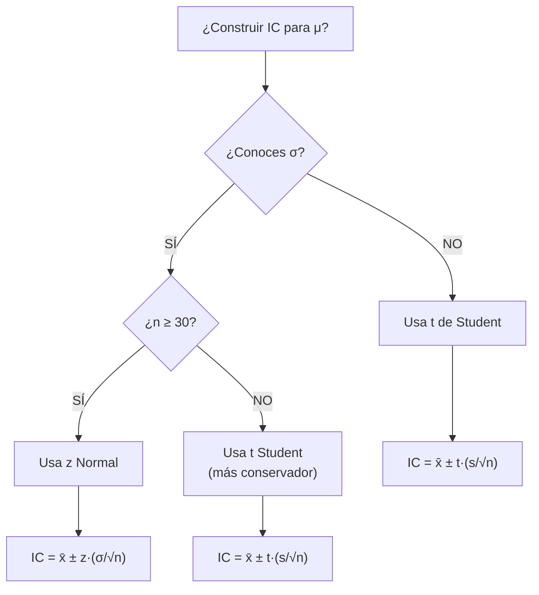

title: "Estimación puntual y por intervalos de confianza"
slug: "ud3-estimacion-intervalos"
date: "2026-01-14"
authors: ["Profesor UAX"]
tags: ["ud3", "estimacion", "intervalos", "confianza", "inferencia"]
difficulty: "intermedio"
type: "definicion"
prerequisitos: ["ud2-distribuciones-continuas", "ud2-variables-aleatorias"]

---

## Objetivo

✨ Comprender cómo estimar parámetros poblacionales (μ, σ) a partir de muestras, y construir intervalos de confianza para cuantificar incertidumbre.

## Idea Clave 💡

**La estimación puntual (un número) es insuficiente. Los intervalos de confianza muestran el rango donde probablemente está el parámetro verdadero.** Esto es la base de toda inferencia estadística.

---

## Estimación Puntual

### Definición

Un **estimador puntual** es una función de la muestra que aproxima un parámetro poblacional desconocido.

**Ejemplos:**

- Media muestral $\bar{x}$ estima la media poblacional μ
- Varianza muestral $s^2$ estima la varianza poblacional σ²
- Proporción muestral $\hat{p}$ estima la proporción poblacional p

### Propiedades Deseables

1. **Insesgadez:** E[estimador] = parámetro verdadero
2. **Consistencia:** A mayor n, más cerca del parámetro verdadero
3. **Eficiencia:** Varianza mínima entre estimadores insesgados

???+ example "Ejemplo: Estimador de Media"

    Muestra: {2, 4, 6, 8}

    Estimador puntual: $\bar{x} = (2+4+6+8)/4 = 5$

    Interpretación: estimamos que μ ≈ 5

    Pero ¿de exacto está 5? ¿μ podría ser 4.8 o 5.2?
    → Necesitamos intervalo de confianza

---

## Intervalos de Confianza

### Concepto Fundamental

Un **intervalo de confianza al (1-α)·100%** es un rango $[L, U]$ tal que si repitiéramos el experimento muchas veces, aproximadamente (1-α)·100% de los intervalos construidos contendrían el verdadero parámetro.

**NO significa:** "el parámetro está en este intervalo con probabilidad (1-α)". El parámetro es fijo, lo variable es el intervalo.

### IC para la Media (σ conocida)

**Fórmula:**

$$\text{IC}_{1-\alpha} = \bar{x} \pm z_{1-\alpha/2} \cdot \frac{\sigma}{\sqrt{n}}$$

Donde:

- $\bar{x}$ = media muestral
- $z_{1-\alpha/2}$ = valor crítico de tabla Normal estándar
- $\sigma$ = desviación típica poblacional (conocida)
- $n$ = tamaño muestral
- $\frac{\sigma}{\sqrt{n}}$ = error estándar

**Valores críticos usuales:**

- 90% confianza: z = 1.645
- 95% confianza: z = 1.96
- 99% confianza: z = 2.576

???+ example "Ejemplo 1: IC con σ Conocida"

    Datos: n = 25, $\bar{x}$ = 100, σ = 15 (conocida), nivel 95%

    Paso 1: Error estándar
    $$SE = \frac{15}{\sqrt{25}} = \frac{15}{5} = 3$$

    Paso 2: Valor crítico
    $$z_{0.975} = 1.96$$

    Paso 3: Margen de error
    $$ME = 1.96 \times 3 = 5.88$$

    Paso 4: Intervalo
    $$IC_{95\%} = 100 \pm 5.88 = [94.12, 105.88]$$

    **Interpretación:** Estamos 95% confiados de que μ está entre 94.12 y 105.88.

---

### IC para la Media (σ desconocida) — Distribución t

Cuando σ es desconocida y/o n es pequeño, usamos **t de Student en lugar de Normal:**

$$\text{IC}_{1-\alpha} = \bar{x} \pm t_{1-\alpha/2, n-1} \cdot \frac{s}{\sqrt{n}}$$

Donde:

- $s$ = desviación típica muestral
- $t_{1-\alpha/2, n-1}$ = valor crítico t con n-1 grados de libertad
- Conforme n → ∞, t → z

**¿Cuándo usar t?**

- ✅ Siempre que σ sea desconocida
- ✅ Especialmente importante si n < 30
- ✅ Si n > 100, prácticamente igual a z

???+ example "Ejemplo 2: IC con σ Desconocida (t de Student)"

    Datos: n = 16, $\bar{x}$ = 50, s = 4, nivel 95%

    Paso 1: Error estándar
    $$SE = \frac{4}{\sqrt{16}} = \frac{4}{4} = 1$$

    Paso 2: Grados de libertad
    $$gl = n - 1 = 15$$

    Paso 3: Valor crítico (tabla t)
    $$t_{0.975, 15} \approx 2.131$$

    Paso 4: Margen de error
    $$ME = 2.131 \times 1 = 2.131$$

    Paso 5: Intervalo
    $$IC_{95\%} = 50 \pm 2.131 = [47.869, 52.131]$$

    **Interpretación:** Estamos 95% confiados de que μ está entre 47.87 y 52.13.

---

## Tabla Comparativa: z vs t

| Aspecto                | z (σ conocida)         | t (σ desconocida)          |
| :--------------------- | :--------------------- | :------------------------- |
| **Cuándo usar**        | σ conocida, n grande   | σ desconocida, cualquier n |
| **Distribución**       | Normal estándar N(0,1) | t de Student               |
| **Grados de libertad** | —                      | n - 1                      |
| **Valores críticos**   | 1.645, 1.96, 2.576     | Dependen de gl (tabla)     |
| **n pequeño**          | Menos exacto           | Más fiable                 |
| **n grande**           | Exacto                 | Converge a z               |

---

## Diagrama de Decisión: ¿z o t?

---

## Interpretación Correcta

⚠️ **INCORRECTO:**

- "Hay 95% probabilidad de que μ esté en [94.12, 105.88]"
- "El parámetro es variable"

✅ **CORRECTO:**

- "Si repetiéramos el experimento 100 veces y construyéramos 100 intervalos, aproximadamente 95 contendrían μ"
- "El parámetro es fijo, el intervalo es variable"

---

## Longitud del IC y Factores

La longitud del IC es: $2 \times z_{1-\alpha/2} \times \frac{\sigma}{\sqrt{n}}$

**Cómo reducir longitud (más precisión):**

1. ⬆️ Aumentar n (reduce $\frac{1}{\sqrt{n}}$)
2. ⬇️ Reducir σ (menos variabilidad en datos)
3. ⬇️ Aceptar menor confianza (de 99% a 95%)

???+ tip "Relación n y Precisión"

    - n = 25: ME ≈ ±5.88
    - n = 100: ME ≈ ±2.94 (25% más preciso)
    - n = 400: ME ≈ ±1.47 (50% más preciso)

    Aumentar n tiene rendimientos decrecientes.

---

## ⚠️ Trampas Comunes

### Trampa 1: Confundir Nivel de Confianza con p-valor

❌ "El IC al 95% significa p-valor = 0.05"

✅ IC y p-valor son conceptos relacionados pero distintos. Nivel 95% ↔ α = 0.05.

### Trampa 2: Usar z cuando desconoces σ

❌ "Como n=15 es pequeño pero conozco x̄ y s, uso z"

✅ Sin σ, siempre usa t. Es más conservador (intervalos más anchos).

### Trampa 3: Ignorar supuestos

IC normales requieren:

- Muestra aleatoria
- Si n pequeño, población aproximadamente normal
- Si n grande, teorema central del límite da normalidad

---

## 💡 Checklist: Construir IC

!!! tip "Paso a Paso"

    1. [ ] ¿Qué parámetro estimas? (μ, p, σ)
    2. [ ] ¿Qué nivel de confianza? (90%, 95%, 99%)
    3. [ ] ¿Conoces σ? (z) o ¿desconocida? (t)
    4. [ ] Calcula error estándar: SE = σ/√n o s/√n
    5. [ ] Busca valor crítico (tabla z o t)
    6. [ ] Calcula margen de error: ME = valor × SE
    7. [ ] IC = estimador ± ME
    8. [ ] Interpreta en contexto

---

## 📝 Ejercicios Prácticos

!!! tip "Práctica"

    1. n=36, x̄=120, σ=24. IC al 95%? (σ conocida)
    2. n=20, x̄=50, s=5. IC al 95%? (σ desconocida, t)
    3. Si duplicas n, ¿cómo cambia la longitud del IC?
    4. ¿Qué IC es más preciso: 95% o 99%? ¿Por qué?

---

## 📖 Enlaces Relacionados

- [Distribuciones continuas](../ud2/distribuciones-continuas.md) — Tabla Normal y t
- [Pruebas de hipótesis](./pruebas-hipotesis.md) — Relación IC ↔ contraste
- [Ejercicios UD3](./ejercicios.md) — Problemas resueltos paso a paso
