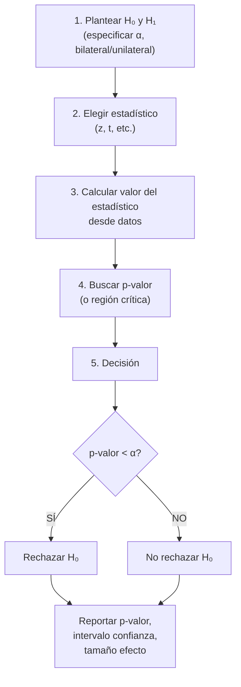

title: "Pruebas de hipótesis y contrastes de significación"
slug: "ud3-pruebas-hipotesis"
date: "2026-01-14"
authors: ["Profesor UAX"]
tags: ["ud3", "hipotesis", "contraste", "significacion", "p-valor"]
difficulty: "intermedio"
type: "definicion"
prerequisitos: ["ud3-estimacion-intervalos", "ud2-distribuciones-continuas"]

---

## Objetivo

✨ Formular y contrastar hipótesis sobre parámetros poblacionales, comprender errores Tipo I/II, y interpretar p-valores.

## Idea Clave 💡

**Las pruebas de hipótesis responden: "¿Los datos son compatibles con H₀?"** No probamos que H₀ sea verdadera, solo si hay evidencia suficiente para rechazarla. El p-valor es la probabilidad de observar los datos (o más extremos) si H₀ fuera cierta.

---

## Formulación de Hipótesis

### Hipótesis Nula (H₀) y Alternativa (H₁)

- **H₀:** Afirmación inicial sobre el parámetro (igualdad)
- **H₁:** Alternativa que investigamos

**Ejemplos:**

| Contexto                   | H₀                  | H₁                  |
| :------------------------- | :------------------ | :------------------ |
| Nuevo medicamento ineficaz | μ = μ₀ (efecto = 0) | μ ≠ μ₀ (efecto ≠ 0) |
| Máquina descalibrada       | μ = 100 g           | μ ≠ 100 g           |
| Dieta reduce peso          | μ ≥ 80 kg           | μ < 80 kg           |

### Tipos de Contraste

1. **Bilateral:** H₁: μ ≠ μ₀ (dos colas, regiones críticas en ambos extremos)
2. **Unilateral derecho:** H₁: μ > μ₀ (una cola derecha)
3. **Unilateral izquierdo:** H₁: μ < μ₀ (una cola izquierda)

---

## Errores Tipo I y Tipo II

### Tabla de Decisión

| Decisión       | H₀ Verdadera         | H₁ Verdadera                 |
| :------------- | :------------------- | :--------------------------- |
| Rechazar H₀    | **Error Tipo I** (α) | ✅ Correcto (potencia = 1-β) |
| No rechazar H₀ | ✅ Correcto          | **Error Tipo II** (β)        |

### Definiciones

- **Error Tipo I (α):** Rechazar H₀ cuando es verdadera (falso positivo)

  - Controlado por el nivel de significación elegido
  - α típico = 0.05 (5%)

- **Error Tipo II (β):** No rechazar H₀ cuando H₁ es verdadera (falso negativo)
  - Menos controlado, depende del tamaño del efecto real
  - Poder = 1 - β (probabilidad de detectar un efecto real)

???+ example "Ejemplo: Test Médico"

    H₀: Paciente sano
    H₁: Paciente enfermo

    Error Tipo I: Decir que está enfermo cuando está sano (alarma falsa, ansiedad)
    Error Tipo II: Decir que está sano cuando está enfermo (grave, diagnóstico perdido)

    En medicina crítica, Error II es peor → bajar α aumenta β

---

## Estadístico de Prueba y p-valor

### Estadístico de Prueba

Para contrastar μ con σ conocida:

$$z = \frac{\bar{x} - \mu_0}{\sigma/\sqrt{n}}$$

Si σ desconocida, usar:

$$t = \frac{\bar{x} - \mu_0}{s/\sqrt{n}}$$

### p-valor (Probabilidad de Significación)

**Definición:** Probabilidad de observar un resultado tan extremo o más que el observado, SI H₀ fuera cierta.

**Interpretación:**

- p-valor **pequeño** (< 0.05): datos poco compatibles con H₀ → rechazar H₀
- p-valor **grande** (> 0.05): datos compatibles con H₀ → no rechazar

**NO es:** Probabilidad de que H₀ sea verdadera. Ni probabilidad de replicar resultados.

???+ example "Ejemplo: p-valor en Contexto"

    Test: H₀: μ = 50 vs H₁: μ ≠ 50

    Si observas z = 2.5 (bilateral):
    - p-valor ≈ 0.012
    - "Si μ = 50, la probabilidad de observar |z| ≥ 2.5 es 1.2%"
    - Como 1.2% < 5%, rechazamos H₀ al nivel 0.05

---

## Procedimiento General de Contraste

---

## Contraste sobre la Media

### Con σ Conocida

$$z = \frac{\bar{x} - \mu_0}{\sigma/\sqrt{n}} \sim N(0,1) \text{ bajo } H_0$$

**Bilateral:** Rechazar si |z| > z*{α/2}
**Unilateral derecho:** Rechazar si z > z*α
**Unilateral izquierdo:** Rechazar si z < -z_α

???+ example "Ejemplo: Contraste Bilateral con z"

    Datos: n=25, x̄=52, σ=10, H₀: μ=50, H₁: μ≠50, α=0.05

    Paso 1: Estadístico
    $$z = \frac{52-50}{10/\sqrt{25}} = \frac{2}{2} = 1$$

    Paso 2: Valor crítico bilateral
    $$z_{0.025} = 1.96$$

    Paso 3: Decisión
    |1| < 1.96 → No rechazar H₀

    Conclusión: No hay evidencia estadística de que μ ≠ 50 al 5%

### Con σ Desconocida (t de Student)

$$t = \frac{\bar{x} - \mu_0}{s/\sqrt{n}} \sim t_{n-1} \text{ bajo } H_0$$

Procedimiento igual pero con tabla t en lugar de z.

---

## Relación: IC ↔ Contraste Bilateral

**Regla práctica:** Si un IC al (1-α)% NO incluye μ₀, rechazamos H₀ al nivel α.

???+ tip "IC vs Contraste"

    IC al 95%: [94.12, 105.88]
    - ¿Contiene 100? SÍ → No rechazar H₀: μ=100 al 5%
    - ¿Contiene 110? NO → Rechazar H₀: μ=110 al 5%

---

## Tabla Comparativa: Valores Críticos

| Nivel (α) | Bilateral z | Unilateral z | Bilateral t (gl=15) | Unilateral t (gl=15) |
| :-------- | :---------: | :----------: | :-----------------: | :------------------: |
| **0.10**  |   ±1.645    |    ±1.28     |       ±1.753        |        ±1.341        |
| **0.05**  |    ±1.96    |    ±1.645    |       ±2.131        |        ±1.753        |
| **0.01**  |   ±2.576    |    ±2.326    |       ±2.947        |        ±2.602        |

---

## ⚠️ Trampas Comunes

### Trampa 1: Interpretar p-valor Incorrectamente

❌ "p-valor = 0.032 significa que hay 3.2% probabilidad de que H₀ sea verdadera"

✅ "p-valor = 0.032 significa que SI H₀ fuera cierta, observaríamos estos datos (o más extremos) con probabilidad 3.2%"

### Trampa 2: Significancia Estadística ≠ Significancia Práctica

❌ "Si p < 0.05, el efecto es importante"

✅ Con n muy grande, efectos pequeños son "significativos". Reporta el tamaño del efecto.

### Trampa 3: Múltiples Pruebas sin Corrección

❌ Hacer 20 pruebas con α=0.05 cada una

✅ Usar correcciones (Bonferroni) si haces múltiples pruebas.

### Trampa 4: Cambiar H₀ después de ver datos

❌ "Observé x̄=52, parece grande, así que contrastaré H₀: μ=51"

✅ Especificar H₀ y H₁ ANTES de recopilar datos.

---

## 💡 Checklist: Realizar Contraste

!!! tip "Paso a Paso"

    1. [ ] Plantear H₀ y H₁ claramente
    2. [ ] Elegir nivel de significación (α típico = 0.05)
    3. [ ] Indicar si bilateral o unilateral
    4. [ ] Calcular estadístico de prueba
    5. [ ] Obtener p-valor (o comparar con valor crítico)
    6. [ ] Decidir: p < α? Rechazar : No rechazar
    7. [ ] Reportar: estadístico, p-valor, conclusión en contexto

---

## 📝 Ejercicios Prácticos

!!! tip "Práctica"

    1. H₀: μ=100, H₁: μ≠100. n=36, x̄=105, σ=12, α=0.05. ¿Rechazar?
    2. Test unilateral H₁: μ>50, n=25, x̄=53, s=5, α=0.05. p-valor? Decisión?
    3. ¿Qué ocurre con Error I vs Error II si bajas α?

---

## 📖 Enlaces Relacionados

- [Estimación e intervalos](./estimacion-y-intervalos.md) — IC como base de contrastes
- [Distribuciones continuas](../ud2/distribuciones-continuas.md) — Tabla Normal y t
- [Ejercicios UD3](./ejercicios.md) — Problemas resueltos
