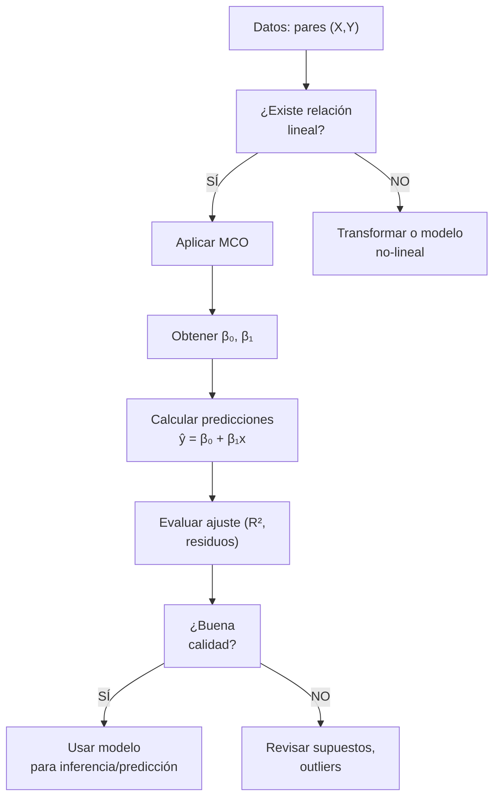

title: "Regresión lineal simple: Modelar relaciones"
slug: "ud3-regresion-simple"
date: "2026-01-14"
authors: ["Profesor UAX"]
tags: ["ud3", "regresion", "lineal", "mco", "ajuste"]
difficulty: "intermedio"
type: "definicion"
prerequisitos: ["ud3-pruebas-hipotesis", "ud2-distribuciones-continuas"]

---

## Objetivo

✨ Modelar relaciones lineales entre variables, estimar parámetros por Mínimos Cuadrados Ordinarios (MCO) y evaluar la calidad del ajuste.

## Idea Clave 💡

**La regresión responde: "¿Cómo predice X a Y?"** Ajustamos una línea a través de los datos para entender y pronosticar la relación. El ajuste nunca es perfecto (hay residuos/errores).

---

## Modelo de Regresión Lineal Simple

### Formulación

$$Y = \beta_0 + \beta_1 X + \varepsilon$$

Donde:

- **Y:** variable dependiente (respuesta)
- **X:** variable independiente (predictor)
- **β₀:** ordenada en el origen (intersección)
- **β₁:** pendiente (cambio en Y por unidad en X)
- **ε:** término de error (variabilidad no explicada)

**Supuestos:**

1. ✅ Linealidad: relación verdadera es lineal
2. ✅ Independencia: observaciones independientes
3. ✅ Homocedasticidad: Var(ε) es constante
4. ✅ Normalidad: ε ~ N(0, σ²)

### Interpretación de Parámetros

- **β₁:** Por cada aumento unitario en X, Y aumenta en promedio β₁ unidades
- **β₀:** Valor predicho de Y cuando X = 0 (a veces sin interpretación práctica)

???+ example "Ejemplo Conceptual: Publicidad vs Ventas"

    Modelo: Ventas = 10 + 5·Publicidad + ε

    - β₀ = 10: sin gastos en publicidad, se predicen 10 unidades de venta base
    - β₁ = 5: cada euro invertido en publicidad genera 5 euros de ventas en promedio

---

## Estimación por Mínimos Cuadrados Ordinarios (MCO)

### Formulación

Queremos minimizar la suma de cuadrados de residuos:

$$\text{SSE} = \sum_{i=1}^{n} (y_i - \hat{y}_i)^2 = \sum_{i=1}^{n} (y_i - \beta_0 - \beta_1 x_i)^2$$

Las soluciones MCO son:

$$\hat{\beta}_1 = \frac{\sum_{i=1}^{n} (x_i - \bar{x})(y_i - \bar{y})}{\sum_{i=1}^{n} (x_i - \bar{x})^2} = \frac{\text{Cov}(X,Y)}{\text{Var}(X)}$$

$$\hat{\beta}_0 = \bar{y} - \hat{\beta}_1 \bar{x}$$

**Interpretación:** La pendiente es la covarianza escalada por la varianza de X.

???+ example "Ejemplo 1: Cálculo Manual de MCO"

    Datos:

    | X | Y |
    |:---:|:---:|
    | 1 | 2 |
    | 2 | 3 |
    | 3 | 5 |

    Paso 1: Calcular medias

    $$\bar{x} = \frac{1+2+3}{3} = 2$$

    $$\bar{y} = \frac{2+3+5}{3} = \frac{10}{3} \approx 3.333$$

    Paso 2: Calcular numerador y denominador

    $$(x_1-\bar{x})(y_1-\bar{y}) = (1-2)(2-3.333) = (-1)(-1.333) = 1.333$$

    $$(x_2-\bar{x})(y_2-\bar{y}) = (2-2)(3-3.333) = 0$$

    $$(x_3-\bar{x})(y_3-\bar{y}) = (3-2)(5-3.333) = (1)(1.667) = 1.667$$

    Suma numerador = 1.333 + 0 + 1.667 = 3

    $$(x_1-\bar{x})^2 = (1-2)^2 = 1$$

    $$(x_2-\bar{x})^2 = (2-2)^2 = 0$$

    $$(x_3-\bar{x})^2 = (3-2)^2 = 1$$

    Suma denominador = 1 + 0 + 1 = 2

    Paso 3: Calcular estimadores

    $$\hat{\beta}_1 = \frac{3}{2} = 1.5$$
    
    $$\hat{\beta}_0 = 3.333 - 1.5 \times 2 = 3.333 - 3 = 0.333$$

    Modelo estimado: $\hat{Y} = 0.333 + 1.5X$

    **Interpretación:** Por cada unidad que aumenta X, Y aumenta en 1.5 unidades en promedio.

---

## Evaluación del Ajuste

### R² (Coeficiente de Determinación)

$$R^2 = 1 - \frac{\text{SSE}}{\text{SST}} = \frac{\text{SSR}}{\text{SST}}$$

Donde:

- **SSE:** Suma de cuadrados de residuos (no explicada)
- **SSR:** Suma de cuadrados de regresión (explicada)
- **SST:** Suma de cuadrados total

**Interpretación:**

- R² = 1: ajuste perfecto
- R² = 0: el modelo no explica nada
- R² = 0.75: X explica 75% de la variabilidad en Y

**Cautela:** R² alto NO implica causalidad ni que el modelo sea bueno.

???+ example "Ejemplo 2: Calcular R²"

    Continuando el ejemplo anterior:

    Residuos: $\hat{y}_1 = 0.333 + 1.5(1) = 1.833$, residuo = 2 - 1.833 = 0.167

    SSE = 0.167² + (3-3)² + (5-4.833)² ≈ 0.055

    SST = (2-3.333)² + (3-3.333)² + (5-3.333)² = 1.778 + 0.111 + 2.778 = 4.667

    $$R^2 = 1 - \frac{0.055}{4.667} \approx 0.988$$

    Modelo explica ~98.8% de la variabilidad (excelente ajuste).

---

## Tabla Comparativa: Conceptos Clave

| Concepto       | Fórmula                                     | Significado                              |
| :------------- | :------------------------------------------ | :--------------------------------------- |
| **Predicción** | $\hat{y} = \hat{\beta}_0 + \hat{\beta}_1 x$ | Valor esperado de Y para X dado          |
| **Residuo**    | $e_i = y_i - \hat{y}_i$                     | Diferencia real vs predicho              |
| **SSE**        | $\sum e_i^2$                                | Variabilidad no explicada                |
| **R²**         | $1 - \frac{\text{SSE}}{\text{SST}}$         | Proporción de varianza explicada (0 a 1) |
| **β₁**         | Covarianza / Varianza                       | Pendiente; cambio en Y por unidad X      |

---

## Diagrama: Regresión Lineal

---

## Inferencia sobre la Regresión

### Intervalo de Confianza para β₁

$$\hat{\beta}_1 \pm t_{1-\alpha/2, n-2} \times SE(\hat{\beta}_1)$$

Donde $SE(\hat{\beta}_1) = \frac{s}{\sqrt{\sum(x_i-\bar{x})^2}}$ y s es el error estándar de la regresión.

### Contraste sobre β₁

**H₀:** β₁ = 0 (X no afecta a Y)
**H₁:** β₁ ≠ 0 (X sí afecta a Y)

Si rechazamos H₀, hay relación estadísticamente significativa.

---

## ⚠️ Trampas Comunes

### Trampa 1: Correlación ≠ Causalidad

❌ "R² alto significa X causa Y"

✅ Regresión asume X → Y por construcción, pero correlación NO implica causalidad. Necesitas razonamiento teórico.

### Trampa 2: Extrapolación Peligrosa

❌ "El modelo con datos 1990-2010 predice bien en 2050"

✅ Extrapolar fuera del rango de datos es arriesgado. Supuestos pueden no mantenerse.

### Trampa 3: Ignorar Residuos

❌ "R² = 0.80, modelo listo"

✅ Visualiza residuos. Busca patrones (no-linealidad, varianza no constante, outliers).

### Trampa 4: Múltiples Predictores sin Justificación

❌ "Agregar X₂, X₃... aumenta R²"

✅ R² siempre sube con más variables. Usa criterios (AIC, BIC) o justificación teórica. Riesgo de overfitting.

---

## 💡 Checklist: Regresión Lineal Simple

!!! tip "Paso a Paso"

    1. [ ] Visualizar scatter plot: ¿relación lineal?
    2. [ ] Calcular β₀ y β₁ (MCO)
    3. [ ] Escribir ecuación: ŷ = β₀ + β₁x
    4. [ ] Calcular R² y σ de residuos
    5. [ ] Visualizar residuos: ¿aleatorios?
    6. [ ] Contrastar H₀: β₁ = 0
    7. [ ] Interpretar β₁ en contexto
    8. [ ] Cuidado con extrapolación

---

## 📝 Ejercicios Prácticos

!!! tip "Práctica"

    1. Datos: (1,2), (2,4), (3,5), (4,7). Regresión Y vs X. β₀, β₁, R²?
    2. Si R² = 0.64, ¿qué proporción de varianza es NO explicada?
    3. Modelo: Peso = 50 + 2·Altura. Interpreta β₁.

---

## 📖 Enlaces Relacionados

- [Pruebas de hipótesis](./pruebas-hipotesis.md) — Contraste sobre β₁
- [Ejercicios UD3](./ejercicios.md) — Problemas resueltos paso a paso
