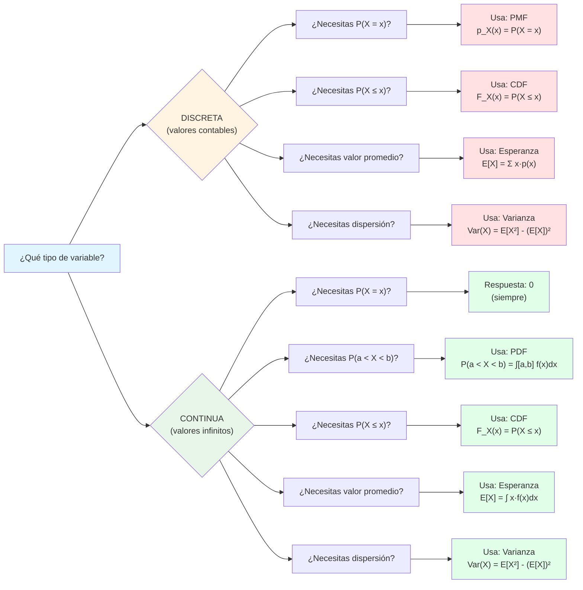
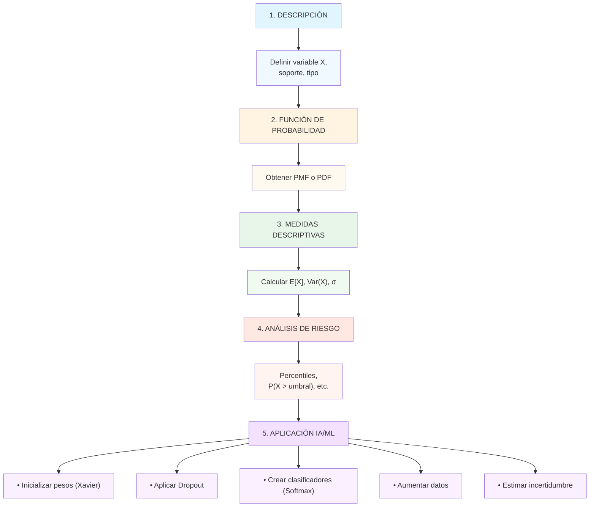

# 📋 Resumen Unidad 3: Variables Aleatorias

## 🎯 Conceptos Clave

**Variables Aleatorias (VA):** Funciones que asignan valores numéricos a resultados de experimentos aleatorios.

$$X: \Omega \to \mathbb{R}$$

---

## 🌳 Árbol de Decisión: Seleccionar Herramientas

---

## 📊 Tabla Rápida de Herramientas

| Herramienta      | Variable | Cálculo                              | Uso                              |
| ---------------- | -------- | ------------------------------------ | -------------------------------- |
| **PMF**          | Discreta | $p_X(x) = P(X=x)$                    | Probabilidad exacta              |
| **CDF**          | Ambas    | $F_X(x) = P(X \leq x)$               | Probabilidad acumulada           |
| **PDF**          | Continua | $f_X(x) = dF/dx$                     | Densidad de probabilidad         |
| **Esperanza**    | Ambas    | $E[X] = \sum xp(x)$ o $\int xf(x)dx$ | Media/valor promedio             |
| **Varianza**     | Ambas    | $\text{Var}(X) = E[X^2] - E[X]^2$    | Dispersión respecto media        |
| **Desv. Típica** | Ambas    | $\sigma = \sqrt{\text{Var}(X)}$      | Dispersión (unidades originales) |

---

## 🔢 Fórmulas Esenciales

### Probabilidad Fundamental

| Concepto              | Fórmula                                           |
| --------------------- | ------------------------------------------------- |
| **Axioma aditividad** | $P(A \cup B) = P(A) + P(B) - P(A \cap B)$         |
| **Complemento**       | $P(\overline{A}) = 1 - P(A)$                      |
| **Condicional**       | $P(A\|B) = \frac{P(A \cap B)}{P(B)}$              |
| **Independencia**     | $P(A \cap B) = P(A) \cdot P(B)$ si independientes |

### Variables Aleatorias

| Operación                | Fórmula                                                             |
| ------------------------ | ------------------------------------------------------------------- |
| **Linealidad esperanza** | $E[aX + b] = aE[X] + b$                                             |
| **Suma esperanzas**      | $E[X + Y] = E[X] + E[Y]$                                            |
| **Varianza escalada**    | $\text{Var}(aX) = a^2 \text{Var}(X)$                                |
| **Suma varianzas**       | $\text{Var}(X+Y) = \text{Var}(X) + \text{Var}(Y)$ si independientes |
| **Cálculo varianza**     | $\text{Var}(X) = E[X^2] - (E[X])^2$                                 |

### Distribuciones

| Distribución      | PMF/PDF                                           | Esperanza       | Varianza             |
| ----------------- | ------------------------------------------------- | --------------- | -------------------- |
| **Bernoulli(p)**  | $p^x(1-p)^{1-x}$                                  | $p$             | $p(1-p)$             |
| **Binomial(n,p)** | $\binom{n}{x}p^x(1-p)^{n-x}$                      | $np$            | $np(1-p)$            |
| **Poisson(λ)**    | $\frac{λ^x e^{-λ}}{x!}$                           | $λ$             | $λ$                  |
| **Uniforme(a,b)** | $\frac{1}{b-a}$                                   | $\frac{a+b}{2}$ | $\frac{(b-a)^2}{12}$ |
| **Normal(μ,σ)**   | $\frac{1}{\sqrt{2πσ^2}}e^{-\frac{(x-μ)^2}{2σ^2}}$ | $μ$             | $σ^2$                |

---

## ✅ Checklist de Aplicación

Cuando trabajes con variables aleatorias:

- [ ] **Identificar tipo:** ¿Discreta o continua?
- [ ] **Definir soporte:** ¿Cuáles son los valores posibles?
- [ ] **Elegir función:** PMF/PDF, CDF según necesidad
- [ ] **Calcular medidas:** Esperanza y varianza
- [ ] **Validar:** ¿Suma a 1? ¿Está bien acotada?
- [ ] **Interpretar:** ¿Tiene sentido el resultado?
- [ ] **Aplicar:** ¿Qué herramienta de IA usar?

---

## 🚀 Flujo de Análisis Típico

---

## 🎓 Cuestiones Frecuentes

### ❓ P: ¿Por qué $P(X = x) = 0$ en continuas?

**R:** Los números reales son infinitos no numerables. La probabilidad de un punto exacto es infinitesimal.

---

### ❓ P: ¿Cuándo usar PMF y cuándo PDF?

**R:**

- **PMF:** Variable discreta (conteos, categorías)
- **PDF:** Variable continua (tiempo, temperatura, peso)

---

### ❓ P: ¿Varianza siempre positiva?

**R:** Sí, por definición $\text{Var}(X) = E[(X - \mu)^2] \geq 0$. Es cero solo si $X$ es constante.

---

### ❓ P: ¿Linealidad de varianza?

**R:** ⚠️ NO. $\text{Var}(X + Y) \neq \text{Var}(X) + \text{Var}(Y)$ en general. Solo si **independientes**.

---

### ❓ P: ¿Por qué inicializar pesos aleatoriamente?

**R:** Evita simetría. Si todos pesan igual, todas las neuronas aprenden lo mismo (red inútil).

---

### ❓ P: ¿Dropout solo en entrenamiento?

**R:** Sí. Durante predicción, usar **todos** los pesos (sin apagar neuronas).

---

## 🎯 Próximos Pasos

**UD4:** Distribuciones Importantes

- Distribuciones discretas (Bernoulli, Binomial, Poisson)
- Distribuciones continuas (Uniforme, Normal, Exponencial)
- Distribuciones derivadas de la normal (χ², t, F)

**UD5:** Estimación y Métodos

- Estimadores puntuales
- Intervalos de confianza
- Estimación máximo verosímil

---

## 📝 Resumen en Línea

> **Las variables aleatorias transforman la incertidumbre en números, permitiendo formalizarla matemáticamente.** A través de PMF/PDF, CDF, esperanza y varianza, describimos cómo se distribuye la probabilidad, facilitando decisiones en IA/ML basadas en datos y cuantificación de riesgo.

---

## 🎓 Ejercicios Integrados

### Nivel 1 (Conceptual)

1. Clasifica si son discretas o continuas:
   - Número de likes en Instagram
   - Tiempo entre tweets
   - Clasificación de sentimiento (Positivo/Negativo/Neutro)

### Nivel 2 (Procedural)

2. Dado $X \sim \text{Bernoulli}(p=0.7)$, calcula:
   - $E[X]$
   - $\text{Var}(X)$
   - $\sigma_X$

### Nivel 3 (Aplicado)

3. Una red neuronal tiene capas:
   - Entrada: 784 neuronas (MNIST)
   - Capa 1: 512 neuronas

   ¿Cuál es varianza Xavier para inicializar conexiones?

??? example "Respuestas"

      1. **Clasificaciones:**
         - Likes: DISCRETA (conteo)
         - Tiempo: CONTINUA (medida)
         - Sentimiento: DISCRETA (categoría)

      2. **Bernoulli(p=0.7):**
         - $E[X] = 0.7$
         - $\text{Var}(X) = 0.7 \times 0.3 = 0.21$
         - $\sigma_X = \sqrt{0.21} \approx 0.458$

      3. **Xavier (784 → 512):**
      
      $$\sigma = \sqrt{\frac{2}{784 + 512}} = \sqrt{\frac{2}{1296}} \approx 0.0394$$

---

