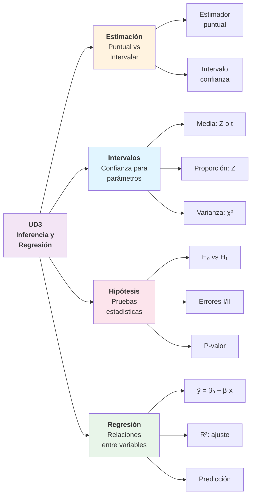
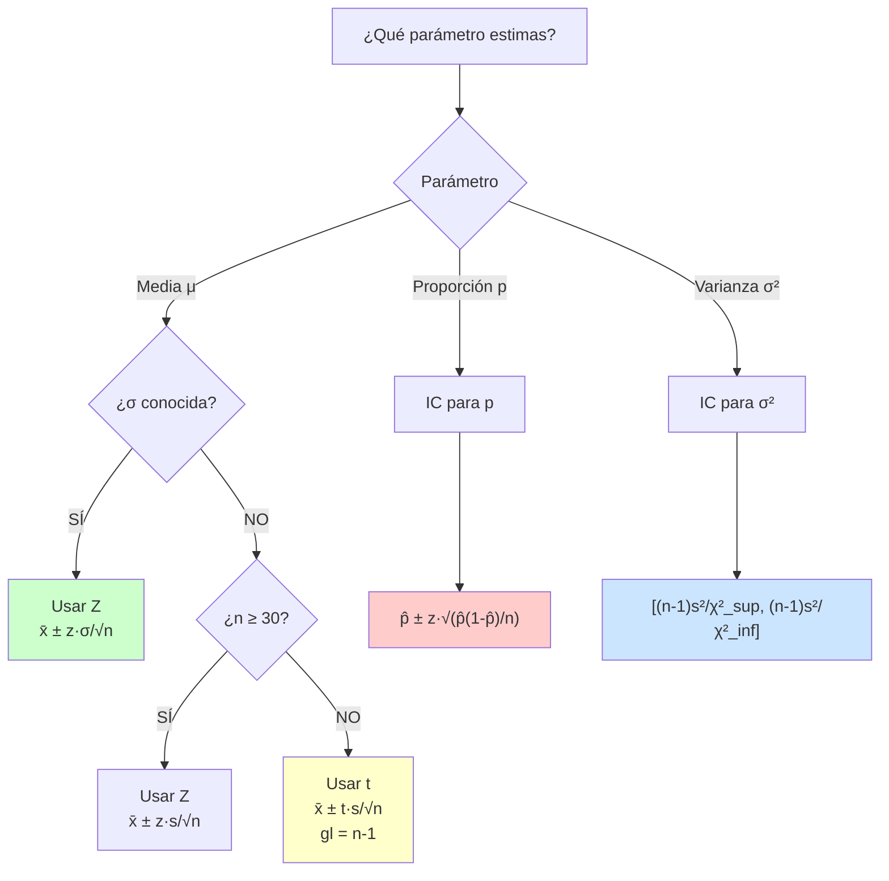
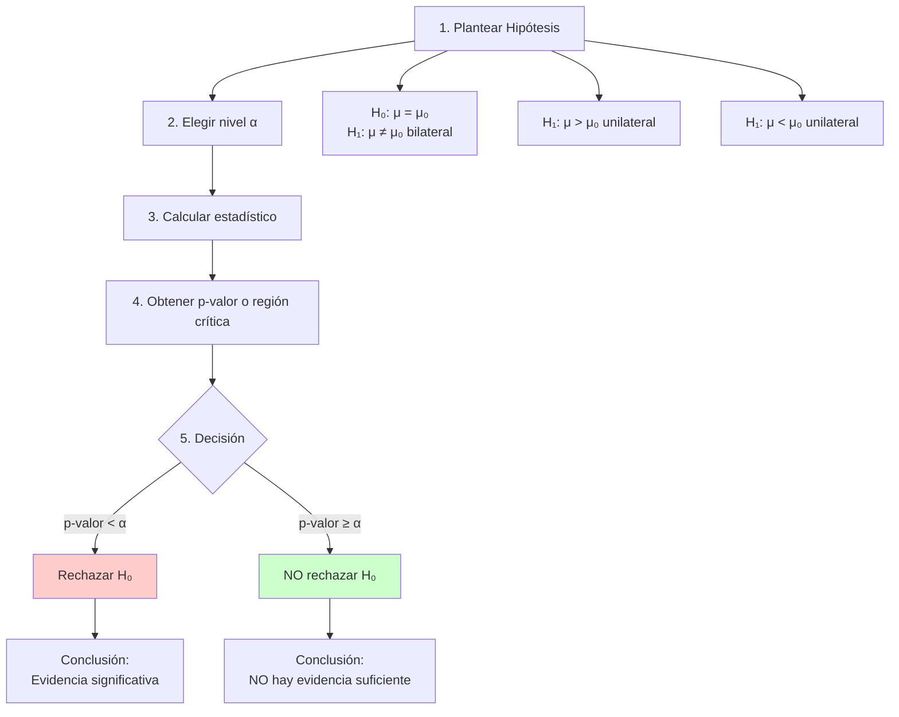
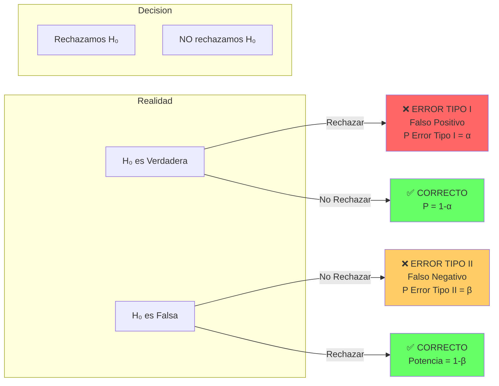
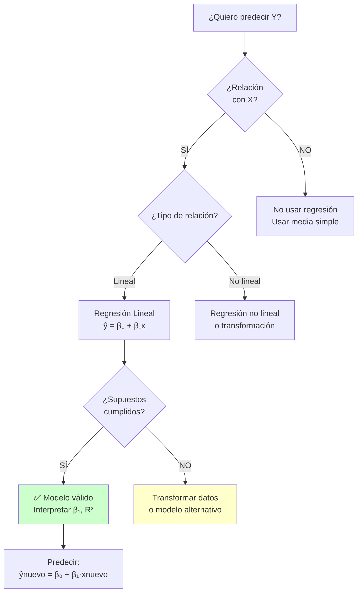
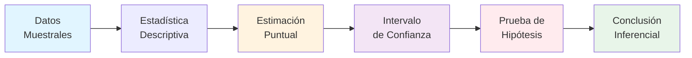
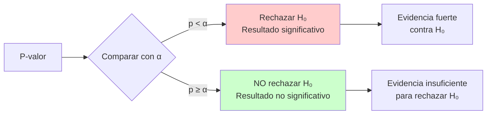

## ✨ Mapa Rápido de Conceptos UD3

---

## 🎯 Conceptos Clave en 1 Página

### Estimación: Puntual vs Intervalo

| Tipo              | Descripción    | Ejemplo             | Ventaja/Desventaja            |
| :---------------- | :------------- | :------------------ | :---------------------------- |
| **Puntual**       | Un solo número | $\bar{x} = 5.2$     | Simple pero sin incertidumbre |
| **Por Intervalo** | Rango [L, U]   | $[4.8, 5.6]$ al 95% | Incluye incertidumbre         |

---

## 📊 Árbol de Decisión: Intervalos de Confianza

---

## 🔑 Fórmulas de Intervalos de Confianza

### IC para Media (σ conocida)

$$
\bar{x} \pm z_{\alpha/2} \cdot \frac{\sigma}{\sqrt{n}}
$$

**Uso:** Muestra grande (n ≥ 30) o población normal con σ conocida

### IC para Media (σ desconocida)

$$
\bar{x} \pm t_{\alpha/2, n-1} \cdot \frac{s}{\sqrt{n}}
$$

**Uso:** Muestra pequeña (n < 30), población normal, σ desconocida

### IC para Proporción

$$
\hat{p} \pm z_{\alpha/2} \cdot \sqrt{\frac{\hat{p}(1-\hat{p})}{n}}
$$

**Requisito:** $n\hat{p} \geq 5$ y $n(1-\hat{p}) \geq 5$

### IC para Varianza

$$
\left[\frac{(n-1)s^2}{\chi^2_{\alpha/2, n-1}}, \frac{(n-1)s^2}{\chi^2_{1-\alpha/2, n-1}}\right]
$$

**Requisito:** Población normal

---

## 🧪 Pruebas de Hipótesis: Proceso Completo

---

## ⚠️ Errores en Pruebas de Hipótesis

### Tabla de Errores

|                    | **H₀ es Verdadera** | **H₀ es Falsa**             |
| :----------------- | :------------------ | :-------------------------- |
| **Rechazar H₀**    | ❌ Error Tipo I (α) | ✅ Correcto (1-β, Potencia) |
| **NO Rechazar H₀** | ✅ Correcto (1-α)   | ❌ Error Tipo II (β)        |

!!! warning "Control de Errores" - **α (nivel de significación):** se fija de antemano (típicamente 0.05 o 0.01) - **β (probabilidad error tipo II):** depende del tamaño muestral y tamaño del efecto - **Potencia = 1-β:** probabilidad de detectar efecto cuando existe

---

## 📉 Regresión Lineal Simple

### Modelo

$$
\hat{y} = \beta_0 + \beta_1 x
$$

- **β₀ (ordenada):** valor de y cuando x = 0
- **β₁ (pendiente):** cambio en y por cada unidad de x

### Estimación por Mínimos Cuadrados

$$
\beta_1 = \frac{\sum (x_i - \bar{x})(y_i - \bar{y})}{\sum (x_i - \bar{x})^2}
$$

$$
\beta_0 = \bar{y} - \beta_1 \bar{x}
$$

### Coeficiente de Determinación R²

$$
R^2 = 1 - \frac{\sum (y_i - \hat{y}_i)^2}{\sum (y_i - \bar{y})^2}
$$

**Interpretación:** Proporción de variabilidad en y explicada por x

- R² = 0: x no explica nada de y
- R² = 1: x explica perfectamente y
- R² = 0.75: x explica el 75% de la variabilidad de y

---

## 🎓 Árbol de Decisión: Regresión

---

## ✅ Supuestos de Regresión Lineal

!!! danger "Supuestos a verificar"

    1. **Linealidad:** La relación entre X e Y es lineal
       - Verificar: Scatterplot de Y vs X

    2. **Independencia:** Las observaciones son independientes
       - Verificar: Conocimiento del diseño del estudio

    3. **Normalidad:** Los residuos siguen distribución normal
       - Verificar: Gráfico Q-Q de residuos

    4. **Homocedasticidad:** Varianza constante de residuos
       - Verificar: Gráfico de residuos vs valores predichos

    5. **Sin outliers extremos:** No hay observaciones influyentes
       - Verificar: Distancia de Cook

---

## 📊 Guía Rápida: Valores Críticos

### Niveles de Confianza Comunes

| Confianza | α    | α/2   | z\_{α/2} |
| :-------- | :--- | :---- | :------- |
| 90%       | 0.10 | 0.05  | 1.645    |
| 95%       | 0.05 | 0.025 | 1.960    |
| 99%       | 0.01 | 0.005 | 2.576    |

### Distribución t (ejemplos)

| gl     | t\_{0.025} | t\_{0.005} |
| :----- | :--------- | :--------- |
| 5      | 2.571      | 4.032      |
| 10     | 2.228      | 3.169      |
| 20     | 2.086      | 2.845      |
| 30     | 2.042      | 2.750      |
| ∞ (≈Z) | 1.960      | 2.576      |

---

## 🚀 Flujo de Trabajo de Inferencia

---

## 🎯 Interpretación de P-valor

**Interpretación correcta del p-valor:**

> "Si H₀ fuera cierta, la probabilidad de observar datos tan extremos (o más) como los que tenemos es p-valor"

!!! warning "❌ Interpretación INCORRECTA"
"La probabilidad de que H₀ sea cierta es p-valor" — **¡MAL!**

---

## 🔗 Ejemplo Completo: IC para Media

**Problema:** Una muestra de n=25 estudiantes obtiene $\bar{x} = 7.2$ con $s = 1.5$. Construir IC al 95%.

**Solución paso a paso:**

1. **Identificar:** μ desconocida, σ desconocida, n < 30 → **Usar distribución t**

2. **Parámetros:**

   - $\bar{x} = 7.2$
   - $s = 1.5$
   - $n = 25$
   - $gl = n - 1 = 24$
   - $\alpha = 0.05$ → $\alpha/2 = 0.025$
   - $t_{0.025, 24} = 2.064$ (de tabla t)

3. **Cálculo:**

$$
IC = \bar{x} \pm t_{\alpha/2, n-1} \cdot \frac{s}{\sqrt{n}}
$$

$$
IC = 7.2 \pm 2.064 \cdot \frac{1.5}{\sqrt{25}} = 7.2 \pm 2.064 \cdot 0.3
$$

$$
IC = 7.2 \pm 0.619 = [6.58, 7.82]
$$

4. **Interpretación:**

> "Con 95% de confianza, la media poblacional está entre 6.58 y 7.82"

---

## 📚 Para Profundizar

- [Estimación e intervalos](estimacion-y-intervalos.md) — Teoría detallada
- [Pruebas de hipótesis](pruebas-hipotesis.md) — Proceso completo
- [Regresión lineal simple](regresion-simple.md) — Ejemplos resueltos
- [Ejercicios UD3](ejercicios.md) — Práctica con soluciones
