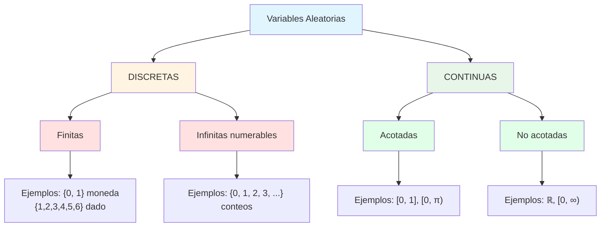

# 📊 Tipos de Variables Aleatorias

## ¿Qué es una Variable Aleatoria?

Una **variable aleatoria (VA)** es una función que asigna un número real a cada resultado de un experimento aleatorio:

$$X: \Omega \to \mathbb{R}$$

Transforma resultados cualitativos o no numéricos en números, permitiéndonos usar herramientas matemáticas para analizar la incertidumbre.

### Notación

- $X$ = variable aleatoria (mayúscula)
- $x$ = valor específico que toma $X$ (minúscula)
- $X = x$ o $P(X = x)$ = probabilidad de que $X$ tome el valor $x$

---

## 🔢 Variables Aleatorias Discretas

### Definición

Una VA es **discreta** si toma valores en un **conjunto finito o numerable** (contable).

### Características

✓ Valores aislados y separados  
✓ Se pueden enumerar: $x_1, x_2, x_3, \ldots$  
✓ Tiene "saltos" entre valores  
✓ Se cuentan (no se miden)

### Ejemplos Comunes

| Contexto          | Variable                                | Valores posibles            |
| ----------------- | --------------------------------------- | --------------------------- |
| **Dados**         | Resultado al lanzar                     | $\{1, 2, 3, 4, 5, 6\}$      |
| **Monedas**       | Número de caras en 3 lanzamientos       | $\{0, 1, 2, 3\}$            |
| **Clasificación** | Etiqueta de imagen (Gato/Perro/Ave)     | $\{0, 1, 2\}$               |
| **Llegadas**      | Número de clientes en 1 hora            | $\{0, 1, 2, 3, \ldots\}$    |
| **Defectos**      | Número de píxeles defectuosos en sensor | $\{0, 1, 2, \ldots, 1000\}$ |

### Ejemplo Detallado: Clasificador Multiclase

Un modelo de IA clasifica imágenes en 3 categorías:

$$
X = \begin{cases}
0 & \text{si es Gato} \\
1 & \text{si es Perro} \\
2 & \text{si es Ave}
\end{cases}
$$

Con probabilidades:

- $P(X = 0) = 0.45$ (Gato)
- $P(X = 1) = 0.35$ (Perro)
- $P(X = 2) = 0.20$ (Ave)

Total: $0.45 + 0.35 + 0.20 = 1$ ✓

---

## 📈 Variables Aleatorias Continuas

### Definición

Una VA es **continua** si puede tomar **cualquier valor en un intervalo real**.

### Características

✓ Valores infinitos dentro de un rango  
✓ No se pueden enumerar (más que numerables)  
✓ No hay "saltos": entre dos valores siempre hay otro  
✓ Se miden (no se cuentan)  
✓ Probabilidad de un valor exacto es CERO: $P(X = x) = 0$

### Ejemplos Comunes

| Contexto                | Variable                     | Rango                                |
| ----------------------- | ---------------------------- | ------------------------------------ |
| **Redes neuronales**    | Activación de neurona (ReLU) | $[0, \infty)$                        |
| **Tasa de aprendizaje** | Learning rate en SGD         | $(0, 1)$                             |
| **Tiempo**              | Latencia de servidor         | $[0, \infty)$                        |
| **Temperatura**         | Temperatura ambiente         | $(-\infty, \infty)$ o rango realista |
| **Peso**                | Peso de una persona          | $(0, \infty)$                        |
| **Ángulo**              | Orientación de objeto        | $[0, 2\pi)$                          |

### Ejemplo Detallado: Probabilidad Continua

Sea $X$ = tiempo de respuesta de un servidor (en segundos), con distribución continua.

**Pregunta:** ¿Cuál es $P(X = 1.5)$?

**Respuesta:** $P(X = 1.5) = 0$ exactamente

Esto puede parecer extraño, pero es correcto: hay infinitos números entre 1.4999... y 1.5000..., por lo que la probabilidad de exactamente 1.5 es infinitesimal.

**Lo que SÍ podemos calcular:**

- $P(X \leq 1.5) = 0.85$ (probabilidad acumulada)
- $P(1.4 < X < 1.6) = 0.12$ (probabilidad en un intervalo)

---

## 🎯 Comparativa: Discreto vs Continuo

| Aspecto                  | Discreta             | Continua                |
| ------------------------ | -------------------- | ----------------------- |
| **Valores**              | Finitos o numerables | Infinitos no numerables |
| **Entre valores**        | Saltos               | Continuidad             |
| **Visualización**        | Puntos aislados      | Curva suave             |
| **$P(X = x)$**           | Puede ser > 0        | Siempre = 0             |
| **Función probabilidad** | PMF: $p_X(x)$        | PDF: $f_X(x)$           |
| **Acumulada**            | Suma                 | Integral                |
| **Ejemplo**              | Nº de defectos       | Tiempo de fallo         |

---

## 🧬 Distribuciones Conjuntas y Marginales

Frecuentemente trabajamos con **múltiples variables aleatorias simultáneamente**.

### Caso: Dos Variables Discretas

Ejemplo: clasificación de imágenes con confianza

$$X = \text{Clase predicha} \in \{0, 1, 2\}$$
$$Y = \text{Confianza} \in \{\text{Baja}, \text{Media}, \text{Alta}\}$$

**Distribución conjunta** $P(X, Y)$:

|               | Baja | Media | Alta | Total |
| ------------- | ---- | ----- | ---- | ----- |
| **Gato (0)**  | 0.05 | 0.15  | 0.25 | 0.45  |
| **Perro (1)** | 0.08 | 0.12  | 0.15 | 0.35  |
| **Ave (2)**   | 0.07 | 0.08  | 0.05 | 0.20  |
| **Total**     | 0.20 | 0.35  | 0.45 | 1.00  |

**Distribuciones marginales**:

- $P(X = 0) = 0.45$ (suma fila Gato)
- $P(Y = \text{Alta}) = 0.45$ (suma columna Alta)

---

## 🔗 Independencia de Variables

Dos variables $X$ e $Y$ son **independientes** si:

$$P(X = x, Y = y) = P(X = x) \cdot P(Y = y)$$

Para **todo** $x$ e $y$.

### Intuición

Conocer el valor de $X$ no nos da información sobre $Y$.

**Ejemplo en tabla anterior:**

- $P(X = 0) = 0.45$
- $P(Y = \text{Alta}) = 0.45$
- $P(X = 0, Y = \text{Alta}) = 0.25$

¿Son independientes?
$$0.45 \times 0.45 = 0.2025 \neq 0.25$$

**No son independientes.** Las imágenes de gatos tienden a tener mayor confianza.

---

## 🚀 Aplicaciones en IA/ML

### 1. Inicialización de Pesos

Las redes neuronales inicializan pesos con variables aleatorias continuas:

$$W \sim N(0, \sigma^2)$$

(Distribución normal con media 0 y varianza $\sigma^2$)

**Por qué:** Usar valores no aleatorios causaría simetría y mal entrenamiento.

### 2. Dropout y Regularización

Durante entrenamiento, se "apagan" neuronas aleatoriamente:

$$\text{Neurona activada} \sim \text{Bernoulli}(p = 0.8)$$

(VA discreta: 80% probabilidad de estar activa, 20% de estar desactivada)

### 3. Sampling y Monte Carlo

Usar muestras aleatorias para aproximar distribuciones:

$$\hat{E}[X] = \frac{1}{N} \sum_{i=1}^N x_i$$

Donde $x_i \sim X$ son muestras independientes.

### 4. Data Augmentation

Transformaciones aleatorias de imágenes:

- Rotación: $\theta \sim \text{Uniforme}(-10°, 10°)$
- Escala: $s \sim \text{Uniforme}(0.9, 1.1)$

---

## 📌 Categorización Completa

---

## ✅ Resumen de Conceptos Clave

| Término                     | Significado                                        |
| --------------------------- | -------------------------------------------------- |
| **Variable aleatoria**      | Función que asigna números a resultados aleatorios |
| **Discreta**                | Toma valores finitos o numerables (se cuentan)     |
| **Continua**                | Toma valores infinitos en intervalo (se miden)     |
| **Función de probabilidad** | PMF (discreta) o PDF (continua)                    |
| **Independencia**           | Conocer una VA no da info sobre otra               |

---

## 🎓 Ejercicio Rápido

**Clasificación de Frutas:**

Un robot clasifica frutas en 4 categorías: Manzana, Plátano, Naranja, Uva.

Su peso se mide en gramos: $[50, 400]$

Además, tiene un "nivel de confianza" entre 0 y 1.

**Pregunta:** Identifica cuáles de las siguientes son discretas/continuas:

1. Tipo de fruta predicho
2. Peso de la fruta
3. Confianza del modelo

??? example "Solución"

    1. **Tipo de fruta:** 🔴 **DISCRETA**
       - Toma 4 valores: {Manzana, Plátano, Naranja, Uva}
       - Se pueden enumerar

    2. **Peso:** 🟢 **CONTINUA**
       - Rango [50, 400] gramos
       - Infinitos valores posibles (50.5, 50.51, 50.512, ...)

    3. **Confianza:** 🟢 **CONTINUA**
       - Rango [0, 1]
       - Valor real (aunque acotado)
