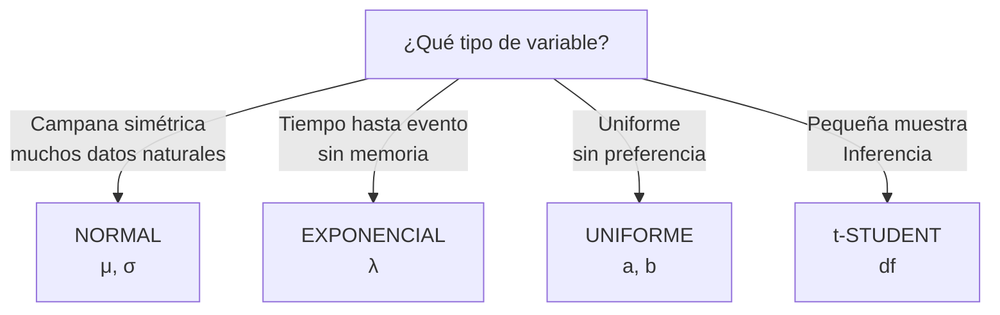

title: "Distribuciones continuas: Normal, Exponencial y otras"
slug: "ud4-distribuciones-continuas"
date: "2026-01-14"
authors: ["Profesor UAX"]
tags: ["ud2", "normal", "exponencial", "continuas", "distribuciones"]
difficulty: "intermedio"
type: "definicion"
prerequisitos: ["ud2-variables-aleatorias", "ud2-distribuciones-discretas"]

---

## Objetivo

✨ Dominar la **distribución Normal** (piedra angular de la estadística inferencial) y entender cuándo usar otras continuas como Exponencial, Uniforme.

## Idea Clave 💡

**La Normal es CENTRAL en estadística.** Aparece en teoremas límite, intervalos de confianza, contrastes de hipótesis. Muchos procesos reales se distribuyen normalmente por ley natural: alturas, pesos, errores de medida. Dominarla es crítico para el examen.

---

## Distribución Normal (Gaussiana)

### Definición Matemática

**Parámetros:** media μ y desviación típica σ

**Función de densidad:**

$$f(x) = \frac{1}{\sigma\sqrt{2\pi}} \exp\left(-\frac{(x-\mu)^2}{2\sigma^2}\right), \quad x \in \mathbb{R}$$

**Notación:** $X \sim N(\mu, \sigma^2)$ o $X \sim N(\mu, \sigma)$

**Gráficamente:** Campana simétrica centrada en μ, anchura determinada por σ.

### Propiedades Fundamentales

1. **Simetría:** Es simétrica alrededor de μ
2. **Unimodal:** Un único pico en x = μ
3. **Media = Mediana = Moda = μ**
4. **68-95-99.7 (Regla Empírica):**
   - P(μ - σ < X < μ + σ) ≈ 0.68 (68%)
   - P(μ - 2σ < X < μ + 2σ) ≈ 0.95 (95%)
   - P(μ - 3σ < X < μ + 3σ) ≈ 0.997 (99.7%)

???+ example "Ejemplo: Alturas de Estudiantes"

    Altura ~ N(170 cm, 5² cm²)

    μ = 170 cm, σ = 5 cm

    - 68% entre 165 y 175 cm
    - 95% entre 160 y 180 cm
    - 99.7% entre 155 y 185 cm

---

### Estandarización (Tipificación)

**Transformar cualquier Normal a N(0,1):**

$$Z = \frac{X - \mu}{\sigma}$$

**Ventajas:**

- Una única tabla Z para TODAS las normales
- Z ~ N(0, 1) se llama **distribución normal estándar**

???+ example "Ejemplo: Estandarizar Alturas"

    X ~ N(170, 5²), queremos P(X < 175)

    Convertir a Z:
    $$Z = \frac{175 - 170}{5} = 1$$

    P(X < 175) = P(Z < 1) ≈ 0.8413 (tabla Z)

---

### Uso de Tabla Z

**Tabla Z:** Da P(Z < z) para valores z de 0 a 4 aprox.

| z    | P(Z < z) |
| :--- | :------- |
| 0.00 | 0.5000   |
| 0.50 | 0.6915   |
| 1.00 | 0.8413   |
| 1.96 | 0.9750   |
| 2.00 | 0.9772   |

**Críticos para el examen:**

- z = 1.96: 95% confianza
- z = 2.576: 99% confianza
- z = 1.645: 90% confianza

???+ tip "Calcular P(a < X < b)"

    1. Estandarizar: $Z_a = \frac{a-\mu}{\sigma}$, $Z_b = \frac{b-\mu}{\sigma}$
    2. Buscar tabla: P(Z < Z_a) y P(Z < Z_b)
    3. Restar: P(a < X < b) = P(Z < Z_b) - P(Z < Z_a)

---

### Cuándo Usarla

✅ **USA NORMAL SI:**

- Variable es **continua**
- Forma de campana (válida con test normalidad)
- **Muchos factores pequeños** afectan la variable (teorema central del límite)
- Procesos naturales: alturas, pesos, errores, tiempos

???+ warning "NO USES NORMAL SI:"

    - ❌ Datos tienen asimetría clara (sesgados)
    - ❌ Hay outliers extremos
    - ❌ Variable es claramente discreta (aunque n grande puede aproximarse)
    - ❌ Rango limitado pero Normal permite negativos (ej: porcentajes de 0-100)

---

## Distribución Exponencial

### Definición

**Parámetro:** λ (tasa, λ > 0)

**Función de densidad:**

$$f(x) = \lambda e^{-\lambda x}, \quad x \geq 0$$

**Media y Varianza:**

$$E[X] = \frac{1}{\lambda}, \quad \text{Var}(X) = \frac{1}{\lambda^2}$$

### Característica Unique: Sin Memoria

**Propiedad de Pérdida de Memoria:**

$$P(X > s+t \mid X > s) = P(X > t)$$

**Interpretación:** Si un evento no ha ocurrido en s unidades, la probabilidad de ocurrir en las próximas t unidades no depende de s.

???+ example "Ejemplo: Vida de Componente"

    Vida útil ~ Exponencial(λ = 0.1 por año)

    E[X] = 1/0.1 = 10 años

    Si el componente ya ha durado 5 años, la probabilidad de durar 5 años más
    es igual a la de un componente nuevo durar 5 años (sin memoria).

---

### Cuándo Usarla

✅ **USA EXPONENCIAL SI:**

- Modelar **tiempo hasta un evento** (fallo, llegada, degradación)
- Evento sigue **proceso Poisson** (relación: si conteos ~ Poisson(λ), tiempos entre eventos ~ Exponencial(λ))
- Interés en **propiedad sin memoria**

???+ example "Ejemplo: Tiempos de Llegada"

    Clientes llegan con tasa Poisson λ = 3 por hora

    Tiempo entre llegadas ~ Exponencial(λ = 3)

    E[tiempo] = 1/3 hora ≈ 20 minutos

---

## Otras Distribuciones Continuas

### Distribución Uniforme

**Parámetros:** a, b (límites del intervalo)

$$f(x) = \frac{1}{b-a}, \quad a \leq x \leq b$$

**Media:** $(a+b)/2$ | **Varianza:** $(b-a)^2/12$

**Cuándo:** Cuando no hay razón para pensar que unos valores son más probables que otros (máxima entropía).

???+ example "Ejemplo: Hora de Llegada"

    Bus llega uniformemente entre 14:00 y 14:20

    X ~ Uniforme(0, 20 minutos)

---

### Distribución t de Student

**Parámetro:** grados de libertad (df)

**Característica:** Similar a Normal, pero con colas más pesadas. Cuando df → ∞, converge a Normal.

**Uso:** Inferencia con muestras pequeñas (Tema UD3).

---

## Tabla Comparativa: Normal vs Exponencial

| **Aspecto**     | **Normal**          | **Exponencial**     |
| :-------------- | :------------------ | :------------------ |
| **Parámetros**  | μ (media), σ (desv) | λ (tasa)            |
| **Rango**       | (-∞, +∞)            | [0, +∞)             |
| **Forma**       | Campana simétrica   | Decreciente         |
| **Media**       | μ                   | 1/λ                 |
| **Varianza**    | σ²                  | 1/λ²                |
| **Sin memoria** | NO                  | SÍ                  |
| **Ejemplo**     | Alturas, errores    | Tiempos hasta fallo |

---

## Diagrama de Decisión: ¿Qué Continua?

---

## ⚠️ Trampas Comunes

### Trampa 1: Asumir Normalidad sin comprobar

❌ **INCORRECTO:** "Precio de casas" → Asumir Normal directamente

✅ **CORRECTO:** Hacer histograma, Q-Q plot, test Shapiro-Wilk. Los precios suelen ser sesgados (cola larga a la derecha).

### Trampa 2: Olvidar estandarizar antes de tabla Z

❌ **INCORRECTO:** Buscar P(X < 175) directamente en tabla (tabla es solo para Z)

✅ **CORRECTO:** Primero Z = (175 - 170) / 5 = 1, luego P(Z < 1)

### Trampa 3: Confundir Exponencial con Poisson

**Poisson:** Conteos (n de eventos en intervalo)

**Exponencial:** Tiempos entre eventos

**Relación:** Son conjugadas (duales). Si eventos siguen Poisson, tiempos siguen Exponencial.

### Trampa 4: Aplicar z = 1.96 sin verificar confianza

El valor **z = 1.96 es para 95%** de confianza. Otros niveles requieren otros z:

- 90% → z ≈ 1.645
- 99% → z ≈ 2.576

---

## 💡 Checklist: Escoger Distribución Continua

!!! tip "Paso a Paso"

    1. **¿Variable es continua?** (sí → continúa)
    2. **¿Qué rango tiene?**
       - Negativos posibles → Normal
       - Solo ≥ 0 → Exponencial, Uniforme, etc.
    3. **¿Qué forma esperada?**
       - Campana → Normal
       - Decreciente → Exponencial
       - Plana → Uniforme
    4. **¿Necesitas tabla/calculadora?**
       - Valores z para Normal
       - Valores λ para Exponencial

---

## 📝 Ejercicios Prácticos

!!! tip "Práctica"

    1. Pesos de adultos ~ N(70, 10²). P(peso < 90)? → Estandarizar y tabla Z
    2. Vida componente ~ Exp(λ=0.05 por año). P(dure >20 años)? → Usar e^(-λt)
    3. ¿Qué diferencia hay entre Normal y Exponencial?

---

## 📖 Enlaces Relacionados

- [Variables aleatorias](./variables-aleatorias.md) — Conceptos base
- [Distribuciones discretas](./distribuciones-discretas.md) — Binomial y Poisson
- [Estimación e intervalos](../ud3/estimacion-y-intervalos.md) — Cómo usar Normal en inferencia
  $P(X<5)=1-e^{-0.1*5}=1-e^{-0.5}\approx 0.3935$.

**Consejo:** para normal usa tablas o funciones acumuladas (p.ej. Python `scipy.stats`).
