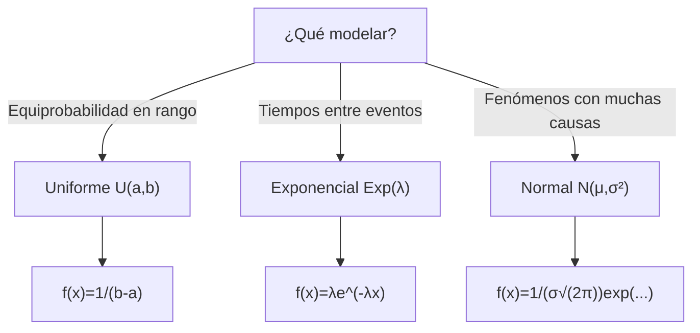

## Objetivo

✨ Dominar las tres distribuciones continuas fundamentales: **Uniforme, Exponencial y Normal**, así como el **Teorema Central del Límite (TCL)** para modelar y realizar inferencia sobre medias muestrales.

## Idea Clave 💡

**Cada distribución continua modela un tipo de fenómeno diferente:** Uniforme = desconocimiento en un rango, Exponencial = tiempos entre eventos (Poisson), Normal = la reina de las distribuciones (TCL, inferencia). La Normal es especialmente importante porque permite aproximar muchas distribuciones y fundamenta toda la inferencia estadística.

### Árbol de Decisión: ¿Cuál Usar?

---

## 📊 Distribución Uniforme Continua

**Contexto:** Una variable que toma cualquier valor en [a, b] con la misma probabilidad (desconocimiento completo en el rango).

**Definición:** Para $a\le x\le b$:

$$f(x)=\frac{1}{b-a}, \quad F(x)=\frac{x-a}{b-a}$$

### Propiedades

| Propiedad    | Valor              |
| :----------- | :----------------- |
| **Media**    | E[X] = (a+b)/2     |
| **Varianza** | Var(X) = (b-a)²/12 |
| **Rango**    | [a, b]             |
| **Simetría** | Simétrica          |

???+ example "Generador aleatorio"

    Si $X\sim U(2,6)$, calcula $P(3\le X\le 5)$.

    $$P(3\le X\le 5)=\int_3^5 \frac{1}{6-2}\,dx=\frac{2}{4}=0.5$$

    Interpretación: probabilidad proporcional a longitud del intervalo.

---

## 📊 Distribución Exponencial

**Contexto:** Tiempos entre eventos en un proceso de Poisson (p.ej., tiempo de espera, tiempo de vida, intervalo entre llegadas).

**Definición:** Para $x\ge 0$:

$$f(x)=\lambda e^{-\lambda x}, \quad F(x)=1-e^{-\lambda x}$$

### Propiedades

| Propiedad     | Valor                                    |
| :------------ | :--------------------------------------- |
| **Media**     | E[X] = 1/λ                               |
| **Varianza**  | Var(X) = 1/λ²                            |
| **Rango**     | [0, ∞)                                   |
| **Propiedad** | Falta de memoria: P(X>s+t \| X>s)=P(X>t) |

**Relación con Poisson:** En proceso Poisson(λ), tiempos entre eventos ~ Exp(λ).

???+ example "Tiempo entre llegadas"

    Proceso de Poisson: λ=0.5 llegadas/minuto. ¿P(X>3)?

    $$P(X>3)=e^{-0.5\cdot3}=e^{-1.5}=0.2231$$

    Interpretación: probabilidad 22.31% de esperar más de 3 minutos.

---

## 📊 Distribución Normal (Gaussiana)

**Contexto:** La distribución más importante en Estadística. Modela fenómenos con muchas causas pequeñas independientes (Teorema Central del Límite). Fundamental para inferencia.

**Densidad:**

$$f(x)=\frac{1}{\sigma\sqrt{2\pi}}\exp\left(-\frac{(x-\mu)^2}{2\sigma^2}\right)$$

### Propiedades

| Propiedad            | Valor                               |
| :------------------- | :---------------------------------- |
| **Media**            | E[X] = μ                            |
| **Varianza**         | Var(X) = σ²                         |
| **Rango**            | (-∞, ∞)                             |
| **Simetría**         | Simétrica alrededor de μ            |
| **Regla 68-95-99.7** | 68% en ±σ, 95% en ±2σ, 99.7% en ±3σ |

**Estandarización:**

$$Z=\frac{X-\mu}{\sigma}\sim N(0,1), \quad P(X\le x)=\Phi\left(\frac{x-\mu}{\sigma}\right)$$

???+ example "Puntuaciones en test"

    $X\sim N(100, 15^2)$. Calcula $P(X\le 130)$.

    Estandariza:
    $$z=\frac{130-100}{15}=2$$

    Busca en tabla: $\Phi(2)\approx 0.9772$

    Interpretación: 97.72% de población puntuada ≤ 130.

!!! note "📊 Tabla de distribución Normal estándar"

    Consulta valores de $\Phi(z)=P(Z\le z)$ para $Z\sim N(0,1)$:
    [Ver tabla Normal (PDF)](../ud4/tablas/TABLA_DISTRIBUCION_NORMAL.pdf){:target="_blank"}

---

## 🎓 Teorema Central del Límite (TCL)

**Enunciado:** Si $X_1,\dots,X_n$ son variables aleatorias independientes con media μ y varianza σ², entonces para n grande:

$$\bar X\approx N\left(\mu, \frac{\sigma^2}{n}\right)$$

**Consecuencia:** La media muestral se distribuye aproximadamente Normal, incluso si X no es Normal, **siempre que n sea suficientemente grande** (n≥30 como regla de oro).

???+ example "Media muestral"

    Variable con μ=50, σ=10. Muestra de n=40. ¿P($\bar X>52$)?

    Por TCL: $\bar X\sim N\left(50, \frac{100}{40}\right)=N(50, 2.5)$

    Estandariza:
    $$Z=\frac{\bar X-\mu}{\sigma/\sqrt{n}}=\frac{52-50}{\sqrt{2.5}}=\frac{2}{1.581}=1.265$$

    Busca: $P(Z>1.265)=1-\Phi(1.265)\approx 0.103$

    Interpretación: 10.3% de probabilidad de media muestral > 52.

---

## 📊 Comparación: Uniforme, Exponencial, Normal

| Aspecto        | Uniforme         | Exponencial             | Normal              |
| :------------- | :--------------- | :---------------------- | :------------------ |
| **Contexto**   | Equiprobabilidad | Tiempos entre eventos   | Fenómenos complejos |
| **Parámetros** | a, b             | λ                       | μ, σ                |
| **Rango**      | [a, b]           | [0, ∞)                  | (-∞, ∞)             |
| **Media**      | (a+b)/2          | 1/λ                     | μ                   |
| **Varianza**   | (b-a)²/12        | 1/λ²                    | σ²                  |
| **Simetría**   | Sí               | No                      | Sí                  |
| **Forma**      | Rectangular      | Exponencial decreciente | Campana (Gauss)     |

---

## ⚠️ Trampas Comunes

**Trampa 1: Usar Normal sin justificar**

- ❌ Incorrecto: Aplicar Normal a datos con n=5 sin verificar distribución original
- ✅ Correcto: TCL requiere n≥30 (o n≥15 si original es aproximadamente simétrica)

**Trampa 2: Confundir Exponencial con tiempos de espera**

- ❌ Incorrecto: Usar Normal para tiempos entre llegadas Poisson
- ✅ Correcto: Tiempos entre eventos Poisson ~ Exponencial (asimétrica)

**Trampa 3: Olvidar estandarizar antes de tabla Normal**

- ❌ Incorrecto: Buscar P(X≤95) directamente en tabla de Z
- ✅ Correcto: Calcular z=(95-μ)/σ y luego buscar Φ(z)

**Trampa 4: Usar varianza en lugar de desv. estándar**

- ❌ Incorrecto: Estandarizar con $z=(x-\mu)/\sigma^2$
- ✅ Correcto: Usar $z=(x-\mu)/\sigma$ (desviación estándar, no varianza)

**Trampa 5: Aplicar TCL a datos dependientes**

- ❌ Incorrecto: Usar TCL en serie temporal con autocorrelación
- ✅ Correcto: TCL requiere **independencia** entre observaciones

---

## 💡 Checklist: Trabajar con Distribuciones Continuas

!!! tip "Paso a Paso"

    1. **Identifica el fenómeno:** ¿Qué tipo de variable modelar?
    2. **Elige distribución:**
       - Rango fijo, equiprobable → Uniforme
       - Tiempos/duraciones → Exponencial (o Weibull)
       - Fenómenos complejos/medias → Normal
    3. **Defina parámetros:** a, b (Uniforme); λ (Exponencial); μ, σ (Normal)
    4. **Si es Normal:** Estandariza $z=(x-\mu)/\sigma$
    5. **Usa tabla/software:** Φ(z) para Normal, fórmulas para Uniforme/Exponencial
    6. **Interpreta probabilidad:** Entre 0 y 1, en contexto del problema
    7. **Si trabajas con medias:** Aplica TCL (n≥30), verifica independencia
    8. **Reporta:** P(X≤x) = ... con contexto e interpretación

---

## 📚 Ejercicios Rápidos

???+ example "Ejercicio 1 — Uniforme"

    Sea $X\sim U(1,5)$. Calcula $P(2\le X\le 4)$ y $E[X]$.

    $$P(2\le X\le4)=\frac{4-2}{5-1}=\frac{2}{4}=0.5$$

    $$E[X]=\frac{1+5}{2}=3$$

???+ example "Ejercicio 2 — Normal"

    $X\sim N(70,8^2)$. Calcula $P(62\le X\le 78)$.

    Estandariza:
    $$z_1=\frac{62-70}{8}=-1, \quad z_2=\frac{78-70}{8}=1$$

    $$P(62\le X\le78)=\Phi(1)-\Phi(-1)\approx0.8413-0.1587=0.6826$$

    (Regla empírica: 68% dentro de ±1σ)

???+ example "Ejercicio 3 — TCL"

    Distribución desconocida: μ=100, σ=15, n=36. ¿P($\bar X\le 105$)?

    Por TCL: $\bar X\sim N(100, 15²/36)=N(100, 6.25)$

    $$z=\frac{105-100}{\sqrt{6.25}}=\frac{5}{2.5}=2$$

    $$P(\bar X\le105)=\Phi(2)\approx0.9772$$

---

## 📖 Enlaces Relacionados

- **UD2:** [Distribuciones Continuas (introducción)](../../ud2/distribuciones-continuas.md) — Repaso
- **UD2:** [Variables Aleatorias](../../ud2/variables-aleatorias.md) — Fundamentos
- **UD4:** [Distribuciones Discretas](./distribuciones-discretas.md) — Contrapartes discretas
- **UD4:** [Derivadas de la Normal](./distribuciones-derivadas-normal.md) — χ², t, F (clave para inferencia)
