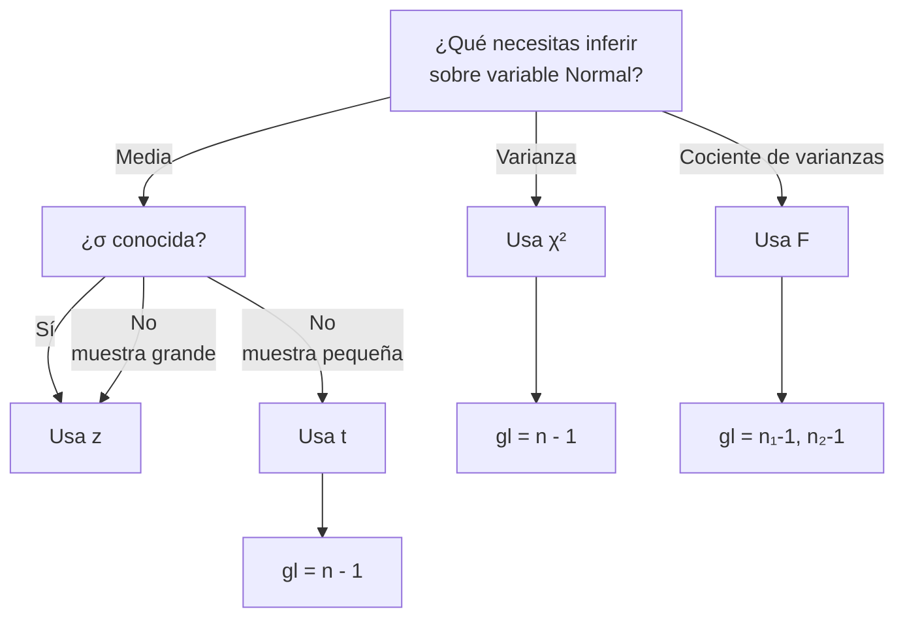

title: "UD4 — Distribuciones derivadas de la normal: χ², t y F"
slug: "ud4-derivadas-normal"
date: "2025-12-29"
authors: ["Profesor Ejemplo","Raul Jimenez"]
tags: ["ud4","inferencia","chi-cuadrado","t-student","snedecor-f","fisher","definicion"]
difficulty: "intermedio"
type: "definicion"
prerequisitos: ["ud4/distribuciones-continuas.md","ud3/estimacion-y-intervalos.md","ud3/pruebas-hipotesis.md"]

---

## Objetivo

✨ Comprender cómo surgen χ², t y F a partir de variables normales y cómo se utilizan en estimación de varianzas, pruebas de hipótesis e intervalos de confianza.

## Idea Clave 💡

**Las distribuciones χ², t y F son transformaciones de variables normales estándar.** Surgen naturalmente en inferencia estadística: χ² para varianzas, t para medias con σ desconocida, F para comparar varianzas.

### Árbol de Decisión: ¿Qué Distribución Usar?

---

## Distribución Chi-Cuadrado (χ²)

**Construcción:** Si $Z_1,\dots,Z_\nu\stackrel{iid}{\sim}N(0,1)$, entonces:

$$X=\sum_{i=1}^{\nu} Z_i^2 \sim \chi^2_{\nu}$$

### Propiedades

| Propiedad    | Valor               |
| :----------- | :------------------ |
| **Media**    | E[X] = ν            |
| **Varianza** | Var(X) = 2ν         |
| **Soporte**  | x > 0               |
| **Simetría** | Asimétrica positiva |

### Teorema de Fisher (Varianza Muestral)

Si $X_1,\dots,X_n\sim N(\mu,\sigma^2)$, entonces:

$$\frac{(n-1)S^2}{\sigma^2}\sim\chi^2_{n-1}$$

Esto permite intervalos de confianza para σ² y contrastes sobre varianza.

???+ example "IC para σ²"

    Con n=6 y s²=0.967:

    $$IC = \left[\frac{5 \cdot 0.967}{12.833}, \frac{5 \cdot 0.967}{0.831}\right] = [0.377, 5.814]$$

!!! note "Па Tabla de distribución Chi-cuadrado"

    Puedes consultar la tabla de valores críticos de $\chi^2_\nu$:

    [Ver tabla Chi-cuadrado (PDF)](./tablas/Tabla_Chi_Cuadrado.pdf){:target="_blank"}

    Para usar la tabla: busca la fila con tus grados de libertad $\nu$ y la columna con el nivel $\alpha$ (p.ej. 0.025, 0.975).

    { type=application/pdf style="min-height:25vh;width:100%" }

## Distribución t de Student

**Construcción:** Si $Z\sim N(0,1)$ y $V\sim\chi^2_\nu$ independientes, entonces:

$$t=\frac{Z}{\sqrt{V/\nu}}\sim t_\nu$$

### Propiedades

| Propiedad    | Valor                       |
| :----------- | :-------------------------- |
| **Media**    | E[t] = 0                    |
| **Varianza** | Var(t) = ν/(ν-2) para ν > 2 |
| **Forma**    | Simétrica, colas pesadas    |
| **Límite**   | Conforme ν → ∞, t → N(0,1)  |

**Interpretación:** Como Normal pero con colas más pesadas para reflejar mayor incertidumbre en muestras pequeñas.

### Teorema de la Media Muestral

Si $X_1,\dots,X_n\sim N(\mu,\sigma^2)$ con σ desconocida:

$$t=\frac{\bar X-\mu}{S/\sqrt{n}}\sim t_{n-1}$$

???+ example "Contraste t bilateral"

    Datos: n=20, x̄=52, s=8, H₀: μ=50, α=0.05

    $$t = \frac{52-50}{8/\sqrt{20}} = 1.118$$

    Con gl=19 y t₀.₉₇₅ ≈ 2.093: |1.118| < 2.093 → No rechazar H₀

!!! note "Па Tabla de distribución t de Student"

    Puedes consultar la tabla de valores críticos de $t_\nu$:

    [Ver tabla t de Student (PDF)](../ud4/tablas/Tabla_t_Student.pdf){:target="_blank"}

    Para usar la tabla: busca la fila con tus grados de libertad $\nu=n-1$ y la columna con el nivel $\alpha/2$ para test bilateral.

    { type=application/pdf style="min-height:25vh;width:100%" }

---

## Distribución F de Snedecor

**Construcción:** Si $V_1\sim\chi^2_{m}$ y $V_2\sim\chi^2_{n}$ independientes:

$$F=\frac{V_1/m}{V_2/n}\sim F_{m,n}$$

### Propiedades

| Propiedad    | Valor                                        |
| :----------- | :------------------------------------------- |
| **Media**    | E[F] = n/(n-2) para n > 2                    |
| **Varianza** | Var(F) = $\frac{2n^2(m+n-2)}{m(n-2)^2(n-4)}$ |
| **Rango**    | [0, ∞)                                       |
| **Simetría** | Asimétrica derecha                           |

**Propiedad importante:** Si F ~ F*{m,n}, entonces $\frac{1}{F}\sim F*{n,m}$

### Teorema: Cociente de Varianzas

Si $X_1,\dots,X_m\sim N(\mu_1,\sigma_1^2)$ y $Y_1,\dots,Y_n\sim N(\mu_2,\sigma_2^2)$ independientes:

$$F=\frac{S_X^2/\sigma_1^2}{S_Y^2/\sigma_2^2}\sim F_{m-1,n-1}$$

???+ example "Contraste de igualdad de varianzas"

    Datos: Muestra X: n=15, s_X²=12 | Muestra Y: n=12, s_Y²=8

    H₀: σ₁²=σ₂², H₁: σ₁²≠σ₂², α=0.05

    $$F = \frac{12}{8} = 1.5$$

    Con gl=(14,11) y F₀.₉₇₅ ≈ 2.95: 1.5 < 2.95 → No rechazar H₀ (varianzas iguales)

!!! note "Па Tabla de distribución F de Snedecor"

    Puedes consultar la tabla de valores críticos de $F(\nu_1,\nu_2)$:

    [Ver tabla F de Snedecor (PDF)](../ud4/tablas/Tabla_F_Snedecor.pdf){:target="_blank"}

    Para usar la tabla: busca los grados de libertad del numerador $\nu_1$ y denominador $\nu_2$, y el nivel de significación.

    { type=application/pdf style="min-height:25vh;width:100%" }

---

## 📊 Comparación: χ², t y F

| Aspecto           | χ²                          | t de Student             | F                                   |
| :---------------- | :-------------------------- | :----------------------- | :---------------------------------- |
| **Construida de** | Una $\chi^2_\nu$            | Normal/χ²                | Dos $\chi^2$                        |
| **Parámetro**     | Grados de libertad (ν)      | Grados de libertad (n-1) | Dos grados de libertad (m, n)       |
| **Rango**         | [0, ∞)                      | (-∞, ∞)                  | [0, ∞)                              |
| **Simetría**      | Asimétrica derecha          | Simétrica                | Asimétrica derecha                  |
| **E[X]**          | ν                           | 0                        | n/(n-2)                             |
| **Var(X)**        | 2ν                          | ν/(ν-2)                  | $\frac{2n^2(m+n-2)}{m(n-2)^2(n-4)}$ |
| **Uso Principal** | Varianzas, bondad de ajuste | Media (σ desconocida)    | Cociente de varianzas               |
| **Supuesto**      | Población Normal            | Población Normal         | Dos poblaciones Normales            |

---

## ⚠️ Trampas Comunes

**Trampa 1: Confundir grados de libertad**

- ❌ Incorrecto: Usar ν=n en una t de Student
- ✅ Correcto: Usar gl=n-1 (los grados de libertad se pierden al estimar σ con S)

**Trampa 2: No verificar normalidad**

- ❌ Incorrecto: Usar t sin verificar normalidad en población origen
- ✅ Correcto: Verificar con gráficos Q-Q o tests de normalidad (n pequeña)

**Trampa 3: Invertir la razón F**

- ❌ Incorrecto: Usar F = S₂²/S₁² sin cuidado con los gl
- ✅ Correcto: Si pones S₁² en numerador, gl₁ = n₁-1 en el numerador

**Trampa 4: IC para una media usando z en lugar de t**

- ❌ Incorrecto: IC = x̄ ± 1.96(S/√n) cuando σ es desconocida
- ✅ Correcto: IC = x̄ ± t\_{α/2,n-1}(S/√n)

**Trampa 5: Contrastar bilateralmente cuando esperabas unilateral**

- ❌ Incorrecto: Usar t\_{0.975} para un contraste H₁: μ > μ₀
- ✅ Correcto: Usar t\_{0.95} (en la cola derecha solamente)

---

## 💡 Checklist: Inferencia con χ², t y F

!!! tip "Paso a Paso"

    1. **Verificar supuestos:** ¿Población(es) Normal(es)?
    2. **Identificar parámetro:** ¿Inferir sobre media, varianza o ambos?
    3. **Definir hipótesis:** H₀ y H₁ (bilateral o unilateral)
    4. **Elegir distribución:**
       - Media con σ desconocida → t de Student
       - Varianza → χ²
       - Cociente de varianzas → F
    5. **Calcular grados de libertad:** n-1 para una muestra, (n₁-1, n₂-1) para dos
    6. **Obtener valor crítico:** De tablas o software
    7. **Calcular estadístico:** Con datos muestrales
    8. **Decidir:** Comparar estadístico con crítico, reportar p-valor y conclusión

---

## Procedimiento general (checklist)

- Identifica tamaños muestrales y grados de libertad.
- Para varianza: usa $\chi^2$ con $(n-1)$ g.l.
- Para media con $\sigma$ desconocida y $n$ pequeña: usa $t$.
- Para comparar varianzas (o ANOVA): usa $F$ y su propiedad recíproca si la cola no coincide.

!!! warning "Errores comunes"

    - Usar normal en lugar de $t$ cuando $\sigma$ es desconocida y $n$ pequeña.
    - Olvidar los grados de libertad correctos en $\chi^2$ y $t$. - No verificar independencia para aplicar $F$.

## Relación con otras unidades

- UD3: estimación e intervalos; pruebas de hipótesis sobre medias y varianzas.
- UD4 (continuas): normal subyace a la construcción de $\chi^2$, $t$ y $F$.

---

## Ejercicios rápidos

Muestra normal $n=12$, $s^2=2.1$. Calcula el IC 95% para $\sigma^2$.

???+ example "Ejercicio 1 — IC para varianza"

    Usa $\chi^2_{0.975;11}$ y $\chi^2_{0.025;11}$. El IC es
    $$\Big[\frac{11\cdot2.1}{\chi^2_{0.975;11}},\; \frac{11\cdot2.1}{\chi^2_{0.025;11}}\Big]$$

    Sustituye con valores de tabla.

$n=9$, $\bar x=101$, $s=6$, $\mu_0=98$. Contrasta al 5%.

???+ example "Ejercicio 2 — t una muestra"

    $$t=\frac{101-98}{6/\sqrt{9}}=\frac{3}{2}=1.5$$

    $$|t|=1.5< t_{0.975;8}\Rightarrow\text{no se rechaza }H_0$$
