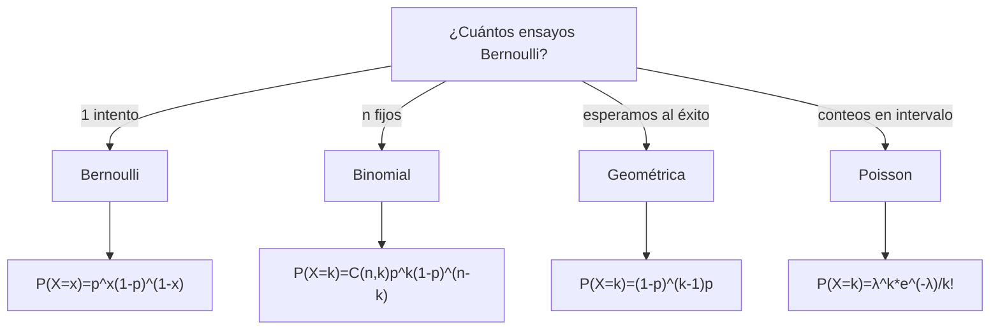

## Objetivo

✨ Dominar las cuatro distribuciones discretas fundamentales: **Bernoulli, Binomial, Geométrica y Poisson**. Entender su construcción, identificar cuándo usarlas y aplicarlas en cálculo de probabilidades y modelado de fenómenos reales.

## Idea Clave 💡

**Cada distribución discreta responde a un contexto diferente:** Bernoulli = 1 intento, Binomial = n intentos fijos, Geométrica = espera al primer éxito, Poisson = conteos en intervalo. Dominar estas distribuciones es esencial para inferencia estadística.

### Árbol de Decisión: ¿Cuál Usar?

---

## 🎲 Distribución Bernoulli

**Contexto:** Un único experimento con dos resultados: éxito (1) o fracaso (0), con probabilidad de éxito $p$.

**Definición:** Si $X\sim\mathrm{Ber}(p)$, entonces para $x\in\{0,1\}$:

$$P(X=x) = p^x(1-p)^{1-x}$$

### Propiedades

| Propiedad     | Valor           |
| :------------ | :-------------- |
| **Media**     | E[X] = p        |
| **Varianza**  | Var(X) = p(1-p) |
| **Rango**     | {0, 1}          |
| **Parámetro** | p ∈ [0, 1]      |

???+ example "Control de calidad"

    Una pieza sale defectuosa con probabilidad p=0.08. Define X=1 si defectuosa, 0 si correcta.

    $$P(X=1)=0.08, \quad P(X=0)=0.92$$

    E[X]=0.08, Var(X)=0.08(0.92)=0.0736

---

## 🎲 Distribución Binomial

**Contexto:** Número de éxitos en $n$ ensayos de Bernoulli **independientes** con probabilidad de éxito constante $p$.

**Definición:** Si $X\sim\mathrm{Bin}(n,p)$, entonces para $k=0,1,\dots,n$:

$$P(X=k)=\binom{n}{k}p^k(1-p)^{n-k}$$

### Propiedades

| Propiedad      | Valor             |
| :------------- | :---------------- |
| **Media**      | E[X] = np         |
| **Varianza**   | Var(X) = np(1-p)  |
| **Rango**      | {0, 1, ..., n}    |
| **Parámetros** | n ≥ 1, p ∈ [0, 1] |

**Supuestos:** Ensayos independientes, n fijo, p constante.

???+ example "Inspección de lote"

    En n=10 inspecciones con p=0.1 defectos, calcula P(X≤2).

    $$P(X=0)=\binom{10}{0}0.1^0 0.9^{10}=0.3487$$
    $$P(X=1)=\binom{10}{1}0.1^1 0.9^{9}=0.3874$$
    $$P(X=2)=\binom{10}{2}0.1^2 0.9^{8}=0.1937$$

    $$P(X\le2)=0.3487+0.3874+0.1937=0.9298$$

!!! note "📊 Tabla de distribución Binomial"

    Consulta valores precalculados:
    [Ver tabla Binomial (PDF)](../ud4/tablas/TABLA_DISTRIBUCION_BINOMIAL.pdf){:target="_blank"}

---

## 🎲 Distribución Geométrica

**Contexto:** Número de ensayos necesarios hasta observar el **primer éxito** (o número de fracasos antes del primer éxito).

**Definición:** Si $X\sim\mathrm{Geom}(p)$, entonces para $k=1,2,\dots$:

$$P(X=k)=(1-p)^{k-1}p$$

### Propiedades

| Propiedad     | Valor                                      |
| :------------ | :----------------------------------------- |
| **Media**     | E[X] = 1/p                                 |
| **Varianza**  | Var(X) = (1-p)/p²                          |
| **Rango**     | {1, 2, 3, ...}                             |
| **Parámetro** | p ∈ (0, 1]                                 |
| **Propiedad** | Falta de memoria: P(X>n+m \| X>n) = P(X>m) |

**Interpretación:** Si p es pequeña, esperas más intentos en promedio (E[X]=1/p grande).

???+ example "Clics en anuncios"

    Probabilidad de clic es p=0.2. ¿Probabilidad de primer clic en 3er intento?

    $$P(X=3)=(1-0.2)^{2}\cdot0.2=0.64\cdot0.2=0.128$$

---

## 🎲 Distribución Poisson

**Contexto:** Número de eventos que ocurren en un intervalo de tiempo/espacio cuando la tasa media es constante ($\lambda$) y los eventos son independientes.

**Definición:** Si $X\sim\mathrm{Poisson}(\lambda)$, entonces para $k=0,1,2,\dots$:

$$P(X=k)=\frac{\lambda^k e^{-\lambda}}{k!}$$

### Propiedades

| Propiedad     | Valor          |
| :------------ | :------------- |
| **Media**     | E[X] = λ       |
| **Varianza**  | Var(X) = λ     |
| **Rango**     | {0, 1, 2, ...} |
| **Parámetro** | λ > 0          |

**Aproximación Binomial:** Si n≥30, p≤0.1 y np=λ<10, entonces $\mathrm{Bin}(n,p)\approx\mathrm{Poisson}(\lambda)$

???+ example "Peticiones API"

    Una API recibe en promedio λ=4 peticiones/minuto. ¿Probabilidad de ≥3 peticiones?

    $$P(X\ge 3)=1-P(X\le 2)$$
    $$=1-\left[\frac{4^0e^{-4}}{0!}+\frac{4^1e^{-4}}{1!}+\frac{4^2e^{-4}}{2!}\right]$$
    $$=1-(0.0183+0.0733+0.1465)=0.7619$$

!!! note "📊 Tabla de distribución Poisson"

    Consulta valores precalculados:
    [Ver tabla Poisson (PDF)](../ud4/tablas/TABLA_DISTRIBUCION_POISSON.pdf){:target="_blank"}

---

## 📊 Comparación: Bernoulli, Binomial, Geométrica, Poisson

| Aspecto        | Bernoulli | Binomial               | Geométrica           | Poisson              |
| :------------- | :-------- | :--------------------- | :------------------- | :------------------- |
| **Contexto**   | 1 intento | n intentos fijos       | Intentos hasta éxito | Conteos en intervalo |
| **Parámetros** | p         | n, p                   | p                    | λ                    |
| **Rango**      | {0, 1}    | {0, 1, ..., n}         | {1, 2, 3, ...}       | {0, 1, 2, ...}       |
| **Media**      | p         | np                     | 1/p                  | λ                    |
| **Varianza**   | p(1-p)    | np(1-p)                | (1-p)/p²             | λ                    |
| **Supuesto**   | 1 ensayo  | n fijo, independientes | p constante          | Tasa λ constante     |

---

## ⚠️ Trampas Comunes

**Trampa 1: Confundir Binomial con Geométrica**

- ❌ Incorrecto: Usar Binomial para "cuántos intentos hasta el éxito"
- ✅ Correcto: Binomial = éxitos en n fijo; Geométrica = intentos hasta primer éxito

**Trampa 2: No verificar independencia**

- ❌ Incorrecto: Usar Binomial si los ensayos no son independientes o p cambia
- ✅ Correcto: Verificar que cada ensayo sea igual (no es bola sin reemplazo)

**Trampa 3: Confundir E[X]=1/p**

- ❌ Incorrecto: En Geométrica pensar que 1/p es el número de fracasos
- ✅ Correcto: 1/p es el número esperado de **intentos** hasta el éxito

**Trampa 4: Usar Poisson sin verificar condiciones**

- ❌ Incorrecto: Aproximar Bin(10, 0.5) con Poisson(5) (p no es pequeña)
- ✅ Correcto: n≥30, p≤0.1, np<10 para buena aproximación

**Trampa 5: Confundir k en Geométrica**

- ❌ Incorrecto: Usar k=número de fracasos directamente
- ✅ Correcto: P(X=k) es para k=intentos (incluye el éxito final)

---

## 💡 Checklist: Resolver Problemas de Distribuciones Discretas

!!! tip "Paso a Paso"

    1. **Identifica el contexto:** ¿Cuál es el experimento aleatorio?
    2. **¿Cuántos intentos?**
       - 1 intento → Bernoulli
       - n fijos → Binomial
       - Hasta primer éxito → Geométrica
       - Conteos en intervalo → Poisson
    3. **Define parámetros:** p, n, o λ
    4. **Verifica supuestos:**
       - Binomial: independencia, p constante, n fijo
       - Geométrica: p constante, independencia
       - Poisson: tasa constante, eventos independientes
    5. **Selecciona fórmula:** Escribe P(X=k) o P(X≤k) según necesites
    6. **Calcula con cuidado:** Combinatorios, potencias, exponenciales
    7. **Interpreta resultado:** ¿Tiene sentido (probabilidad entre 0 y 1)?
    8. **Reporta:** Valor numérico + contexto

---

## 📚 Ejercicios Rápidos

???+ example "Ejercicio 1 — Binomial"

    En un lote, p=0.05 defectuosas. Para n=20, calcula P(X≤1).

    $$P(X=0)=0.95^{20}=0.3585$$
    $$P(X=1)=\binom{20}{1}0.05\cdot0.95^{19}=0.3774$$
    $$P(X\le1)=0.3585+0.3774=0.7359$$

???+ example "Ejercicio 2 — Geométrica"

    Con p=0.3, calcula P(X≥4).

    Usa P(X≥4) = P(X>3) = (1-p)³

    $$P(X\ge4)=0.7^3=0.343$$

???+ example "Ejercicio 3 — Poisson"

    Llamadas a central: λ=2/hora. ¿P(X=0) en 1 hora?

    $$P(X=0)=\frac{2^0 e^{-2}}{0!}=e^{-2}=0.1353$$

---

## 📖 Enlaces Relacionados

- **UD2:** [Eventos y Probabilidad](../../ud2/eventos-y-probabilidad.md) — Fundamentos
- **UD2:** [Distribuciones Discretas (introducción)](../../ud2/distribuciones-discretas.md) — Repaso
- **UD4:** [Distribuciones Continuas](./distribuciones-continuas.md) — Contrapartes continuas
- **UD4:** [Derivadas de la Normal](./distribuciones-derivadas-normal.md) — χ², t, F
