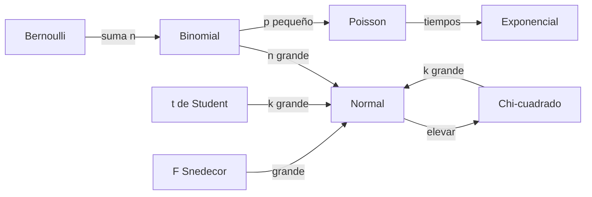
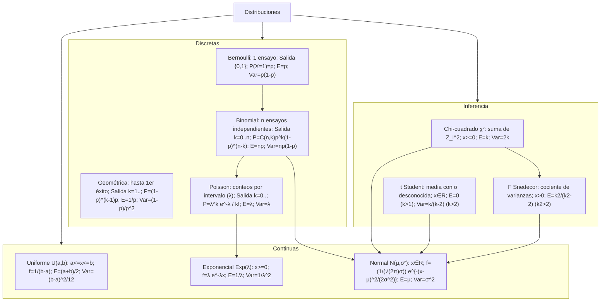

Aquí tienes la información principal de la **Unidad 4: Modelos de Probabilidad**, extraída de los documentos proporcionados, organizada por tipos de distribuciones, términos clave y ejercicios.

---

## Tablas de Referencia Rápida

### **1. Distribuciones Discretas (Conteos)**

Se utilizan cuando la variable aleatoria toma valores en un conjunto **numerable** (puntos aislados), generalmente resultados de "contar" sucesos.

| Distribución   | Puntos clave y Cuándo usarla                                                                                   | Esperanza $E[X]$ | Varianza $Var(X)$ | Función de Probabilidad / Uso                |
| :------------- | :------------------------------------------------------------------------------------------------------------- | :--------------- | :---------------- | :------------------------------------------- |
| **Bernoulli**  | Experimento con **dos resultados posibles** (éxito/fracaso).   **Ej:** Un email es spam (1) o no (0).       | $p$              | $p(1-p)$          | $P(X=x) = p^x(1-p)^{1-x}$                    |
| **Binomial**   | Número de éxitos en **$n$ ensayos independientes**.   **Ej:** Contar errores en un batch de 20 imágenes.    | $np$             | $np(1-p)$         | $P(X=k) = \binom{n}{k} p^k (1-p)^{n-k}$      |
| **Geométrica** | Número de ensayos hasta el **primer éxito**.   **Ej:** Intentos de conexión hasta que el servidor responde. | $\frac{1}{p}$    | $\frac{1-p}{p^2}$ | $P(X=k) = (1-p)^{k-1}p$                      |
| **Poisson**    | Eventos en un **intervalo fijo** (tiempo/espacio).   **Ej:** Peticiones web recibidas por minuto.           | $\lambda$        | $\lambda$         | $P(X=k) = \frac{\lambda^k e^{-\lambda}}{k!}$ |

---

### **2. Distribuciones Continuas (Mediciones)**

Se aplican cuando la variable puede tomar cualquier valor en un **intervalo real** (tiempo, peso, intensidad), siendo la probabilidad de un punto exacto siempre cero.

| Distribución    | Puntos clave y Cuándo usarla                                                                                       | Esperanza $E[X]$    | Varianza $Var(X)$     | Función de Densidad / Propiedad                                       |
| :-------------- | :----------------------------------------------------------------------------------------------------------------- | :------------------ | :-------------------- | :-------------------------------------------------------------------- |
| **Uniforme**    | Probabilidad **constante** en el intervalo $[a, b]$.   **Ej:** Inicializar pesos de una neurona entre 0 y 1.    | $\frac{a+b}{2}$     | $\frac{(b-a)^2}{12}$  | $f(x) = \frac{1}{b-a}$                                                |
| **Exponencial** | **Tiempo entre eventos**. Tiene "falta de memoria".   **Ej:** Segundos entre la llegada de dos paquetes de red. | $\frac{1}{\lambda}$ | $\frac{1}{\lambda^2}$ | $f(x) = \lambda e^{-\lambda x}$                                       |
| **Normal**      | Simétrica, forma de campana (**Gauss**).   **Ej:** Distribución de las notas medias de una facultad.            | $\mu$               | $\sigma^2$            | $f(x) = \frac{1}{\sqrt{2\pi}\sigma} e^{-\frac{(x-\mu)^2}{2\sigma^2}}$ |

---

### **3. Distribuciones de Inferencia (Muestreo)**

Estas distribuciones derivan de la Normal estándar y son los pilares para tomar decisiones estadísticas sobre poblaciones a partir de muestras.

| Distribución                | Puntos clave y Cuándo usarla                                                                                             | Esperanza $E[X]$    | Varianza $Var(X)$            | Uso Principal en IA / Ciencia de Datos                              |
| :-------------------------- | :----------------------------------------------------------------------------------------------------------------------- | :------------------ | :--------------------------- | :------------------------------------------------------------------ |
| **$\chi^2$ (Chi-cuadrado)** | Suma de normales al cuadrado. Solo valores positivos.   **Ej:** Validar si un generador es uniforme.                  | $k$                 | $2k$                         | **Bondad de ajuste** e independencia de variables categóricas.      |
| **t de Student**            | Similar a la Normal pero con **colas más pesadas**.   **Ej:** Comparar precisión de modelos con pocos datos ($n<30$). | $0$ (si $k > 1$)    | $\frac{k}{k-2}$ (si $k > 2$) | Inferencia sobre la **media poblacional** con varianza desconocida. |
| **F de Snedecor**           | Cociente de dos Chi-cuadrados.   **Ej:** Evaluar si dos modelos de IA tienen la misma estabilidad.                    | $\frac{k_2}{k_2-2}$ | _(compleja)_                 | **Comparación de varianzas** y análisis ANOVA en regresión.         |

---

## Contenido Detallado

---

## 📊 I. Distribuciones Discretas — Explicación Ampliada

Las distribuciones discretas modelan **experimentos donde contamos algo**: número de errores, intentos hasta ganar, eventos en un periodo, etc. La variable aleatoria toma valores en un conjunto finito o infinito numerable.

### Distribución de Bernoulli

#### 💡 Intuición

Un **único experimento con dos posibles resultados**: éxito (1) o fracaso (0). Como lanzar una moneda, validar si un email es spam, o que un modelo acierte su predicción.

#### Definición Formal

$$X \sim \text{Bernoulli}(p) \implies P(X=x) = p^x(1-p)^{1-x} \quad \text{para } x \in \{0, 1\}$$

donde $p = P(\text{éxito})$ es el parámetro.

#### Propiedades Clave

| Propiedad      | Valor                    |
| -------------- | ------------------------ |
| Esperanza      | $E[X] = p$               |
| Varianza       | $\text{Var}(X) = p(1-p)$ |
| Desv. Estándar | $\sigma = \sqrt{p(1-p)}$ |

!!! note "📌 Nota importante"

    Bernoulli es el "bloque de construcción" de la Binomial. Si repites el experimento $n$ veces de forma independiente, obtienes una Binomial.

---

### Distribución Binomial

#### 💡 Intuición

Repites un experimento de **Bernoulli $n$ veces de forma independiente** y cuentas cuántos éxitos obtienes. Ejemplo: lanzar una moneda 10 veces y contar cuántas caras salen.

#### Definición Formal

$$X \sim \text{Binomial}(n, p) \implies P(X=k) = \binom{n}{k} p^k(1-p)^{n-k} \quad \text{para } k = 0, 1, \ldots, n$$

donde:

- $n$ = número de ensayos
- $p$ = probabilidad de éxito en cada ensayo
- $k$ = número de éxitos que queremos contar

#### Propiedades Clave

| Propiedad | Valor                     |
| --------- | ------------------------- |
| Esperanza | $E[X] = np$               |
| Varianza  | $\text{Var}(X) = np(1-p)$ |
| Moda      | $\lfloor (n+1)p \rfloor$  |

!!! warning "⚠️ Condición de aplicación"

    Úsala cuando:

    - Tienes **$n$ ensayos independientes**.
    - Cada ensayo tiene **solo dos resultados** (éxito/fracaso).
    - La **probabilidad $p$ es igual** en todos los ensayos.

---

### Distribución Geométrica

#### 💡 Intuición

¿**Cuántos intentos necesitas** hasta conseguir tu primer éxito? Lanzas un dado hasta sacar un 6; intenta conectar a un servidor hasta que responde; pruebas un código hasta que funciona.

#### Definición Formal

$$X \sim \text{Geométrica}(p) \implies P(X=k) = (1-p)^{k-1}p \quad \text{para } k = 1, 2, 3, \ldots$$

donde $k$ es el número del ensayo en el cual obtienes el **primer éxito**.

#### Propiedades Clave

| Propiedad            | Valor                              |
| -------------------- | ---------------------------------- |
| Esperanza            | $E[X] = \frac{1}{p}$               |
| Varianza             | $\text{Var}(X) = \frac{1-p}{p^2}$  |
| **Falta de Memoria** | $P(X > n+m \mid X > n) = P(X > m)$ |

!!! tip "✨ Falta de Memoria"

    Si ya has fallado $n$ veces, **el número de fallos futuros** no depende de $n$. El proceso "olvida" el pasado. Es la única distribución discreta con esta propiedad.

---

### Distribución de Poisson

#### 💡 Intuición

Cuentas **eventos aleatorios en un intervalo fijo** (un minuto, una hora, un metro cuadrado). Ejemplos: llamadas telefónicas por minuto, accesos a un servidor por segundo, defectos en una pieza de tela.

#### Definición Formal

$$X \sim \text{Poisson}(\lambda) \implies P(X=k) = \frac{\lambda^k e^{-\lambda}}{k!} \quad \text{para } k = 0, 1, 2, \ldots$$

donde $\lambda > 0$ es la **tasa media de eventos** en el intervalo.

#### Propiedades Clave

| Propiedad                 | Valor                               |
| ------------------------- | ----------------------------------- |
| Esperanza                 | $E[X] = \lambda$                    |
| Varianza                  | $\text{Var}(X) = \lambda$           |
| **Coincidencia especial** | La media y varianza **son iguales** |

!!! important "🔗 Límite de la Binomial"

    Si $n$ es **muy grande**, $p$ es **muy pequeño** y $np \approx \lambda$, entonces:

    $$\text{Binomial}(n, p) \approx \text{Poisson}(\lambda)$$

    Regla práctica: úsalo cuando $n \ge 30$, $p \le 0.1$ y $np < 10$.

---

## 📈 II. Distribuciones Continuas — Explicación Ampliada

Las distribuciones continuas modelan **variables que pueden tomar cualquier valor real** en un intervalo: tiempos, pesos, intensidades, voltajes, etc. La probabilidad de un punto exacto es siempre **cero**; solo tiene sentido hablar de probabilidades en intervalos.

### Distribución Uniforme Continua

#### 💡 Intuición

Todos los valores en el intervalo $[a, b]$ tienen **exactamente la misma probabilidad**. Densidad constante. Ejemplo: elegir un número al azar entre 0 y 1 para inicializar pesos de una neurona; tiempo de espera uniformemente distribuido.

#### Definición Formal

$$X \sim U(a, b) \implies f(x) = \frac{1}{b-a} \quad \text{si } a \le x \le b$$

#### Propiedades Clave

| Propiedad                                 | Valor                                |
| ----------------------------------------- | ------------------------------------ |
| Esperanza                                 | $E[X] = \frac{a+b}{2}$ (punto medio) |
| Varianza                                  | $\text{Var}(X) = \frac{(b-a)^2}{12}$ |
| Probabilidad en $[c, d] \subseteq [a, b]$ | $P(c \le X \le d) = \frac{d-c}{b-a}$ |

---

### Distribución Exponencial

#### 💡 Intuición

**Tiempo entre eventos** en un proceso sin memoria. Si una estación de tren recibe pasajeros al azar, la distribución del tiempo entre dos llegadas consecutivas es exponencial. También modeliza tiempo de vida de componentes electrónicos.

#### Definición Formal

$$X \sim \text{Exp}(\lambda) \implies f(x) = \lambda e^{-\lambda x} \quad \text{para } x \ge 0$$

donde $\lambda > 0$ es la **tasa de eventos** (inversa del tiempo medio).

#### Propiedades Clave

| Propiedad                 | Valor                                                  |
| ------------------------- | ------------------------------------------------------ |
| Esperanza                 | $E[X] = \frac{1}{\lambda}$                             |
| Varianza                  | $\text{Var}(X) = \frac{1}{\lambda^2}$                  |
| **Coincidencia especial** | $E[X] = \sqrt{\text{Var}(X)}$ (media = desv. estándar) |
| **Falta de Memoria**      | $P(X > s+t \mid X > s) = P(X > t)$                     |

!!! tip "✨ Relación con Poisson"

    Si cuentas eventos según una **Poisson** con tasa $\lambda$, el **tiempo entre eventos consecutivos** sigue una **Exponencial** con el mismo $\lambda$.

---

### Distribución Normal (Gaussiana)

#### 💡 Intuición

La distribución más importante en estadística. Forma de **campana simétrica** centrada en la media $\mu$. Aparece naturalmente en muchísimas situaciones reales: alturas, pesos, errores de medición, notas de exámenes, salarios, etc. Gracias al **Teorema Central del Límite**, es el límite de casi todas las demás distribuciones.

#### Definición Formal

$$X \sim N(\mu, \sigma^2) \implies f(x) = \frac{1}{\sqrt{2\pi}\sigma} e^{-\frac{(x-\mu)^2}{2\sigma^2}} \quad \text{para } x \in \mathbb{R}$$

donde:

- $\mu$ = **media** (centra la campana)
- $\sigma^2$ = **varianza** (controla la amplitud)

#### Propiedades Clave

| Propiedad | Valor                      |
| --------- | -------------------------- |
| Esperanza | $E[X] = \mu$               |
| Varianza  | $\text{Var}(X) = \sigma^2$ |
| Simetría  | Simétrica respecto a $\mu$ |

#### Estandarización a Normal Estándar

Cualquier Normal se transforma a la **Normal Estándar** $N(0, 1)$ mediante:

$$Z = \frac{X - \mu}{\sigma} \sim N(0, 1)$$

!!! note "📌 Por qué es importante"

    Solo existe una tabla para $N(0, 1)$. Si tu variable es $X \sim N(\mu, \sigma^2)$, estandariza, busca en la tabla y luego "destandardiza" para obtener tu respuesta.

#### Regla Empírica (68-95-99.7)

$$
P(\mu - k\sigma \le X \le \mu + k\sigma) = \begin{cases}
0.683 & \text{si } k=1 \\
0.954 & \text{si } k=2 \\
0.997 & \text{si } k=3
\end{cases}
$$

!!! tip "✨ Uso práctico"

    - **68.3%** de los datos en $[\mu - \sigma, \mu + \sigma]$.
    - **95.4%** en $[\mu - 2\sigma, \mu + 2\sigma]$ (casi todos).
    - **99.7%** en $[\mu - 3\sigma, \mu + 3\sigma]$ (prácticamente todos).

#### Teorema Central del Límite (TCL)

Si $X_1, X_2, \ldots, X_n$ son variables **independientes e idénticamente distribuidas** con media $\mu$ y varianza $\sigma^2$, entonces:

$$\bar{X} = \frac{X_1 + \cdots + X_n}{n} \xrightarrow{d} N\left(\mu, \frac{\sigma^2}{n}\right) \quad \text{cuando } n \to \infty$$

En la práctica, para $n \ge 30$ ya es una muy buena aproximación.

---

## 🎯 III. Distribuciones de Inferencia — El Triángulo de Fisher

Estas distribuciones **surgen al procesar muestras de una Normal**. Son las herramientas para:

- Contrastar hipótesis sobre la media (t de Student)
- Contrastar hipótesis sobre la varianza (Chi-cuadrado, F de Snedecor)
- Validar modelos (bondad de ajuste)

Todas derivan de la transformación de una **Normal Estándar $Z \sim N(0, 1)$**.

### Distribución Chi-Cuadrado ($\chi^2$)

#### 💡 Intuición

Suma de **cuadrados de variables normales estándar independientes**. Ejemplo: tomas $k$ valores normales estándar, los elevas al cuadrado y los sumas. El resultado sigue una $\chi^2_k$.

#### Definición Formal

Si $Z_1, Z_2, \ldots, Z_k$ son $k$ variables independientes $N(0, 1)$, entonces:

$$\chi^2_k = Z_1^2 + Z_2^2 + \cdots + Z_k^2$$

#### Propiedades Clave

| Propiedad | Valor                                       |
| --------- | ------------------------------------------- |
| Esperanza | $E[X] = k$                                  |
| Varianza  | $\text{Var}(X) = 2k$                        |
| Dominio   | Solo $x \ge 0$                              |
| Forma     | Asimétrica positiva (cola hacia la derecha) |

!!! warning "⚠️ Comportamiento" - Para $k$ pequeño: muy asimétrica. - Conforme $k$ crece: se va "normalizando" gracias al TCL.

#### Teorema de Fisher (Distribución de la Varianza Muestral)

Si tienes una muestra $X_1, \ldots, X_n$ de $N(\mu, \sigma^2)$ con varianza muestral $S^2$, entonces:

$$\frac{(n-1)S^2}{\sigma^2} \sim \chi^2_{n-1}$$

!!! important "🔗 Uso en intervalos de confianza para varianzas"

    Este resultado es **fundamental** para construir intervalos de confianza para $\sigma^2$ y contrastar si la varianza de una población tiene un valor específico.

---

### Distribución t de Student

#### 💡 Intuición

Parece a la Normal Estándar, pero **con colas más pesadas** (cola más gorda). Cuando estimamos la media con varianza desconocida y muestra pequeña, el estadístico sigue una t, no una Normal.

#### Definición Formal

Si $Z \sim N(0, 1)$ y $V \sim \chi^2_k$ son independientes, entonces:

$$t_k = \frac{Z}{\sqrt{V/k}} \sim t_k$$

#### Propiedades Clave

| Propiedad | Valor                                        |
| --------- | -------------------------------------------- |
| Esperanza | $E[X] = 0$ (si $k > 1$)                      |
| Varianza  | $\text{Var}(X) = \frac{k}{k-2}$ (si $k > 2$) |
| Dominio   | Todo $x \in \mathbb{R}$                      |
| Forma     | Simétrica, como la Normal                    |
| Colas     | **Más pesadas** que la Normal                |

!!! tip "✨ Convergencia a la Normal"

    Conforme $k \to \infty$, la $t_k$ **converge a $N(0, 1)$**. En la práctica:

    - Si $k < 30$: usa $t_k$ (más conservador).
    - Si $k \ge 30$: puedes usar $N(0, 1)$ como aproximación.

#### Caso de uso: Estimación de la media con varianza desconocida

Si tienes una muestra $X_1, \ldots, X_n$ de $N(\mu, \sigma^2)$ (varianza **desconocida**), el estadístico:

$$T = \frac{\bar{X} - \mu}{S/\sqrt{n}} \sim t_{n-1}$$

!!! important "🔗 Úsalo para IC y contrastes"

    Todo intervalo de confianza para la media con $\sigma$ desconocida utiliza esta distribución.

---

### Distribución F de Snedecor

#### 💡 Intuición

**Cociente de dos varianzas muestrales** independientes (escaladas por sus grados de libertad). Se usa para comparar la variabilidad de dos grupos o para ANOVA (análisis de varianza).

#### Definición Formal

Si $U \sim \chi^2_{k_1}$ y $V \sim \chi^2_{k_2}$ son independientes, entonces:

$$F = \frac{U / k_1}{V / k_2} \sim F(k_1, k_2)$$

#### Propiedades Clave

| Propiedad          | Valor                                                     |
| ------------------ | --------------------------------------------------------- |
| Esperanza          | $E[X] = \frac{k_2}{k_2 - 2}$ (si $k_2 > 2$)               |
| Dominio            | Solo $x > 0$                                              |
| Forma              | Asimétrica positiva                                       |
| Relación recíproca | $F_{1-\alpha; k_1, k_2} = \frac{1}{F_{\alpha; k_2, k_1}}$ |

!!! note "📌 Nota"

    Los dos grados de libertad importan: $F(2, 30)$ es diferente de $F(30, 2)$.

#### Caso de uso: Comparar varianzas (ANOVA)

Si quieres contrastar si dos grupos tienen la misma varianza, o si en ANOVA hay diferencias significativas entre medias de grupos, usarás la F.

---

### 📋 Ejercicios Resueltos y Propuestos

### 📋 Ejercicios Resueltos y Propuestos

#### ✅ Ejercicios Resueltos

???- example "Ejercicio 1: Binomial (Lectura de Tabla)"

    ## Enunciado

    Calcular $P(X \le 3)$ para $X \sim \text{Binomial}(10, 0.3)$.

    ## Solución

    Identificamos los parámetros:

    - $n = 10$ ensayos
    - $p = 0.3$ probabilidad de éxito
    - Queremos $P(X \le 3) = P(X=0) + P(X=1) + P(X=2) + P(X=3)$

    Buscamos en la tabla acumulada de la Binomial para $n=10, p=0.3$ y $k=3$:

    $$P(X \le 3) = \mathbf{0.6496}$$

    **Interpretación:** Hay aproximadamente un 65% de probabilidad de obtener 3 o menos éxitos en 10 ensayos con probabilidad 0.3.

---

???- example "Ejercicio 2: Poisson (Complementario)"

    ## Enunciado

    Calcular $P(X \ge 3)$ para $X \sim \text{Poisson}(2.5)$.

    ## Solución

    Identificamos: $\lambda = 2.5$, queremos la **cola derecha**.

    Usamos el complemento:

    $$P(X \ge 3) = 1 - P(X \le 2) = 1 - P(X=0) - P(X=1) - P(X=2)$$

    De la tabla de Poisson acumulada para $\lambda = 2.5$:

    $$P(X \le 2) = 0.5438$$

    Por lo tanto:

    $$P(X \ge 3) = 1 - 0.5438 = \mathbf{0.4562}$$

    **Interpretación:** Hay aproximadamente un 45.6% de probabilidad de que ocurran 3 o más eventos.

---

???- example "Ejercicio 3: Chi-Cuadrado (Generación a partir de Normales)"

    ## Enunciado

    Dados 5 valores normales estándar: $Z_1=1.2, Z_2=-0.8, Z_3=0.5, Z_4=-1.1, Z_5=0.3$, calcula la realización de $\chi^2_5$.

    ## Solución

    Por definición, $\chi^2_5 = Z_1^2 + Z_2^2 + Z_3^2 + Z_4^2 + Z_5^2$.

    Calculamos cada término:

    $$Z_1^2 = 1.2^2 = 1.44$$

    $$Z_2^2 = (-0.8)^2 = 0.64$$

    $$Z_3^2 = 0.5^2 = 0.25$$

    $$Z_4^2 = (-1.1)^2 = 1.21$$

    $$Z_5^2 = 0.3^2 = 0.09$$

    Suma:

    $$\chi^2_5 = 1.44 + 0.64 + 0.25 + 1.21 + 0.09 = \mathbf{3.63}$$

    **Interpretación:** La realización es 3.63. Comparando con $E[\chi^2_5] = 5$, está por debajo de lo esperado en promedio.

---

???- example "Ejercicio 4: Teorema de Fisher — Intervalo de Confianza para la Varianza"

    ## Enunciado

    Tiempos de ejecución de un algoritmo (en ms) con $n=6$ observaciones: $\{12.3, 13.8, 11.5, 14.2, 12.9, 13.1\}$.
    Sabemos que $\sigma^2 = 4$ (conocida). Construye un IC al 95% para $\sigma^2$.

    ## Solución

    ### Paso 1: Calcular la media muestral

    $$\bar{X} = \frac{12.3 + 13.8 + 11.5 + 14.2 + 12.9 + 13.1}{6} = \frac{77.8}{6} = 12.97$$

    ### Paso 2: Calcular la varianza muestral

    $$S^2 = \frac{\sum (X_i - \bar{X})^2}{n-1}$$

    Desviaciones: $-0.67, 0.83, -1.47, 1.23, -0.07, 0.13$.
    Desviaciones al cuadrado: $0.4489, 0.6889, 2.1609, 1.5129, 0.0049, 0.0169$.
    Suma: $4.8334$.

    $$S^2 = \frac{4.8334}{5} = 0.9667$$

    ### Paso 3: Aplicar Teorema de Fisher

    $$\frac{(n-1)S^2}{\sigma^2} = \frac{5 \times 0.9667}{4} = 1.208 \sim \chi^2_5$$

    ### Paso 4: Construir el IC

    Para un IC al 95%, buscamos $\chi^2_{0.025, 5}$ y $\chi^2_{0.975, 5}$:

    - $\chi^2_{0.025, 5} = 0.831$
    - $\chi^2_{0.975, 5} = 12.833$

    El intervalo es:

    $$\left[ \frac{(n-1)S^2}{\chi^2_{0.975, 5}}, \frac{(n-1)S^2}{\chi^2_{0.025, 5}} \right] = \left[ \frac{4.8335}{12.833}, \frac{4.8335}{0.831} \right]$$

    $$= \mathbf{[0.377, 5.814]}$$

    **Interpretación:** Con 95% de confianza, la varianza real está entre 0.377 y 5.814 ms².

---

???- example "Ejercicio 5: F de Snedecor — ANOVA Simple"

    ## Enunciado

    Se prueban 4 learning rates diferentes en un modelo de IA. Se calcula ANOVA y se obtiene:

    - Media de cuadrados entre grupos: $MS_{\text{entre}} = 0.00817$
    - Media de cuadrados dentro de grupos: $MS_{\text{dentro}} = 0.00098$

    ¿Hay diferencias significativas entre los learning rates al nivel 0.05?

    ## Solución

    ### Paso 1: Calcular el estadístico F

    $$F = \frac{MS_{\text{entre}}}{MS_{\text{dentro}}} = \frac{0.00817}{0.00098} = 8.34$$

    Con $k_1 = 3$ (4 grupos - 1) y $k_2 = 16$ (grados de libertad del error).

    ### Paso 2: Comparar con el valor crítico

    Del tabla F al nivel 0.05: $F_{0.95; 3, 16} = 3.24$.

    ### Paso 3: Decisión

    Como $F = 8.34 > 3.24$, **rechazamos la hipótesis nula**.

    $$\text{Conclusión: Hay diferencias significativas entre los learning rates.}$$

    **Interpretación:** La variabilidad entre grupos es **mucho mayor** que dentro de grupos, sugiriendo que los learning rates tienen efectos realmente distintos en el modelo.

---

???- example "Ejercicio 6: Chi-Cuadrado de Bondad de Ajuste"

    ## Enunciado

    Se genera una secuencia de números pseudo-aleatorios y se clasifica en 10 categorías. Las frecuencias observadas vs esperadas (uniforme) son:

    | Categoría | 1 | 2 | 3 | 4 | 5 | 6 | 7 | 8 | 9 | 10 |
    |-----------|---|---|---|---|---|---|---|---|---|----|
    | $O_i$ | 105 | 98 | 102 | 96 | 101 | 99 | 104 | 97 | 103 | 95 |
    | $E_i$ | 100 | 100 | 100 | 100 | 100 | 100 | 100 | 100 | 100 | 100 |

    ¿Es razonable asumir que el generador es uniforme?

    ## Solución

    ### Paso 1: Aplicar la fórmula de Chi-Cuadrado

    $$\chi^2 = \sum_{i=1}^{10} \frac{(O_i - E_i)^2}{E_i}$$

    Calculamos cada término:

    $$\begin{align}
    &\frac{(105-100)^2}{100} = 0.25, \quad \frac{(98-100)^2}{100} = 0.04, \quad \ldots \\
    &\chi^2 = 0.25 + 0.04 + 0.04 + 0.16 + 0.01 + 0.01 + 0.16 + 0.09 + 0.09 + 0.25 = 0.82
    \end{align}$$

    ### Paso 2: Comparar con el valor crítico

    Grados de libertad: $df = 10 - 1 = 9$.
    Valor crítico al nivel 0.05: $\chi^2_{0.95, 9} = 16.92$.

    ### Paso 3: Decisión

    Como $\chi^2 = 0.82 < 16.92$, **no rechazamos la hipótesis nula**.

    $$\text{Conclusión: No hay evidencia contra que el generador sea uniforme.}$$

---

#### 🎯 Ejercicios Propuestos (Para Practicar)

1. **Bernoulli/Binomial:** De 100 predicciones de un modelo de IA, cada una es correcta con probabilidad 0.8. ¿Cuál es la probabilidad de tener más de 85 aciertos?

2. **Poisson:** Un servidor recibe en promedio 50 peticiones por minuto. ¿Cuál es la probabilidad de recibir exactamente 45 en un minuto?

3. **Geométrica:** Intentas conectarte a una base de datos. Cada intento falla con probabilidad 0.1. ¿Cuál es el número medio de intentos hasta conectarse?

4. **Exponencial:** El tiempo entre llegadas de clientes es exponencial con media 10 minutos. ¿Cuál es la probabilidad de que pasen más de 15 minutos entre dos llegadas?

5. **Normal + TCL:** Tienes una muestra de 50 datos. Aunque no sabes la distribución original, ¿por qué puedes asumir que la media muestral es aproximadamente normal?

6. **t de Student vs Normal:** Compara un IC al 95% para la media usando t de Student vs Normal. ¿Cuál es más ancho? ¿Por qué?

7. **Chi-Cuadrado:** Simula 10,000 realizaciones de $\chi^2_{10}$ sumando 10 normales estándar al cuadrado cada vez. Dibuja un histograma.

8. **F de Snedecor:** Tienes dos muestras de tamaño 20 cada una. La primera tiene varianza muestral 4.5 y la segunda 2.1. ¿Puedes rechazar que ambas poblaciones tienen igual varianza?

---

## 🎓 Resumen Ejecutivo — Lo Imprescindible para el Examen

!!! important "📍 Condiciones Críticas"

    ### Aproximaciones Clave

    - **Binomial → Poisson:** Úsala cuando $n \ge 30$, $p \le 0.1$ y $np < 10$.
    - **Cualquier distribución → Normal:** Por el TCL, si $n \ge 30$, la media muestral es aproximadamente Normal.

    ### Propiedades Únicas (¡No las olvides!)

    | Propiedad | Distribuciones |
    |-----------|-------|
    | **Falta de Memoria** | Geométrica (discreto) + Exponencial (continuo) |
    | **Media = Varianza** | Poisson ($\lambda$) + Exponencial ($1/\lambda^2$) |
    | **Insesgadez** | $E[\bar{X}] = \mu$ y $E[S^2] = \sigma^2$ |

!!! warning "⚠️ Errores Comunes"

    1. **Confundir Bernoulli con Binomial:** Bernoulli es UN ensayo; Binomial es la suma de $n$ Bernoulli.
    2. **Olvidar estandarizar la Normal:** Siempre convierte $X \sim N(\mu, \sigma^2)$ a $Z = \frac{X-\mu}{\sigma} \sim N(0,1)$ para usar la tabla.
    3. **Usar Normal cuando la varianza es desconocida:** En muestras pequeñas ($n < 30$), usa $t$ de Student, no Normal.
    4. **Confundir $\chi^2$ con Normal:** $\chi^2$ es asimétrica; solo toma valores $\ge 0$.

!!! tip "✨ Estrategia en el Examen"

    ### Diferenciación Rápida

    1) **¿Cuento algo discreto?**

       - Número de éxitos → **Binomial**
       - Eventos en un intervalo → **Poisson**
       - Intentos hasta éxito → **Geométrica**

    2) **¿Mido algo continuo?**

       - Uniformemente distribuido → **Uniforme**
       - Tiempo entre eventos → **Exponencial**
       - Campana simétrica → **Normal**

    3) **¿Me piden inferencia (IC, test)?**

       - Media con $\sigma$ desconocida → **t de Student**
       - Varianza → **$\chi^2$**
       - Comparar dos varianzas → **F de Snedecor**
       - ¿Es uniforme un generador? → **$\chi^2$ de bondad de ajuste**

---

## 🔗 Relaciones Entre Distribuciones

!!! note "📌 Intuición de los Límites"

    **¿Por qué ocurren estas convergencias?**

    - **Binomial → Normal:** Cuando sumas muchas variables independientes (teorema central del límite).
    - **Poisson → Normal:** Misma razón; es un caso especial del TCL.
    - **$\chi^2_k$ → Normal:** Estás sumando $k$ variables al cuadrado; conforme $k$ crece, el TCL aplica.
    - **$t_k$ → Normal:** La $\chi^2_k$ en el denominador se estabiliza cuando $k$ es grande.

---

## 📚 Consejos Adicionales para Dominar el Tema

!!! example "💡 Ejercicios Típicos de Examen"

    ### Tipo 1: Reconocer la distribución

    **Problema:** "Un sistema recibe 100 peticiones por hora. ¿Cuál es la probabilidad de recibir más de 120?"

    **Solución:**
    - "100 por hora" → tasa constante → **Poisson** con $\lambda = 100$.
    - Calculas $P(X > 120)$.

    ### Tipo 2: Estimación puntual e intervalo

    **Problema:** "De 50 mediciones, $\bar{X} = 10.5$, $S^2 = 2.1$. Intervalo de confianza para $\mu$ al 95%."

    **Solución:**
    - $n = 50 \ge 30$ → Puedes usar Normal O t de Student (este es más conservador).
    - Fórmula: $\bar{X} \pm t_{49, 0.975} \cdot \frac{S}{\sqrt{n}}$.

    ### Tipo 3: Test de hipótesis

    **Problema:** "¿Es la media igual a 0?" → Contraste $H_0: \mu = 0$ vs $H_1: \mu \neq 0$.

    **Estadístico:** $T = \frac{\bar{X} - 0}{S/\sqrt{n}} \sim t_{n-1}$ bajo $H_0$.

!!! tip "✨ Manejo de Tablas"

    - **Tabla Normal estándar:** Búscala en columnas (dos primeros decimales) y filas (tercero).
    - **Tabla t de Student:** Elige fila por grados de libertad y columna por nivel (0.025, 0.05, etc.).
    - **Tabla $\chi^2$:** Fila = grados de libertad, columna = nivel.
    - **Tabla F:** Requiere dos grados de libertad: $(k_1, k_2)$.

---

## 🎯 Mapa Mental Final

---

## ✅ Checklist Final Antes del Examen

- [ ] ¿Reconozco cuando usar Bernoulli, Binomial, Geométrica y Poisson?
- [ ] ¿Puedo estandarizar una Normal y leer la tabla?
- [ ] ¿Sé cuándo aplicar TCL?
- [ ] ¿Conozco las propiedades de falta de memoria?
- [ ] ¿Sé construir intervalos de confianza con $t$, $\chi^2$ y $F$?
- [ ] ¿Entiendo la diferencia entre varianza conocida vs desconocida?
- [ ] ¿Puedo interpretar el resultado de un test de hipótesis?
- [ ] ¿Manejo bien las tablas estadísticas?
