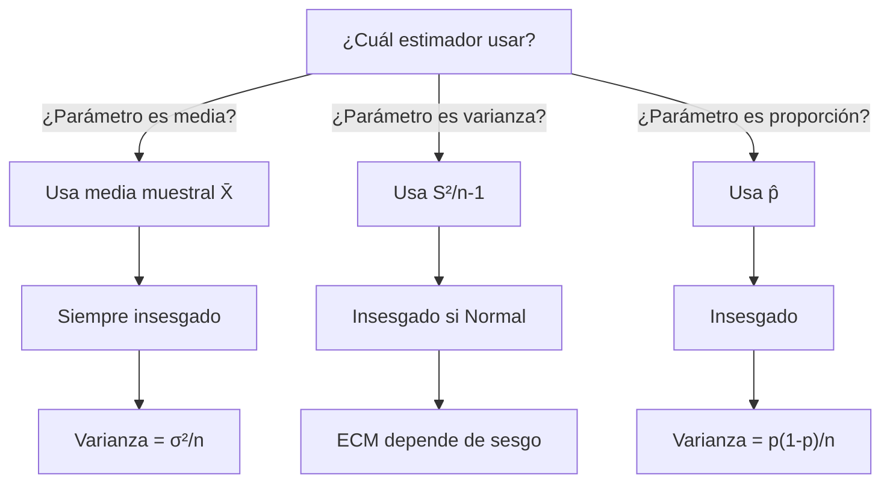

## Objetivo

✨ Comprender qué es un estimador puntual, analizar sus propiedades deseables (insesgadez, eficiencia, consistencia) y usar el error cuadrático medio (ECM) para seleccionar el mejor estimador en cada situación.

## Idea Clave 💡

**Un estimador puntual es una función de la muestra que produce un único valor para aproximar un parámetro poblacional desconocido.** La clave es elegir el estimador con mejores propiedades: insesgadez (no tiene error sistemático), eficiencia (menor varianza) y consistencia (mejora con más datos).

### Árbol de Decisión: Elegir Estimador

---

## 📌 Definiciones Básicas

### Parámetro vs Estimador vs Estimación

| Concepto        | Definición                                  | Ejemplo             |
| :-------------- | :------------------------------------------ | :------------------ |
| **Parámetro θ** | Valor fijo pero desconocido en población    | μ (media verdadera) |
| **Estimador θ̂** | Función de los datos (variable aleatoria)   | X̄ = (1/n)ΣX_i       |
| **Estimación**  | Valor numérico concreto tras observar datos | X̄ = 52.3            |

**Nota:** Estimador es función (cambia entre muestras); estimación es número (fijo para datos concretos).

???+ example "Control de calidad"

    **Parámetro:** Diámetro medio verdadero μ de tuercas

    **Estimador:** X̄ = (1/n)ΣX_i (varía según muestra)

    **Estimación:** X̄ = 10.05 mm (resultado de esta muestra)

---

## 📊 Propiedades Deseables de Estimadores

### 1. Insesgadez

Un estimador es **insesgado** si $E[\hat{\theta}] = \theta$ (no tiene error sistemático).

$$\text{Sesgo}(\hat{\theta}) = E[\hat{\theta}] - \theta$$

| Propiedad     | Interpretación                        |
| :------------ | :------------------------------------ |
| **Sesgo = 0** | Estimador centrado en verdadero valor |
| **Sesgo > 0** | Tiende a sobrestimar                  |
| **Sesgo < 0** | Tiende a subestimar                   |

???+ example "Media vs mediana"

    Para distribución Normal: X̄ es insesgada (E[X̄]=μ), mediana es insesgada (E[Md]=μ), ambas válidas.

    Para distribución sesgada: X̄ es insesgada, pero mediana puede ser sesgada.

### 2. Eficiencia

Un estimador es **más eficiente** si tiene **menor varianza** entre estimadores insesgados de la misma clase.

$$\text{Var}(\hat{\theta}) = E[\hat{\theta}^2] - (E[\hat{\theta}])^2$$

???+ example "Comparar varianzas"

    - Media muestral: Var(X̄) = σ²/n
    - Mediana muestral: Var(Md) ≈ (π/2)(σ²/n) ≈ 1.57(σ²/n)

    X̄ es más eficiente (menor varianza).

### 3. Consistencia

Un estimador es **consistente** si converge al parámetro verdadero cuando $n \to \infty$:

$$\hat{\theta}_n \xrightarrow{P} \theta \quad \text{cuando} \quad n \to \infty$$

**Regla práctica:** Si Var($\hat{\theta}$) → 0 y sesgo → 0 cuando n → ∞, el estimador es consistente.

???+ example "Media muestral"

    $$\text{Var}(\bar{X}) = \frac{\sigma^2}{n} \to 0 \quad \text{cuando} \quad n \to \infty$$

    X̄ es consistente para μ.

### 4. Error Cuadrático Medio (ECM)

El **ECM** combina varianza y sesgo, permitiendo comparar estimadores aunque uno sea sesgado:

$$\text{ECM}(\hat{\theta}) = \text{Var}(\hat{\theta}) + [\text{Sesgo}(\hat{\theta})]^2$$

**Interpretación:** Mide desviación promedio cuadrada del estimador respecto al parámetro verdadero.

???+ example "Comparar ECM"

    Estimador A: insesgado, Var = 10, Sesgo = 0
    - ECM(A) = 10 + 0² = 10

    Estimador B: sesgado, Var = 2, Sesgo = 2
    - ECM(B) = 2 + 2² = 6

    B es mejor globalmente a pesar de ser sesgado.

---

## 📊 Estimadores Comunes y sus Propiedades

### Media Muestral

$$\bar{X} = \frac{1}{n}\sum_{i=1}^n X_i$$

| Propiedad              | Valor                      |
| :--------------------- | :------------------------- |
| **Parámetro estimado** | μ (media poblacional)      |
| **Insesgadez**         | ✅ E[X̄] = μ                |
| **Varianza**           | Var(X̄) = σ²/n              |
| **ECM**                | σ²/n                       |
| **Consistencia**       | ✅ Var(X̄) → 0 cuando n → ∞ |

???+ example "Cálculo de ECM"

    Datos: X_i ~ N(100, 15²), n = 25

    $$\text{ECM}(\bar{X}) = \frac{15^2}{25} = \frac{225}{25} = 9$$

    Desviación estándar: √9 = 3 (X̄ típicamente 100 ± 3)

### Varianza Muestral

$$S^2 = \frac{1}{n-1}\sum_{i=1}^n (X_i-\bar{X})^2$$

| Propiedad              | Valor                                  |
| :--------------------- | :------------------------------------- |
| **Parámetro estimado** | σ² (varianza poblacional)              |
| **Insesgadez**         | ✅ E[S²] = σ² (si población Normal)    |
| **Nota importante**    | Si usas 1/n: sesgado, pero consistente |
| **Consistencia**       | ✅ Converge a σ² cuando n → ∞          |

???+ example "Sesgo en divisor"

    Usar 1/n: $E[S^2_{n}] = \frac{n-1}{n}\sigma^2$ (sesgo = -σ²/n)

    Usar 1/(n-1): E[S²] = σ² (insesgado)

### Proporción Muestral

$$\hat{p} = \frac{1}{n}\sum_{i=1}^n X_i, \quad X_i \sim \text{Ber}(p)$$

| Propiedad              | Valor                     |
| :--------------------- | :------------------------ |
| **Parámetro estimado** | p (probabilidad de éxito) |
| **Insesgadez**         | ✅ E[p̂] = p               |
| **Varianza**           | Var(p̂) = p(1-p)/n         |
| **ECM**                | p(1-p)/n                  |
| **Consistencia**       | ✅ Convergente por LGN    |

???+ example "Encuesta electoral"

    Muestra: n=400, p̂=0.45 (45% votaría sí)

    $$\text{Var}(\hat{p}) = \frac{0.45 \times 0.55}{400} = 0.000619$$

    $$\text{DE}(\hat{p}) = \sqrt{0.000619} \approx 0.0249 \approx 2.5\%$$

---

## ⚠️ Trampas Comunes

**Trampa 1: Confundir estimador con estimación**

- ❌ Incorrecto: "El estimador de μ es 52.5" (52.5 es estimación, no función)
- ✅ Correcto: "El estimador es X̄; para estos datos, la estimación es 52.5"

**Trampa 2: Usar 1/n en lugar de 1/(n-1) para varianza**

- ❌ Incorrecto: $S^2 = \frac{1}{n}\sum(X_i-\bar{X})^2$ (sesgado)
- ✅ Correcto: $S^2 = \frac{1}{n-1}\sum(X_i-\bar{X})^2$ (insesgado)

**Trampa 3: Asumir insesgadez implica eficiencia**

- ❌ Incorrecto: Todos los estimadores insesgados tienen la misma varianza
- ✅ Correcto: Comparar varianzas; elegir de menor Var entre insesgados

**Trampa 4: Confundir Var(X) con Var(X̄)**

- ❌ Incorrecto: Var(X̄) = σ² (varianza de dato individual)
- ✅ Correcto: Var(X̄) = σ²/n (varianza de promedio)

**Trampa 5: Ignorar sesgo en comparativas**

- ❌ Incorrecto: Elegir estimador solo por insesgadez
- ✅ Correcto: Comparar ECM (combina varianza y sesgo)

---

## 💡 Checklist: Analizar un Estimador

!!! tip "Paso a Paso"

    1. **Identifica parámetro:** ¿Qué población parameter estimar? (μ, σ², p, ...)
    2. **Propón estimador:** ¿Qué función de datos usar?
    3. **Calcula E[θ̂]:** Usando linealidad de esperanza
    4. **Calcula Var(θ̂):** Usando propiedades de varianza
    5. **Sesgo:** Sesgo = E[θ̂] - θ
    6. **ECM:** ECM = Var + Sesgo²
    7. **Consistencia:** ¿Var → 0 y Sesgo → 0 cuando n → ∞?
    8. **Compara:** Si hay alternativas, elige menor ECM
    9. **Reporta:** Estimador elegido, propiedades, ECM

---

## 📚 Ejercicios Rápidos

Estimador propuesto: $\tilde{\mu}=\frac{1}{n-1}\sum_{i=1}^n X_i$. Calcula sesgo para E[X] = μ.

???+ example "Ejercicio 1 — Sesgo de estimador"

    $$E[\tilde{\mu}] = E\left[\frac{1}{n-1}\sum X_i\right] = \frac{n}{n-1}\mu$$

    $$\text{Sesgo} = E[\tilde{\mu}] - \mu = \frac{n}{n-1}\mu - \mu = \frac{\mu}{n-1}$$

    Para n grande, sesgo → 0 (consistente).

Estimador A: insesgado, Var(A) = 4/n. Estimador B: Var(B) = 1/n, Sesgo(B) = 1/n. Para n=25, ¿cuál tiene menor ECM?

???+ example "Ejercicio 2 — Comparar ECM"

    $$\text{ECM}(A) = \frac{4}{25} + 0^2 = 0.16$$

    $$\text{ECM}(B) = \frac{1}{25} + \left(\frac{1}{25}\right)^2 = 0.04 + 0.0016 = 0.0416$$

    B gana (menor ECM) a pesar de ser sesgado.

Población: X ~ N(70, 12²), n=36. ¿Cuál es Var(X̄) y DE(X̄)?

???+ example "Ejercicio 3 — Varianza de media muestral"

    $$\text{Var}(\bar{X}) = \frac{\sigma^2}{n} = \frac{144}{36} = 4$$

    $$\text{DE}(\bar{X}) = \sqrt{4} = 2$$

    Interpretación: Media muestral típicamente ±2 unidades de media verdadera.

## 📖 Enlaces Relacionados

- **UD3:** [Estimación e Intervalos](../../ud3/estimacion-y-intervalos.md) — Introducción
- **UD5:** [Métodos de Estimación](./metodos-estimacion.md) — MV, momentos
- **UD5:** [Intervalos de Confianza](./intervalos-confianza.md) — Estimación por intervalos
- **UD5:** [Contrastes de Hipótesis](./contrastes-hipotesis.md) — Tests
