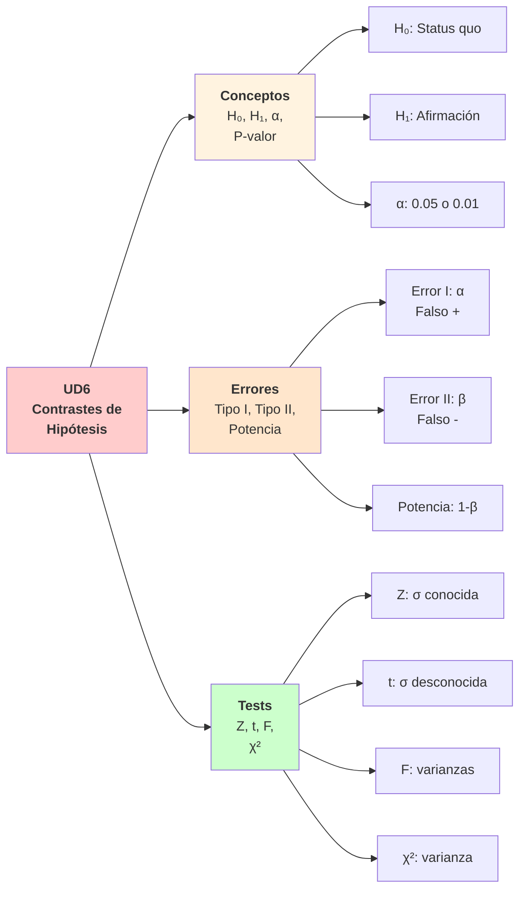
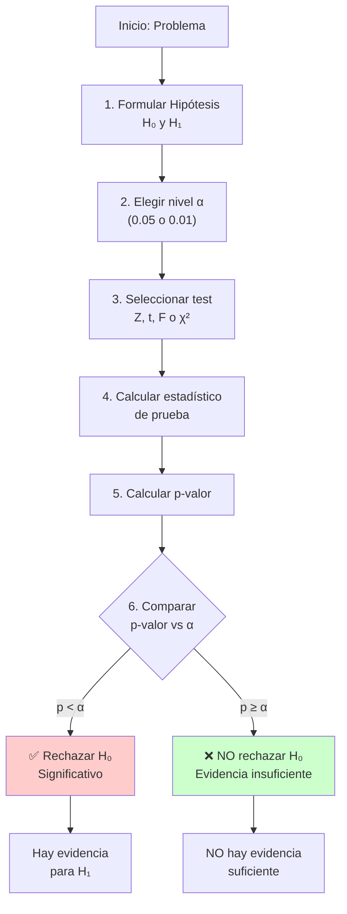
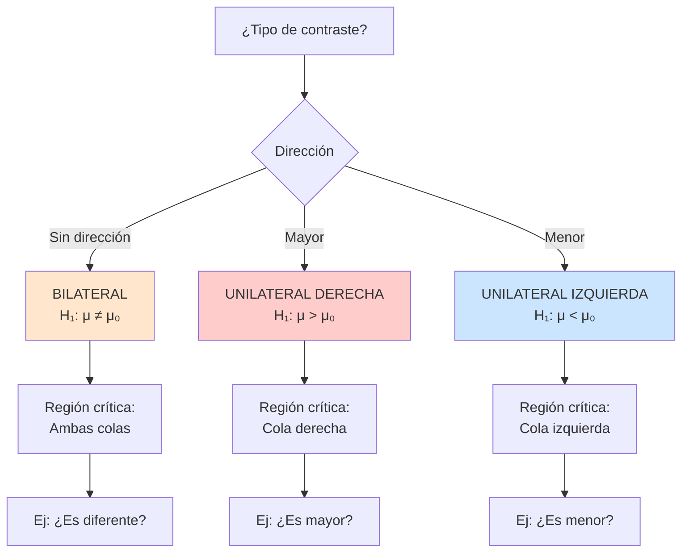
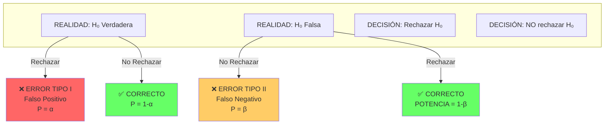
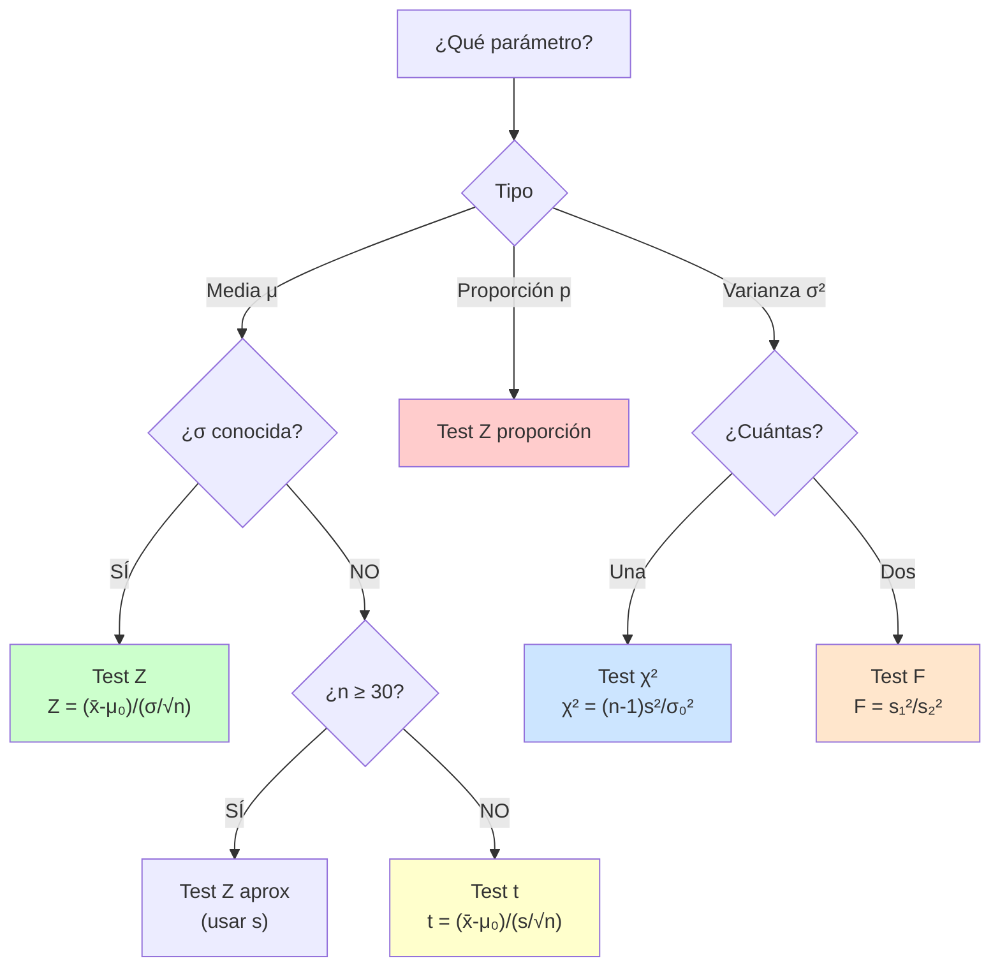
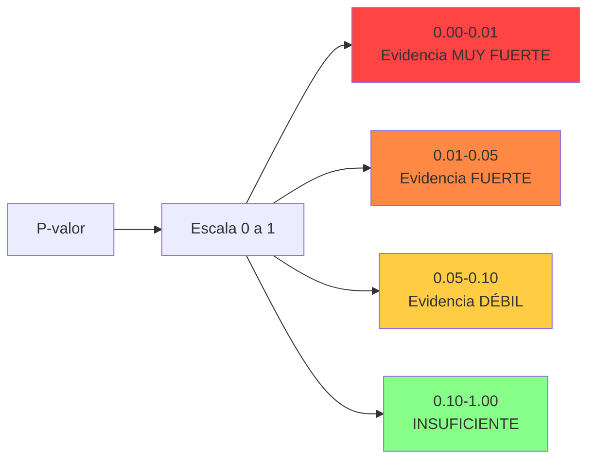

## ✨ Mapa Conceptual UD6

---

## 🎯 Proceso Completo de Contraste

---

## 🔀 Árbol de Decisión: Tipo de Hipótesis

---

## ⚠️ Matriz de Errores

### Tabla Resumen de Errores

|                    | **H₀ Verdadera**    | **H₀ Falsa**               |
| :----------------- | :------------------ | :------------------------- |
| **Rechazar H₀**    | ❌ Error Tipo I (α) | ✅ Correcto (Potencia 1-β) |
| **NO Rechazar H₀** | ✅ Correcto (1-α)   | ❌ Error Tipo II (β)       |

!!! warning "Control de Errores" - **α:** Se fija previamente (0.05 o 0.01) - **β:** Depende de n y tamaño del efecto - **Potencia = 1-β:** Detectar efecto cuando existe - **Balance:** ↓α → ↑β (para ↓ambos → ↑n)

---

## 🧪 Árbol: Elegir Test Apropiado

---

## 🔑 Fórmulas Clave

### Test Z para Media (σ conocida)

$$
Z = \frac{\bar{x} - \mu_0}{\sigma / \sqrt{n}} \sim N(0,1)
$$

**Condiciones:** n ≥ 30 o población normal, σ conocida

---

### Test t para Media (σ desconocida)

$$
t = \frac{\bar{x} - \mu_0}{s / \sqrt{n}} \sim t_{n-1}
$$

**Condiciones:** n < 30, población normal, σ desconocida

---

### Test t para Dos Medias

$$
t = \frac{\bar{x}_1 - \bar{x}_2}{s_p \sqrt{\frac{1}{n_1} + \frac{1}{n_2}}} \sim t_{n_1+n_2-2}
$$

Varianza combinada:

$$
s_p^2 = \frac{(n_1-1)s_1^2 + (n_2-1)s_2^2}{n_1 + n_2 - 2}
$$

---

### Test t Pareado

$$
t = \frac{\bar{d}}{s_d / \sqrt{n}} \sim t_{n-1}
$$

Donde $\bar{d}$ = media de diferencias, $s_d$ = desv. típica

---

### Test F para Varianzas

$$
F = \frac{s_1^2}{s_2^2} \sim F_{n_1-1, n_2-1}
$$

**Convención:** Varianza mayor en numerador

---

### Test χ² para Varianza

$$
\chi^2 = \frac{(n-1)s^2}{\sigma_0^2} \sim \chi^2_{n-1}
$$

**Uso:** Contrastar H₀: σ² = σ₀²

---

## 📊 Interpretación del P-valor

> "Si H₀ fuera cierta, la probabilidad de observar un resultado tan extremo o más es p-valor"

!!! danger "❌ Interpretación INCORRECTA" - "P(H₀ es cierta) = p-valor" — **¡FALSO!** - "P(H₁ es cierta) = 1 - p-valor" — **¡FALSO!**

---

## 📚 Tabla de Contrastes

| Contraste        | Parámetro | Condiciones      | Estadístico                                             | Distribución      |
| :--------------- | :-------- | :--------------- | :------------------------------------------------------ | :---------------- |
| **Z media**      | μ         | σ conocida, n≥30 | $Z = \frac{\bar{x}-\mu_0}{\sigma/\sqrt{n}}$             | N(0,1)            |
| **t media**      | μ         | σ desc., normal  | $t = \frac{\bar{x}-\mu_0}{s/\sqrt{n}}$                  | $t_{n-1}$         |
| **t dos medias** | μ₁-μ₂     | Indep., normales | $t = \frac{\bar{x}_1-\bar{x}_2}{s_p\sqrt{1/n_1+1/n_2}}$ | $t_{n_1+n_2-2}$   |
| **t pareado**    | μ_d       | Pareadas         | $t = \frac{\bar{d}}{s_d/\sqrt{n}}$                      | $t_{n-1}$         |
| **F varianzas**  | σ₁²/σ₂²   | Indep., normales | $F = \frac{s_1^2}{s_2^2}$                               | $F_{n_1-1,n_2-1}$ |
| **χ² varianza**  | σ²        | Normal           | $\chi^2 = \frac{(n-1)s^2}{\sigma_0^2}$                  | $\chi^2_{n-1}$    |

---

## ✅ Checklist para Contrastes

???+ tip "Pasos sistemáticos"

    **1. Formular Hipótesis**

    - [ ] Escribir H₀ (status quo)
    - [ ] Escribir H₁ (afirmación a probar)
    - [ ] Determinar: bilateral/unilateral

    **2. Nivel de Significación**

    - [ ] Elegir α (0.05 o 0.01)

    **3. Identificar Test**

    - [ ] ¿Qué parámetro?
    - [ ] ¿Se cumplen supuestos?
    - [ ] Elegir: Z, t, F o χ²

    **4. Calcular Estadístico**

    - [ ] Obtener x̄, s, etc.
    - [ ] Calcular valor prueba

    **5. P-valor**

    - [ ] Usar tabla o software
    - [ ] Considerar uni/bilateral

    **6. Decisión**

    - [ ] Comparar p vs α
    - [ ] Si p < α → Rechazar H₀
    - [ ] Si p ≥ α → NO rechazar H₀

    **7. Conclusión**

    - [ ] Expresar en contexto
    - [ ] Indicar nivel confianza
    - [ ] Mencionar limitaciones

---

## 🎓 Errores Comunes

!!! danger "❌ Evitar"

    1. **"NO rechazar H₀" ≠ "Aceptar H₀"**
       - Correcto: Evidencia insuficiente

    2. **Mal interpretar p-valor**
       - ❌ "P(H₀ cierta)"
       - ✅ "P(datos | H₀ cierta)"

    3. **Test incorrecto**
       - σ conocida → Z
       - σ desc. + n<30 → t
       - Verificar normalidad

    4. **Confundir uni/bilateral**
       - "¿Diferente?" → Bilateral
       - "¿Mayor?" → Unilateral derecha
       - "¿Menor?" → Unilateral izquierda

    5. **Olvidar grados libertad**
       - t: gl = n-1
       - t dos muestras: gl = n₁+n₂-2
       - F: gl = (n₁-1, n₂-1)

---

## 🚀 Ejemplo Completo

**Problema:** ¿El tiempo medio de ejecución es 45 ms? Muestra: n=15, $\bar{x}=42.3$ ms, $s=5.8$ ms. Usar α=0.05.

**Solución:**

1. **Hipótesis:**

   - H₀: μ = 45 ms
   - H₁: μ ≠ 45 ms (bilateral)

2. **Nivel:** α = 0.05

3. **Test:** t de Student (σ desc., n<30)

4. **Estadístico:**

$$
t = \frac{42.3 - 45}{5.8/\sqrt{15}} = \frac{-2.7}{1.498} \approx -1.80
$$

5. **GL:** n-1 = 14

6. **Valor crítico:** $t_{0.025,14} = 2.145$

7. **Decisión:** $|t| = 1.80 < 2.145$ → NO rechazar H₀

8. **Conclusión:**

> "Con α=0.05, NO hay evidencia suficiente para afirmar que el tiempo medio difiere de 45 ms."

---

## 📚 Para Profundizar

- [Introducción a contrastes](introduccion-contrastes-hipotesis.md) — Conceptos básicos
- [Hipótesis nula/alternativa](hipotesis-nula-alternativa.md) — Formulación
- [Errores y significación](errores-nivel-significacion.md) — Tipos I y II
- [P-valor](p-valor.md) — Interpretación detallada
- [Contrastes media](contrastes-media.md) — Tests Z y t
- [Contrastes varianza](contrastes-varianza.md) — Tests F y χ²
- [Ejercicios UD6](ejercicios.md) — Práctica con soluciones
